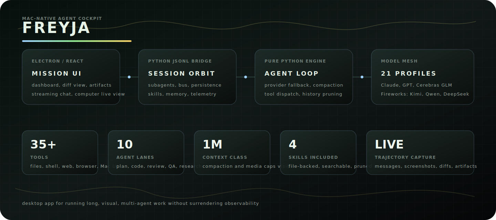
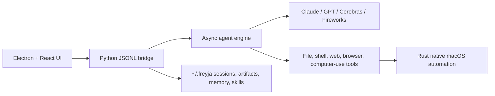

<p align="center">
  
</p>

<h1 align="center">Freyja</h1>

<p align="center">
  <strong>A Mac-native cockpit for long-running, visual, multi-agent work.</strong>
</p>

<p align="center">
  Freyja is an agentic desktop app that can write code, browse the web, operate your Mac,
  launch specialist subagents, preserve the full trajectory, and show what is happening
  while the work is still alive.
</p>

<p align="center">
  
</p>

<p align="center">
  <em>The desktop cockpit, event spine, engine, model mesh, swarm lanes, native tools, and persistent observability plane.</em>
</p>

> Platform: macOS on Apple Silicon<br>
> Status: internal alpha, `v0.1.0`<br>
> Stack: Electron, React, TypeScript, Python, Rust, pyo3

## Why Freyja Exists

Most agent apps are either chat boxes with tools bolted on, or opaque runners
that become impossible to inspect once the work gets large. Freyja is built for
the messy middle: multi-hour sessions, many subagents, computer-use screenshots,
tool traces, files changing under your feet, context compaction, and models with
different strengths working together.

The product goal is simple: give powerful agents a real desktop mission control
surface without hiding the machinery. You should be able to watch the swarm,
inspect the evidence, jump to a file edit, see when context was compacted, and
recover the trajectory later.

## What It Can Do

- Run a first-class desktop chat with streaming model output, attached images,
  tool calls, inline screenshots, and a persistent session sidebar.
- Drive macOS directly: screenshot, click, type, scroll, inspect windows, query
  accessibility trees, focus windows, find elements, and execute multi-step
  computer-use loops.
- Spawn background subagents with explicit profiles for planning, research,
  coding, review, testing, browser QA, performance profiling, docs, and memory
  curation.
- Coordinate agents through a session message bus where sibling agents can
  publish findings, read evidence, and continue work without waiting on the
  parent chat.
- Show live work products: file changes, diff cards, artifacts, markdown/code
  previews, logs, screenshots, and subagent output.
- Persist transcripts, artifacts, settings, session slices, message bus events,
  memory, skill usage, compaction events, and trajectory exports.
- Keep long computer-use sessions under control with request-level image pruning:
  the UI keeps the visual trail, while provider requests keep only the most
  recent screenshot image blocks needed for the next step.

## Product Surface

Freyja has a few major views that work together:

- Main conversation: streaming text, tool groups, visual computer-use frames,
  pasted images, file changes, and the input dock.
- Activity rail: context, spend, tool timeline, compaction/media events, changes,
  artifacts, system events, and logs.
- Mission dashboard: a wide operational view for swarms, findings, evidence,
  agent health, compaction before/after points, image policy, and session lanes.
- Artifact workspace: focused inspection for generated files, markdown, JSON,
  SVG, HTML, images, and code.
- Model and agent controls: provider-aware model picker, reasoning metadata,
  subagent profile table, and slash-command workflows.

## System Architecture

Freyja ships as a single `.app` bundle with four layers:

| Layer | Tech | What it owns |
| --- | --- | --- |
| UI | Electron, React, Vite, Tailwind, Zustand | Mission UI, chat, dashboard, diffs, artifacts, local persistence |
| Bridge | Python asyncio over JSONL stdin/stdout | Sessions, commands, subagent orchestration, skills, memory, events |
| Engine | Pure Python | Agent loop, provider adapters, compaction, context pressure, tool dispatch |
| Native | Rust + pyo3 | macOS screen capture, input, windows, accessibility primitives |

At runtime Electron spawns `bridge/freyja_bridge.py`, talks to it over JSONL,
and proxies capture/input through the main process so macOS TCC permissions are
owned by the app bundle instead of a random shell process.



## Model Mesh

Freyja currently exposes 21 model profiles across 4 provider families:

| Family | Models |
| --- | --- |
| Anthropic | Claude Opus 4.7, Opus 4.6, Sonnet 4.6, Sonnet 4.5, Opus 4.5, Haiku 4.5 |
| OpenAI | GPT-5.5, GPT-5.4, GPT-5.4 Mini, GPT-5.4 Nano, GPT-5.3 Codex |
| Cerebras | Z.ai GLM 4.7 |
| Fireworks | Kimi K2.5, Kimi K2.6, DeepSeek V4 Pro, DeepSeek v3.2, GLM 5.1, GLM 5, MiniMax M2.7, MiniMax M2.5, Qwen3.6 Plus |

The picker tracks context window, provider family, API key availability,
reasoning mode, supported reasoning levels, and model-specific reasoning
history behavior. Provider adapters live in `engine/*_provider.py`; the visible
model catalog lives in `bridge/freyja_bridge.py`.

## Agent Profiles

Subagents are declarative profiles in `bridge/tools/agent_types.py`. Each profile
controls model choice, fallback policy, thinking effort, tool allowlist, prompt,
and iteration budget.

Built-ins:

| Profile | Purpose |
| --- | --- |
| `general` | Default delegation, inherits the parent model and safe tools |
| `explore` | Deep web/file/codebase research with publishing to the bus |
| `explore-fast` | Fast fanout lookup over a rotating low-latency model set |
| `code` | Isolated file/code edits with high thinking and editing tools |
| `verify` | Independent read-only validation after implementation |
| `plan` | Read-only implementation planning before broad work |
| `review` | Read-only code review focused on bugs, regressions, and tests |
| `test` | Build/test execution and failure diagnosis |
| `browser-qa` | Frontend behavior, layout, and browser screenshot checks |
| `performance` | Profiling and low-risk optimization investigation |
| `docs` | Documentation and design-document writing |
| `memory-curator` | Skill and memory hygiene |

Custom project/user profiles can be added as markdown files under
`.freyja/agents` or `~/.freyja/agents`.

## Tools

The bridge exposes a desktop tool registry with file, shell, web, browser,
computer-use, memory, skills, subagents, and message-bus tools. Highlights:

- File system: read, write, edit, JSON edit, glob, grep, list directories.
- Shell: bounded command execution with summarized output.
- Web: search, fetch, and research workflows.
- Browser: CDP-backed JavaScript and screenshot inspection for frontend QA.
- Computer use: screenshot, click, type, key events, scroll, move mouse,
  inspect regions, focus/list windows, read accessibility trees, find elements.
- Collaboration: `sub_agent`, `subagents`, `publish_finding`, `read_findings`.
- Knowledge: `record_user_preference`, `list_skills`, `search_skills`,
  `load_skill`, with file-backed usage tracking and pruning.

## Memory And Skills

Freyja keeps this intentionally simple. No database is required.

- Durable memory is file-backed under `~/.freyja/knowledge` and project-aware.
- Skills are markdown files discovered from `~/.freyja/skills`,
  `~/.claude/skills`, `knowledge/`, and `.freyja/skills`.
- The prompt builder retrieves relevant memories and skills by query.
- Skill loading is explicit, visible in the UI, and tracked with lightweight
  usage metadata.
- Skill pruning removes irrelevant loaded skill context when a session grows,
  keeping prompts lean without deleting the skill itself.

This repository includes starter project skills in `.freyja/skills`:
`analyze-session`, `frontend-design`, `holographic-label-system`, and
`teach-impeccable`.

## Context, Compaction, And Media

Long sessions are first-class. Freyja tracks context pressure, compaction
events, image history, and request media policy instead of treating them as
invisible backend chores.

- Token pressure triggers pruning and LLM-based compaction.
- Compactions are represented as transcript events with before/after token
  estimates and summary text.
- The mission dashboard shows compaction before/after cards and image history
  policy.
- Computer-use tool-result images are pruned from provider request history
  after the most recent few frames, while the UI and local frame dump retain
  the visual trail.
- Request-level image safety leaves provider headroom for user attachments.

Key constants live in `engine/constants.py`.

## Quick Start

Use this for development. Renderer changes hot-reload through Vite. Python
bridge/engine changes require a bridge restart.

```bash
# Prerequisites:
# Node 18+, Python 3.11+, uv, Rust toolchain
brew install node python uv rustup-init
rustup-init

# Configure providers
cp .env.example .env
# Fill whichever keys you want:
# ANTHROPIC_API_KEY, OPENAI_API_KEY, CEREBRAS_API_KEY, FIREWORKS_API_KEY

# Install dependencies
npm install
uv sync --extra dev

# Build the native macOS extension once
cd native/freyja_native
uv run maturin develop --release
cd ../..

# Run the desktop app
./launch.sh
# or
npm run dev
```

The dev orchestrator in `scripts/dev.mjs` runs Vite, watches the Electron
main/preload bundle, and launches Electron against the local renderer URL.

## Running The Bridge Standalone

Useful when debugging engine behavior without Electron:

```bash
uv run python -m bridge.freyja_bridge
```

The bridge reads JSONL commands from stdin and emits JSONL events to stdout.

## Build A Shippable App

The production app bundles Python, the engine, the bridge, native extension,
renderer assets, and Electron.

```bash
npm install
uv sync
cd native/freyja_native && uv run maturin develop --release && cd ../..

./scripts/bundle-python.sh
npm run package
open out/mac-arm64/Freyja.app
```

To create a DMG:

```bash
npm run dist
```

The app is currently ad-hoc signed for internal alpha distribution. First
launch may require right-clicking the app and choosing Open. Real distribution
should add Developer ID signing and notarization.

## Project Layout

```text
freyja/
├── src/
│   ├── main/                 Electron main process and native proxies
│   ├── preload/              contextBridge API
│   ├── renderer/             React UI, mission dashboard, activity rail
│   └── shared/               IPC and event types
├── bridge/
│   ├── freyja_bridge.py      JSONL bridge, sessions, commands, events
│   ├── knowledge/            file-backed memory and skill stores
│   └── tools/                desktop tool registry and implementations
├── engine/
│   ├── runner.py             async agent loop
│   ├── session.py            transcript, compaction, image pruning
│   ├── compaction.py         LLM summary compaction strategy
│   └── *_provider.py         provider adapters
├── native/freyja_native/     Rust pyo3 macOS capture/input/window/AX layer
├── docs/                     architecture, performance, skills, research
├── scripts/                  dev, packaging, signing, trajectory export
├── tests/                    Python regression tests
└── .freyja/skills/           starter project skills
```

## Useful Commands

```bash
npm run build
uv run --extra dev pytest -q
python3 -m py_compile bridge/freyja_bridge.py engine/runner.py
```

## Documentation

- `docs/ARCHITECTURE.md`: system architecture deep dive.
- `docs/PERFORMANCE-DEEP-DIVE.md`: renderer, media, session, and subagent
  performance analysis.
- `docs/SKILLS-MEMORY-DESIGN.md`: skills and memory design.
- `docs/WARP-FILE-EDIT-UX-RESEARCH.md`: file-edit UX research and design notes.
- `docs/TRAJECTORY-TRAINING.md`: trajectory export formats.

## Troubleshooting

| Symptom | Likely fix |
| --- | --- |
| App starts in demo mode | Check `.env` and bridge startup logs |
| Packaged bridge cannot import modules | Re-run `./scripts/bundle-python.sh` |
| `freyja_native` missing in dev | Run `uv run maturin develop --release` inside `native/freyja_native` |
| Computer-use permissions fail | Grant Screen Recording and Accessibility to the app bundle, then restart |
| Context grows with many screenshots | Use the dashboard image policy view; provider requests should prune old tool-result images automatically |
| OpenAI image attachments are ignored | Ensure the bridge is restarted after the image attachment fix and confirm `OPENAI_API_KEY` is set |

## License

MIT.
