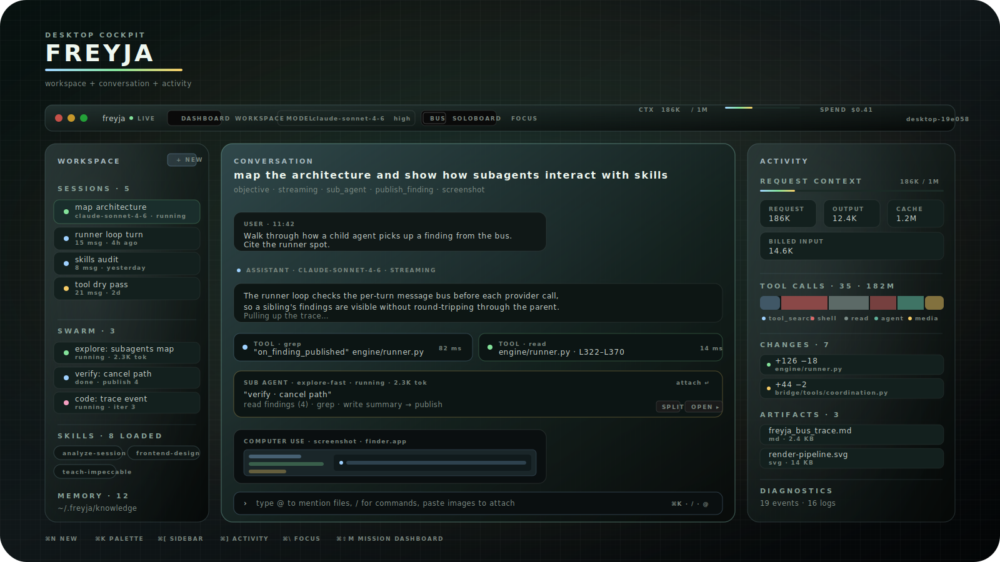
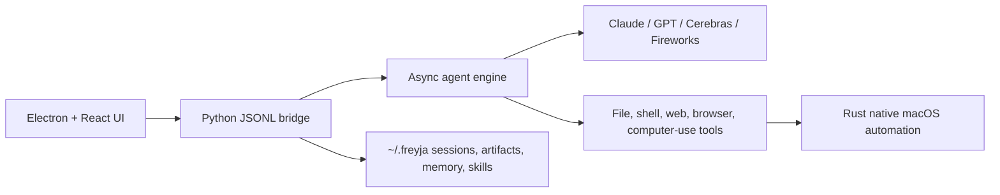
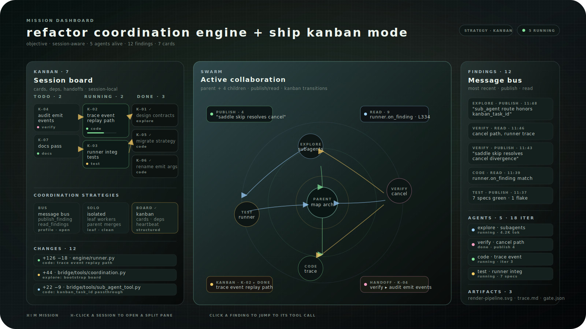

<p align="center">
  
</p>

<h1 align="center">Freyja</h1>

<p align="center">
  <strong>A Mac-native cockpit for long-running, visual, multi-agent work.</strong>
</p>

<p align="center">
  Freyja is an agentic desktop app that can write code, browse the web, operate your Mac,
  launch specialist subagents, preserve the full trajectory, and show what is happening
  while the work is still alive.
</p>

<p align="center">
  
</p>

<p align="center">
  <em>The desktop cockpit, event spine, engine, model mesh, swarm lanes, native tools, and persistent observability plane.</em>
</p>

> Platform: macOS on Apple Silicon<br>
> Status: internal alpha, `v0.1.0`<br>
> Stack: Electron, React, TypeScript, Python, Rust, pyo3

## Why Freyja Exists

Most agent apps are either chat boxes with tools bolted on, or opaque runners
that become impossible to inspect once the work gets large. Freyja is built for
the messy middle: multi-hour sessions, many subagents, computer-use screenshots,
tool traces, files changing under your feet, context compaction, and models with
different strengths working together.

The product goal is simple: give powerful agents a real desktop mission control
surface without hiding the machinery. You should be able to watch the swarm,
inspect the evidence, jump to a file edit, see when context was compacted, and
recover the trajectory later.

## What It Can Do

- Run a first-class desktop chat with streaming model output, attached images,
  tool calls, inline screenshots, and a persistent session sidebar.
- Drive macOS directly: screenshot, click, type, scroll, inspect windows, query
  accessibility trees, focus windows, find elements, and execute multi-step
  computer-use loops.
- Spawn background subagents with explicit profiles for planning, research,
  coding, review, testing, browser QA, performance profiling, docs, and memory
  curation.
- Pick how subagents coordinate per session — message bus (publish/read shared
  findings), isolated (independent leaf workers, parent synthesizes), or kanban
  (a session board with cards, dependencies, status, and handoffs).
- Visualize collaboration as a round-based mission graph: subagent spawn waves,
  publish/read edges, inferred cross-agent reuse, kanban board state, and bus
  traffic stay visible after the swarm completes.
- Open multiple sessions side-by-side with split panes — the active session
  stays writable, the rest are live read-only views of running or archived
  trajectories.
- Generate creative imagery in-line via the `generate_image` tool, with a
  session-local image store so agents can refer to attachments and outputs by
  stable refs instead of carrying base64 in tool args.
- Show live work products: file changes, diff cards, artifacts, markdown/code
  previews, logs, screenshots, and subagent output.
- Persist transcripts, artifacts, settings, session slices, message bus events,
  memory, skill usage, compaction events, and trajectory exports.
- Keep long computer-use sessions under control with request-level image pruning:
  the UI keeps the visual trail, while provider requests keep only the most
  recent screenshot image blocks needed for the next step.

## Product Surface

<p align="center">
  
</p>

<p align="center">
  <em>The cockpit: workspace sidebar, streaming conversation with tool calls and inline computer-use frames, and the activity rail.</em>
</p>

Freyja has a few major views that work together:

- Main conversation: streaming text, tool groups, visual computer-use frames,
  pasted images, file changes, and the input dock. Splittable into multiple
  panes for side-by-side session views.
- Activity rail: context, spend, tool timeline, compaction/media events, changes,
  artifacts, system events, and logs.
- Mission dashboard: a wide operational view for swarms, collaboration rounds,
  message-bus edges, kanban cards, findings, evidence, agent health, compaction
  before/after points, image policy, and session lanes.
- Artifact workspace: focused inspection for generated files, markdown, JSON,
  SVG, HTML, images, and code.
- Title bar: model and reasoning picker, sub-agent coordination strategy,
  workspace/dashboard/activity toggles, and a focus mode that hides the side
  panels for distraction-free runs.

## System Architecture

Freyja ships as a single `.app` bundle with four layers:

| Layer | Tech | What it owns |
| --- | --- | --- |
| UI | Electron, React, Vite, Tailwind, Zustand | Mission UI, chat, dashboard, diffs, artifacts, local persistence |
| Bridge | Python asyncio over JSONL stdin/stdout | Sessions, commands, subagent orchestration, skills, memory, events |
| Engine | Pure Python | Agent loop, provider adapters, compaction, context pressure, tool dispatch |
| Native | Rust + pyo3 | macOS screen capture, input, windows, accessibility primitives |

At runtime Electron spawns `bridge/freyja_bridge.py`, talks to it over JSONL,
and proxies capture/input through the main process so macOS TCC permissions are
owned by the app bundle instead of a random shell process.



## Model Mesh

Freyja currently exposes 21 model profiles across 4 provider families:

| Family | Models |
| --- | --- |
| Anthropic | Claude Opus 4.7, Opus 4.6, Sonnet 4.6, Sonnet 4.5, Opus 4.5, Haiku 4.5 |
| OpenAI | GPT-5.5, GPT-5.4, GPT-5.4 Mini, GPT-5.4 Nano, GPT-5.3 Codex |
| Cerebras | Z.ai GLM 4.7 |
| Fireworks | Kimi K2.5, Kimi K2.6, DeepSeek V4 Pro, GLM 5.1, GLM 5, MiniMax M2.7, MiniMax M2.5, Qwen3.6 Plus |

The picker tracks context window, provider family, API key availability,
reasoning mode, supported reasoning levels, and model-specific reasoning
history behavior. Provider adapters live in `engine/*_provider.py`; the visible
model catalog lives in `bridge/freyja_bridge.py`.

## Agent Profiles

<p align="center">
  
</p>

<p align="center">
  <em>The mission dashboard: kanban board, swarm graph with publish/read edges and kanban handoffs, and a live findings feed.</em>
</p>

Subagents are declarative profiles in `bridge/tools/agent_types.py`. Each profile
controls model choice, fallback policy, thinking effort, tool allowlist, prompt,
and iteration budget.

Built-ins:

| Profile | Purpose |
| --- | --- |
| `general` | Default delegation, inherits the parent model and safe tools |
| `explore` | Deep web/file/codebase research with publishing to the bus |
| `explore-fast` | Fast fanout lookup over a rotating low-latency model set |
| `code` | Isolated file/code edits with high thinking and editing tools |
| `verify` | Independent read-only validation after implementation |
| `plan` | Read-only implementation planning before broad work |
| `review` | Read-only code review focused on bugs, regressions, and tests |
| `test` | Build/test execution and failure diagnosis |
| `browser-qa` | Frontend behavior, layout, and browser screenshot checks |
| `performance` | Profiling and low-risk optimization investigation |
| `docs` | Documentation and design-document writing |
| `memory-curator` | Skill and memory hygiene |

Custom project/user profiles can be added as markdown files under
`.freyja/agents` or `~/.freyja/agents`.

## Tools

The bridge exposes a desktop tool registry with file, shell, web, browser,
computer-use, memory, skills, subagents, and message-bus tools. Highlights:

- File system: read, write, edit, JSON edit, glob, grep, list directories.
- Shell: bounded command execution with summarized output.
- Web: search, fetch, and research workflows.
- Browser: CDP-backed JavaScript and screenshot inspection for frontend QA.
- Computer use: screenshot, click, type, key events, scroll, move mouse,
  inspect regions, focus/list windows, read accessibility trees, find elements.
- Provider-native computer use: OpenAI `computer_call` requests route through
  Freyja's shared desktop backend while returning screenshots in the provider's
  expected native shape. Provider-specific tool protocols are isolated in a
  small adapter layer so future models can add their own native tool formats.
- Creative media: `generate_image` for inline image generation, plus a
  session-local image store that gives every attachment and result a stable
  `img_…` reference for follow-up edits.
- Collaboration: `sub_agent`, `subagents`, `publish_finding`, `read_findings`,
  and `kanban` (session board) — the subset offered to children depends on the
  active coordination strategy.
- Knowledge: `record_user_preference`, `list_skills`, `search_skills`,
  `load_skill`, with file-backed usage tracking and pruning.

## Memory And Skills

Freyja keeps this intentionally simple. No database is required.

- Durable memory is file-backed under `~/.freyja/knowledge` and project-aware.
- Skills are markdown files discovered from `~/.freyja/skills`,
  `~/.claude/skills`, `knowledge/`, and `.freyja/skills`.
- The prompt builder retrieves relevant memories and skills by query.
- Skill loading is explicit, visible in the UI, and tracked with lightweight
  usage metadata.
- Skill pruning removes irrelevant loaded skill context when a session grows,
  keeping prompts lean without deleting the skill itself.

This repository includes starter project skills in `.freyja/skills`:
`analyze-session`, `frontend-design`, `holographic-label-system`, and
`teach-impeccable`.

## Context, Compaction, And Media

Long sessions are first-class. Freyja tracks context pressure, compaction
events, image history, and request media policy instead of treating them as
invisible backend chores.

- Token pressure triggers pruning and LLM-based compaction.
- Compactions are represented as transcript events with before/after token
  estimates and summary text.
- The mission dashboard shows compaction before/after cards and image history
  policy.
- Computer-use tool-result images are pruned from provider request history
  after the most recent few frames, while the UI and local frame dump retain
  the visual trail.
- Request-level image safety leaves provider headroom for user attachments.

Key constants live in `engine/constants.py`.

## Generative UI Widgets

Agents can render interactive HTML/SVG widgets directly in the conversation
— metric dashboards, diagrams, charts, and structured input forms that
submit back as the next user message. The architecture mirrors Claude
Desktop's "Imagine" pattern and the MCP Apps SEP-1865 wire shape so a
future MCP client integration is a thin shim, not a rewrite.

- Two bridge tools (`bridge/tools/widget_tool.py`): `widget_spec` returns
  the design-system reference (CSS classes, color ramps, Tabler icons,
  elicit form chrome, hard constraints), `show_widget` emits a
  `widget_render` event carrying the agent's HTML/SVG fragment keyed by
  tool-call id.
- The renderer mounts each widget in a sandboxed iframe
  (`allow-scripts allow-popups`, no `allow-same-origin` — opaque origin
  blocks parent DOM access) with a Freyja-flavored design-system runtime
  (`src/renderer/widgetRuntime.ts`): CSS variables matching the mono
  palette, pre-built SVG classes, nine color ramps × seven stops, the
  Tabler webfont via jsDelivr, `sendPrompt(text)` / `openLink(url)`
  globals, and auto-wired `.elicit-*` forms (zero JS in the agent's
  fragment — the shell handles selection state, multi-select,
  "Other"-reveal, and submit collection in the documented
  `Subject — Field: value · Field: value` format).
- Widgets render chromeless directly in the chat — `groupParts` pulls
  `show_widget` tool calls out of the parallel-tools grouping into a
  dedicated `widget` group kind so the tool chip is hidden entirely and
  the widget floats on the chat surface (see `FloatingWidget` in
  `src/renderer/components/Conversation.tsx`).
- The iframe declares `color-scheme: dark` three ways so `background:
  transparent` actually resolves to transparent (Chromium's default
  light-mode fallback was painting widgets against a white rectangle).

**Pending / next steps:**
- MCP client wired into the bridge so external MCP Apps servers
  (Claude Desktop's `visualize`, mcpui.dev catalog, etc.) can connect and
  return `ui://` resources that route through the same `widget_render`
  path. The renderer side is reusable — only the Python MCP client +
  resource-fetch loop need writing.
- Bundle Tabler icons locally (currently ~650KB jsDelivr fetch on first
  widget per session) and route `openLink` through Electron's
  `shell.openExternal` via preload IPC for a proper OS handoff.
- `update_widget` semantics — currently each `show_widget` call produces
  an independent iframe; stepper-style multi-turn forms need design.
- Preload Chart.js / Mermaid in the runtime so chart and diagram
  widgets don't pay a per-iframe CDN cost.
- Light-mode CSS variables — runtime is dark-only today.

## Setup

**Prerequisites**: macOS on Apple Silicon, Node 18+, Python 3.11+, [uv](https://docs.astral.sh/uv/), Rust toolchain.

```bash
brew install node python uv rustup-init && rustup-init

git clone https://github.com/<you>/freyja.git && cd freyja
cp .env.example .env   # fill the API keys you want — ANTHROPIC_API_KEY,
                       # OPENAI_API_KEY, CEREBRAS_API_KEY, FIREWORKS_API_KEY
npm install
uv sync --extra dev

# One-time native extension build (macOS screen / input / accessibility).
cd native/freyja_native && uv run maturin develop --release && cd ../..
```

That's all the dependency setup. From here you have two workflows.

### Development (hot reload)

```bash
npm run dev
```

Vite hot-reloads the renderer. Python bridge/engine edits need an app
restart. Useful for UI iteration but does **not** produce a real `.app`
bundle — computer-use permissions are gated by the parent process, so for
realistic testing use the packaged build below.

### Packaged build (`.app` you actually install)

```bash
npm install
uv sync
cd native/freyja_native && uv run maturin develop --release && cd ../..

./scripts/bundle-python.sh   # pulls a hermetic Python into python-bundle/
npm run rebuild              # builds, signs, installs to /Applications, launches
```

`npm run rebuild` runs the full electron-builder pipeline, replaces
`/Applications/Freyja.app` with the new bundle, and launches it. It
preserves macOS TCC permissions (Screen Recording, Accessibility, Input
Monitoring, Full Disk Access) across rebuilds by signing every build
with the same self-signed certificate — so you only grant permissions
**once**, not after every iteration.

**One-time keychain setup** for permission persistence:

Easiest path — run the bundled CLI helper (uses `openssl` + `security`,
takes ~10 seconds, asks for `sudo` once to trust the cert):

```bash
npm run setup-signing-cert
```

Manual alternative — if you'd rather use the GUI:

1. Open **Keychain Access** → menu **Keychain Access → Certificate
   Assistant → Create a Certificate…** (if you don't see Certificate
   Assistant under that menu, use the CLI helper above).
2. Name `Freyja Dev`, Identity Type `Self Signed Root`, Certificate Type
   `Code Signing`. Tick **Let me override defaults** to extend validity
   beyond one year.
3. Right-click the new cert → **Get Info → Trust → Code Signing: Always Trust**.

Either way, verify with:

```bash
security find-identity -v -p codesigning | grep "Freyja Dev"
```

Once that's in place, `npm run rebuild` is a single command per iteration.
The script's header (`./scripts/rebuild.sh --help`) documents flags and
the reset path (`tccutil reset All co.freyja.desktop`) if you ever want a
clean grant slate.

If you'd rather build without the rebuild script:

```bash
npm run package           # build .app into out/mac-arm64/
npm run dist              # also creates a DMG
```

Builds default to ad-hoc signing (no certificate needed) but TCC
permissions will not persist across rebuilds with that path.

### Bridge standalone (engine debugging)

```bash
uv run python -m bridge.freyja_bridge
```

The bridge reads JSONL commands from stdin and emits JSONL events to
stdout — useful when debugging engine behavior without the Electron UI.

## Project Layout

```text
freyja/
├── src/
│   ├── main/                 Electron main process and native proxies
│   ├── preload/              contextBridge API
│   ├── renderer/             React UI, mission dashboard, activity rail
│   └── shared/               IPC and event types
├── bridge/
│   ├── freyja_bridge.py      JSONL bridge, sessions, commands, events
│   ├── knowledge/            file-backed memory and skill stores
│   └── tools/                desktop tool registry and implementations
├── engine/
│   ├── runner.py             async agent loop
│   ├── session.py            transcript, compaction, image pruning
│   ├── compaction.py         LLM summary compaction strategy
│   └── *_provider.py         provider adapters
├── native/freyja_native/     Rust pyo3 macOS capture/input/window/AX layer
├── docs/                     architecture, performance, skills, research
├── scripts/                  dev, packaging, signing, trajectory export
├── tests/                    Python regression tests
└── .freyja/skills/           starter project skills
```

## Useful Commands

```bash
npm run build
uv run --extra dev pytest -q
python3 -m py_compile bridge/freyja_bridge.py engine/runner.py
```

## Documentation

- `docs/ARCHITECTURE.md`: system architecture deep dive.
- `docs/PERFORMANCE-DEEP-DIVE.md`: renderer, media, session, and subagent
  performance analysis.
- `docs/SKILLS-MEMORY-DESIGN.md`: skills and memory design.
- `docs/WARP-FILE-EDIT-UX-RESEARCH.md`: file-edit UX research and design notes.
- `docs/TRAJECTORY-TRAINING.md`: trajectory export formats.

## Troubleshooting

| Symptom | Likely fix |
| --- | --- |
| App starts in demo mode | Check `.env` and bridge startup logs |
| Packaged bridge cannot import modules | Re-run `./scripts/bundle-python.sh` |
| `freyja_native` missing in dev | Run `uv run maturin develop --release` inside `native/freyja_native` |
| Computer-use permissions fail | Grant Screen Recording, Accessibility, Input Monitoring, and (for filesystem access outside `~/`) Full Disk Access to the installed `/Applications/Freyja.app`, then restart. If grants vanish after each rebuild, you skipped the one-time Keychain Access cert in the Setup section — `npm run rebuild` needs the `Freyja Dev` self-signed identity for TCC to persist grants. |
| Context grows with many screenshots | Use the dashboard image policy view; provider requests should prune old tool-result images automatically |
| OpenAI image attachments are ignored | Ensure the bridge is restarted after the image attachment fix and confirm `OPENAI_API_KEY` is set |

## License

MIT.
