# Compaction Decision — Internal Draft

> **Status: DRAFT. Do NOT commit. Internal decision doc.**
> Comparing Freyja's current context-compaction stack against Claude Code
> and Hermes-Agent, deciding what (if anything) to port.
>
> **Implementation status:** Phase 1 of the cooperative architecture has
> shipped — see `## Implementation log` at the bottom of the doc for the
> commit-level summary of what changed in this pass.

---

## TL;DR

Freyja's compaction is **structurally healthy** (three-tier cascade, multi-mechanism, structured summary prompt, post-restore compaction) but **lossy in two places that matter**:

1. We **prune images** — Claude Code explicitly keeps them in the summarizer request to preserve the prompt-cache prefix. Every prune of the prefix evicts the cache. We're probably losing real money on this.
2. We **re-summarize from scratch** every compaction. Hermes treats the previous summary as the seed and only adds new turns, which both saves tokens and prevents semantic drift across N compactions.

We also have **no thrash detector** — both Claude Code (`3 compactions in a row → stop`) and Hermes (`last 2 compactions saved < 10% → stop`) have one. A pathological turn could currently send Freyja into an infinite compact loop.

Three small wins worth shipping; one bigger architectural question (image cache preservation) worth measuring first.

---

## Glossary

- **Threshold**: token fraction of context window at which a mechanism fires.
- **Trigger point**: where in the turn lifecycle the check runs (pre-request, post-response, on-error, etc.).
- **Mechanism**: the actual mutation applied to the transcript (image prune, tool-result halve, LLM summary, etc.).
- **Cascade**: ordered escalation of mechanisms when cheaper ones don't free enough.
- **Iterative compaction**: re-summarizing using the prior summary as the seed instead of from-scratch.
- **Thrash**: condition where compaction fires repeatedly without making meaningful progress.

---

## The three systems at a glance

### Freyja (today)

**Triggers (7 points):**

```mermaid
flowchart TD
    A[Turn starts] --> B[_ensure_context_room<br/>pre-request]
    B --> C{API call}
    C -->|success| D[_handle_context_pressure_async<br/>post-response]
    C -->|ContextOverflowError| E[_handle_overflow_cascade<br/>3 attempts]
    C -->|rate_limit| F[_ensure_context_room<br/>before retry]
    C -->|too much media| G[image prune<br/>tighter budget]

    H[Manual /compact] --> I[force_compact]
    J[Session restore from disk] --> K{>0.9 of window?}
    K -->|yes| L[SummaryCompaction once]

    B -.runs.-> M[image prune always]
    B -.if >0.8.-> N[tool-result halve]
    B -.if >0.9.-> O[LLM summary]
    D -.same tiers.-> M
    D -.same tiers.-> N
    D -.same tiers.-> O
    E -.tries.-> O
    E -.then.-> P[advance fallback model]
```

**Mechanisms:** image prune (`prune_old_tool_result_images`) → tool-result halve (`prune_old_tool_results`, keep last 3 verbatim) → LLM summary (`SummaryCompaction`, 9-section structured prompt) → fallback-model retry on summary failure.

**Thresholds:**

```
0%                                                      100%
│─────────────────────────────────────────────────────│
                                  ▲           ▲
                                  │           │
                            0.80 halve    0.90 summary
                            (tool       (LLM
                             results)    summary)
```

`MIN_MESSAGES_TO_COMPACT = 20`, `MAX_COMPACTION_ATTEMPTS = 3` (overflow cascade only — not a thrash detector).

---

### Hermes-Agent

**Triggers (3 points):**

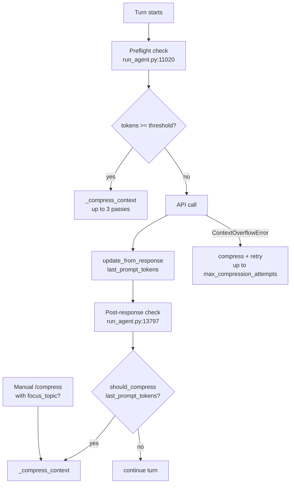

**Mechanisms (two-phase):**

1. **Cheap pre-pass** — `_prune_old_tool_results` does THREE things without an LLM call:
   - Per-tool 1-liner summaries: `[terminal] ran 'npm test' → exit 0, 47 lines`, `[read_file] read config.py from line 1 (3,400 chars)`, `[search_files] content search for 'compress' in agent/ → 12 matches`. There's a hand-rolled summarizer for ~15 tool names.
   - Dedup: identical tool results (same MD5) replaced with `[Duplicate tool output]` back-reference (keeps newest verbatim).
   - JSON-safe argument truncation for huge `function.arguments` (write_file with 50KB content).
2. **LLM summary** with 11-section structured prompt + iterative re-compression (uses prior summary as seed).

**Thresholds (`agent/context_compressor.py:382`):**

```
0%                                                      100%
│─────────────────────────────────────────────────────│
                ▲
                │
          0.50 threshold
          (floor: 64K via MINIMUM_CONTEXT_LENGTH)
```

`protect_first_n = 3`, `protect_last_n = 20`, `summary_target_ratio = 0.20` → tail token budget ≈ 20% of threshold. `_MIN_SUMMARY_TOKENS = 2000`, `_SUMMARY_TOKENS_CEILING = 12_000`.

**Anti-thrash (`context_compressor.py:479-487`):**

```python
if self._ineffective_compression_count >= 2:
    logger.warning("Compression skipped — last %d compressions saved <10%% each. "
                   "Consider /new to start a fresh session ...")
    return False  # skip; recommend user start a new session
```

---

### Claude Code (from CHANGELOG + plugin SDK; runtime is bundled and opaque)

**Triggers (5 points, contractual):**

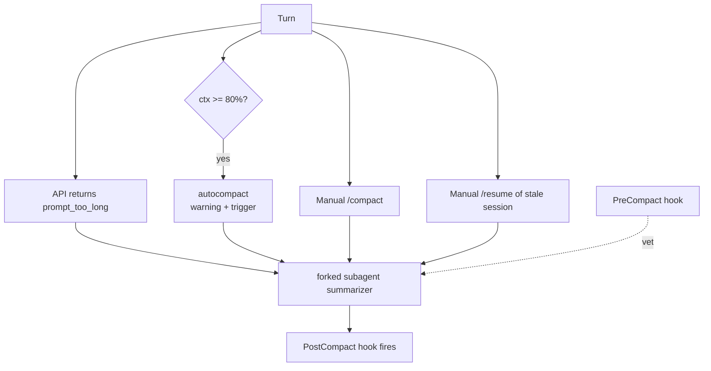

**Mechanisms (single LLM summary, multi-phase pre-strip):**
- Strip "heavy progress message payloads" (2.1.41)
- Strip PDF/document blocks (2.1.37)
- **Preserve images** in the summarizer request specifically so the prompt-cache prefix stays warm and the next call's cache HITs instead of MISSes (2.1.60)
- Forked subagent summarizer with its own context budget (the `/compact` request itself can overflow → fix in 2.1.93)

**Thresholds:**

```
0%                                                      100%
│─────────────────────────────────────────────────────│
                              ▲                       ▲
                              │                       │
                         0.80 auto-              ~0.98 hard
                         compact                  block
                         (since v1.0.51)         (effective
                                                  ctx, reserves
                                                  output tokens)
```

`0.80` is the *warning + auto-trigger* level. The intended *blocking* limit (where API requests are refused) is `~98%` of the **effective** context window (full window minus max output tokens reserved). Regressed to `~65%` once; fixed in v2.1.14.

**Anti-thrash + circuit breaker:**
- 3 consecutive auto-compaction failures → stop (v2.1.44, "circuit breaker").
- Context refills to the limit immediately after **3 compactions in a row** → halt with actionable error (v2.1.50).
- Token estimator over-counted thinking/tool_use blocks → premature compaction; fixed in v2.1.44.

**Hooks:**
- `PreCompact` — stdin gets `{session_id, transcript_path, cwd, permission_mode, hook_event_name}`. Exit code 2 or `{"decision":"block"}` veto.
- `PostCompact` — fires after compaction succeeds.

**Env-var kill switches:** `DISABLE_COMPACT`, `CLAUDE_CODE_MAX_CONTEXT_TOKENS`, `CLAUDE_CODE_MAX_OUTPUT_TOKENS`, `CLAUDE_CODE_DISABLE_1M_CONTEXT`.

---

## Side-by-side comparison

| Concern                       | Freyja today                                              | Hermes-Agent                                    | Claude Code                                              |
| ----------------------------- | --------------------------------------------------------- | ----------------------------------------------- | -------------------------------------------------------- |
| **Primary threshold**         | 0.80 halve / 0.90 summary                                 | **0.50** of window                              | **0.80** auto / ~0.98 hard                               |
| **Minimum-context floor**     | none                                                      | `MINIMUM_CONTEXT_LENGTH = 64_000`               | unknown                                                  |
| **Effective-window math**     | no (uses full window)                                     | no (uses full window)                           | **yes** (reserves max_output_tokens)                     |
| **Pre-request check**         | yes                                                       | yes                                             | yes (auto-compact warning at 0.80)                       |
| **Post-response check**       | yes                                                       | yes (uses `prompt_tokens` only)                 | implicit                                                 |
| **On `ContextOverflowError`** | three-tier cascade (3 attempts)                           | compress + retry                                | forked subagent re-summary                               |
| **On rate-limit retry**       | pre-compact before retry                                  | not explicit                                    | not documented                                           |
| **On "too much media"**       | tighter image prune + retry                               | n/a                                             | image-dimension errors suggest `/compact` (2.1.41)       |
| **Manual command**            | `/compact`                                                | `/compress <focus_topic>`                       | `/compact`                                               |
| **Focus-topic compaction**    | **no**                                                    | yes                                             | yes (mentioned in `/compact`)                            |
| **Restore-time compaction**   | yes (post-restore if > 0.9)                               | n/a (resume creates new session)                | yes (resume of stale large sessions)                     |
| **Image strategy**            | **prune** old screenshots                                 | count as 1600 tokens flat                       | **preserve for prompt-cache reuse**                      |
| **Tool-result strategy**      | halve content (head + tail truncate)                      | **per-tool 1-liner summaries** + MD5 dedup      | strip progress payloads + PDFs                           |
| **JSON-safe arg truncation**  | no                                                        | yes (`_truncate_tool_call_args_json`)           | unknown                                                  |
| **Secret redaction**          | **no**                                                    | input + output (`redact_sensitive_text`)        | unknown                                                  |
| **Structured summary**        | 9 sections                                                | **11 sections** + focus-topic mode              | unknown (opaque bundle)                                  |
| **Iterative re-compaction**   | **no** — fresh summary each time                          | **yes** — prior summary is the seed             | unknown                                                  |
| **Anchor latest user msg**    | implicit via `_find_safe_split` (no explicit guarantee)   | **explicit** (`_ensure_last_user_message_in_tail`, bug #10896) | unknown                                  |
| **Thrash detector**           | **no** (only overflow-cascade `max_attempts`)             | yes (skip if last 2 saved <10%)                 | yes (3-loop halt)                                        |
| **Circuit breaker**           | overflow cascade only                                     | yes (cooldowns: 60s transient / 600s permanent) | yes (3-failure circuit breaker)                          |
| **Hooks**                     | no                                                        | no                                              | `PreCompact` (vetoable) + `PostCompact`                  |
| **Env-var kill switch**       | no                                                        | yes (`auto_compress = false`)                   | `DISABLE_COMPACT`                                        |
| **Fallback on summary fail**  | static templated summary (`_generate_fallback_summary`)   | static marker; cooldown 60s/600s                | n/a (forked agent has its own context)                   |
| **Persistence after compact** | summary appended as `is_compaction=True` entry            | new session created in SQLite, parent linked    | session metadata preserved (plan mode + title)           |

---

## Token-band visualization (per system)

Where each mechanism fires across the lifetime of a single context window:

```
Freyja today
  0 ─────────────────────────────────────────────────► window
                                    ▲       ▲
                                    │       │
                              halve(0.80)  summary(0.90)
                              ┌─────┴───────┴──────────┐
                              │ image prune always-on  │
                              └────────────────────────┘
                                          ▲
                                    overflow → cascade

Hermes-Agent
  0 ─────────────────────────────────────────────────► window
                  ▲
                  │
            compress(0.50, floor 64K)
            ┌─────┴────────────────────────────────────┐
            │ tool-pruning + dedup + 1-liners (cheap)  │
            │ then LLM summary (structured + iter.)    │
            └──────────────────────────────────────────┘
                              ▲▲ skip if last 2 ineffective

Claude Code
  0 ─────────────────────────────────────────────────► window
                                    ▲                ▲
                                    │                │
                              warn+auto(0.80)    hard(~0.98 of effective)
                                    │
                              image-preserve summary
                                    ▲▲▲ halt after 3 thrash
```

---

## Per-turn lifecycle, three systems in parallel

```mermaid
sequenceDiagram
    participant U as User msg
    participant F as Freyja
    participant H as Hermes
    participant C as Claude Code

    U->>F: send
    F->>F: _ensure_context_room (always image-prune; halve >0.8; summary >0.9)
    F->>F: API call
    F->>F: _handle_context_pressure_async (same tiers, real tokens)
    F-->>F: on overflow → cascade × 3

    U->>H: send
    H->>H: Preflight (estimate_request_tokens_rough incl tools)
    alt > threshold (0.5)
        H->>H: prune tool results + dedup
        H->>H: LLM summary (iterative if prior summary exists)
    end
    H->>H: API call
    H->>H: should_compress(prompt_tokens) post-response
    alt > threshold
        H->>H: same compress path
    end

    U->>C: send
    C->>C: PreCompact hook? veto?
    alt ctx > 0.80
        C->>C: warn + auto-compact (forked summarizer; preserve images)
        C->>C: PostCompact hook
    end
    C->>C: API call
    C-->>C: prompt_too_long → forked summary + retry
```

---

## Gap analysis for Freyja

Sorted by **expected impact** (token/$ savings + correctness) divided by **estimated effort**.

### Gap 1 — No thrash detector  *(easy / high)*

**Risk:** a turn where every compaction summary is itself near-window-sized can loop the overflow cascade until `MAX_COMPACTION_ATTEMPTS = 3` exhausts and the turn aborts. The user-visible failure mode is repeated "Summarization complete: X → Y tokens" logs with Y staying high.

**Both peers solve it differently:**
- Hermes: `_ineffective_compression_count` increments when a compaction saved < 10%; at 2 consecutive ineffective, skip + recommend `/new`.
- Claude Code: detects "context refills to the limit immediately after 3 consecutive compactions" → halt with actionable error.

**Proposal:** copy Hermes's pattern verbatim into `engine/runner.py` after `_attempt_compaction` returns. Track last savings as a field on `RunnerContext` and skip the next summary if ineffective count ≥ 2. Surface a `SystemEvent` so the UI can suggest a fresh session.

**Estimated effort:** 30 lines, no API surface change.

---

### Gap 2 — Re-summarizing from scratch each time  *(medium / high)*

**Cost:** every `SummaryCompaction.compact()` call re-reads the *full* transcript prefix (capped at `MAX_CHARS_TO_SUMMARIZE`) and asks the model to redo work it already did. For a long-lived session that hits 3-4 compactions, that's 3-4× the summarizer cost it should be.

**Hermes's iterative path (`context_compressor.py:833-847`):**

```python
if self._previous_summary:
    # Iterative update: preserve existing info, add new progress
    prompt = f"""...PREVIOUS SUMMARY: {self._previous_summary}
                  NEW TURNS TO INCORPORATE: {content_to_summarize}
                  Update the summary using this exact structure.
                  PRESERVE all existing information that is still relevant.
                  ADD new completed actions to the numbered list..."""
```

**Proposal for Freyja:**

1. After `append_compaction(summary)` succeeds, also stash `summary` on `SummaryCompaction` instance (e.g. `self._previous_summary`).
2. In `compact()`, walk `transcript.entries` to find the most recent `is_compaction=True` entry; if found, use the iterative prompt variant. Otherwise use the fresh-summary prompt.
3. Add a second prompt template `SUMMARY_UPDATE_PROMPT` that takes the prior summary + new turns and emits an updated structured summary.

**Estimated effort:** ~100 lines in `engine/compaction.py`, no engine API change. Test by running back-to-back manual `/compact` calls and verifying that re-summary doesn't lose information about early turns.

---

### Gap 3 — Image pruning evicts the prompt-cache prefix  *(architectural / unknown impact — measure first)*

**Background:** Anthropic's prompt cache is keyed on the *exact byte prefix* of the message list. Every time the prefix changes, the cache evicts and the next call pays full input cost (5× cache-read cost on Opus). Freyja's `prune_old_tool_result_images` mutates the prefix on every pre-request check that crosses `KEEP_RECENT_COMPUTER_IMAGES = 4`. That's potentially evicting the cache *every turn* during heavy computer-use sessions.

**Claude Code 2.1.60 explicitly addressed this:** *"Improved compaction to preserve images in the summarizer request, allowing prompt cache reuse for faster and cheaper compaction."*

**Tension:** images are big (Anthropic charges ~`width*height/750` tokens per image). Keeping them costs prefix tokens; removing them costs cache evictions. Which wins depends on:
- Whether the agent re-reads the same prefix many times (cache-favorable) or burns through one-shot.
- Image count + size vs cache TTL (1 hour for Anthropic).
- Per-call input vs cache-read rate ratio (cache-read is ~10% of input on Opus).

**Proposal (3-phase):**

1. **Measure first** — instrument the bridge to log `cache_read_tokens` vs `input_tokens` per call (we already have this in `_on_llm_call`) and report the cache hit ratio on long computer-use sessions. Today we don't know if we're getting cache hits at all.
2. If hit ratio is low, change `prune_old_tool_result_images` to mark images for omission *only* in the call where the context would otherwise overflow — leave the transcript prefix intact for the next call. Implementation: separate "transcript image count" from "request-time image count" via a per-call image filter rather than a transcript mutation.
3. Long-term: align our cache strategy with `cache_control` blocks — explicitly mark stable prefixes as cacheable in the Anthropic provider.

**Estimated effort:** Phase 1 ~10 lines (logging). Phase 2 ~200 lines of plumbing. Phase 3 is a larger provider-API rework.

---

### Gap 4 — No latest-user-message anchor  *(easy / medium-high)*

Hermes had a real bug here (#10896): `_align_boundary_backward` pulled the cut past a user message when keeping tool_call/result groups together. The latest user message ended up in the compressed middle and the summarizer wrote it into "Pending User Asks" — but the summary preamble said "respond only to messages AFTER this summary", so the model never saw the active task.

Freyja's `_find_safe_split` walks backward past `tool`/`tool_result` roles but **doesn't explicitly guarantee the latest user message survives**. If a user message is followed by a tool_use group that the model never completed (e.g. cancelled), `_find_safe_split` could plausibly cut past the user message.

**Proposal:** add `_ensure_latest_user_message_kept(split_point)` to `engine/compaction.py:SummaryCompaction`, ported directly from `context_compressor.py:1148-1193`. Walk backwards from end to find the latest user message; if its index ≥ split_point, return as-is; otherwise pull split_point down to keep it.

**Estimated effort:** ~30 lines. Add a regression test with a transcript ending in `user → assistant(tool_use) → [cut]` to verify the user message stays kept.

---

### Gap 5 — No secret redaction in summary input/output  *(easy / medium)*

Hermes does this in two passes (`context_compressor.py:686, 892`): redact before feeding to the summarizer AND redact the summary output (in case the LLM ignored the prompt and echoed back secrets verbatim). The summary persists across the session, so a leaked key sticks around.

Freyja's summary prompt asks for `[REDACTED]` substitution but doesn't enforce — it just trusts the model.

**Proposal:** add `engine/redact.py` with a regex sweep for common patterns (AWS keys `AKIA[0-9A-Z]{16}`, GitHub tokens `gh[ps]_[a-zA-Z0-9]{36,}`, Anthropic keys `sk-ant-[a-zA-Z0-9-]{90,}`, bearer-token-shaped strings). Apply once on summarizer input + once on output. Same two-pass strategy as Hermes.

**Estimated effort:** ~80 lines + test cases.

---

### Gap 6 — No per-tool 1-liner summaries  *(medium / medium)*

Hermes's pre-pass replaces old tool results with semantic summaries instead of head/tail truncation:

```
Freyja today:      [first 1KB] ... [middle truncated, request specific sections] ... [last 1KB]
Hermes equivalent: [terminal] ran `npm test` → exit 0, 47 lines output
```

For a session with 40 `terminal` calls, Hermes's pre-pass collapses the entire batch to ~40 one-liners (~2K tokens total) before any LLM is involved. Freyja's halving keeps ~2KB per tool call (~80K tokens for the same batch).

Tradeoff: Hermes's per-tool heuristics are brittle (hardcoded for ~15 tool names; falls back to generic for the rest). Adding to Freyja means writing N tool-specific summarizers and maintaining them as tools evolve.

**Proposal:** add `engine/tool_summary.py` with a `summarize_tool_call(name, args_json, result)` function. Start with the 5-6 highest-volume tools (`bash`, `read_file`, `write_file`, `edit_file`, `grep`, `glob`) and a generic fallback. Wire into `prune_old_tool_results` so any result over a threshold gets the 1-liner instead of head/tail.

**Estimated effort:** ~200 lines + a test per tool.

---

### Gap 7 — No focus-topic compaction  *(easy / low-medium)*

Hermes's `/compress <topic>` allocates 60-70% of summary budget to topic-related content, more aggressive elsewhere. Useful when a user is mid-debug and wants to keep error context but compact the exploration that led there.

**Proposal:** extend `force_compact()` in the bridge to accept an optional `focus_topic` and thread it to `SummaryCompaction.compact(focus_topic=...)`. The summary prompt gets a final clause prioritizing topic-related content. UI-side: `/compact reason for X` parses the args.

**Estimated effort:** ~60 lines.

---

### Gap 8 — No "effective context window" math  *(easy / low-medium)*

Claude Code reserves `max_output_tokens` from the window before computing the threshold percentage (v2.1.0 — fixed regression in v2.1.14). For a 1M-window Opus call with `max_tokens=64K`, the effective window is 936K. Freyja currently checks against the full window, so at 90% we have only ~36K of slack before the API actually rejects.

**Proposal:** in `_current_context_tokens` (or one level up), compute `effective_window = context_window - config.max_tokens_per_turn`. Use that as the denominator everywhere thresholds are evaluated.

**Estimated effort:** ~20 lines, no behavior change at low fill rates, more aggressive triggering near the ceiling.

---

### Gap 9 — `PreCompact` / `PostCompact` hooks  *(medium / low — only if we ship a plugin system)*

Claude Code's hook surface lets plugins veto compaction (e.g. `npm test`-style critical-block plugins veto if a file watcher is mid-flight) or react afterwards (e.g. dump the just-summarized history to disk for offline review). Freyja's already shipping subagents + computer use; long-running tool work *would* benefit from veto rights.

But this is a substantial API surface to commit to. Skip unless we're already building a hook system for other reasons.

**Estimated effort:** ~300 lines (event bus, JSON contract, IPC plumbing) — but most of the cost is the surface commitment, not the code.

---

### Gap 10 — Threshold philosophy: late vs early  *(superseded; see next section)*

Hermes triggers at **50%** with a 64K floor. Freyja triggers at **80–90%**. Claude Code at **80%**. Different philosophies:

- **Late (Freyja/Claude Code):** model sees more verbatim history, summarizer rarely runs, tool bursts can push past the window.
- **Early (Hermes):** summarizer runs often (cost!), headroom always available, cache-friendlier.

**Decision: lower aggressively, but only as part of the cooperative architecture below.** See *"Proposed Freyja architecture: cooperative early-trigger compaction"* — we're committing to a five-band ladder starting at 15% (cheap pruning), with LLM summarization triggered by the *agent* at 40%+ rather than by the runtime at 90%. This subsumes the "just tune the threshold" framing here.

The context-rot research (Chroma) makes a strong correctness case for the lower threshold even setting aside cost: model quality degrades on long context well before window-fill.

---

## Decision matrix

| Gap | Recommendation | Reason |
|---|---|---|
| 1. Thrash detector | **Ship** | Cheap, prevents an infinite-loop failure mode we currently have no guard against. |
| 2. Iterative re-compaction | **Ship** | Tangible token/$ savings on every long session; small code change, no API surface. |
| 3. Image cache preservation | **Measure first** | Real ambiguity. Add cache-hit logging now; decide on Phase 2 with data. |
| 4. Latest-user-message anchor | **Ship** | Cheap and prevents a real correctness bug. |
| 5. Secret redaction | **Ship** | Cheap, defense in depth, summary persists. |
| 6. Per-tool 1-liner summaries | **Consider** | Real wins on tool-heavy sessions but maintenance burden. Maybe ship for top 5 tools only. |
| 7. Focus-topic compaction | **Consider** | Useful but not load-bearing. Ship after #1-5. |
| 8. Effective-window math | **Ship** | Trivial, more correct near the ceiling. |
| 9. `Pre/PostCompact` hooks | **Skip** | Too much API surface to commit to without a broader plugin story. |
| 10. Threshold tuning | **Wait** | Need telemetry first; current values are defensible. |

**Phasing:**
- **Phase 1 (this week):** #1, #4, #5, #8 — small contained changes, total ~150 LOC.
- **Phase 2 (next):** #2 — iterative re-compaction, needs careful prompt work + a test.
- **Phase 3 (after telemetry):** #3 — image cache preservation, measure first.
- **Backlog:** #6, #7. **Won't do:** #9 (for now).
- **Gap 10 (threshold tuning) is subsumed by the next section** — we're choosing to commit to a much lower trigger band as part of the cooperative architecture below.

---

## Proposed Freyja architecture: cooperative early-trigger compaction

> The Gap section above is "catch up to peers." The speculative section below is "outrun the field at the research horizon." *This* section is the bigger near-term architectural bet that ties them together: an opinionated design choice we want to commit to.

### The thesis

Today, the runtime decides when to compact based on hard token thresholds (80% halve / 90% summary). The agent has no agency. This is wrong on two axes:

1. **The agent knows things the runtime doesn't.** Whether the current moment is a natural break in its work, whether the upcoming turn is going to be tool-heavy, whether the user just asked a question that depends on the very content we're about to evict. The runtime sees *tokens*; the agent sees *meaning*.

2. **Every compaction decision is supervised training data we're throwing away.** When Opus chooses to compact at turn 47 (after a clean test run) vs at turn 53 (mid-debugging chain), that choice — combined with the downstream outcome — is exactly the supervised signal we need to train a small compaction policy. Today we generate zero such signal because the runtime is in control.

**The proposed architecture:** runtime as *pressure sensor*; agent as *decision maker*; with a fallback safety net at the high end. Compaction happens **earlier** (informed by context-rot research), happens **cooperatively** (informed by the agent's judgment), and every decision is captured as training data for the specialists we'll build later.

### The pressure ladder

Five bands, escalating in invasiveness:

```
┌─────────────────────────────────────────────────────────────────────┐
│ Band              Threshold      Action                              │
├─────────────────────────────────────────────────────────────────────┤
│ Clean             0–15%          No intervention                     │
│ Cheap pruning     15–25%         Runtime: tool-result 1-liners,      │
│                                  image trim, dedup. Silent to agent. │
│ Awareness         25–40%         Runtime: append [ctx: 32%] to every │
│                                  observation. Agent passively        │
│                                  informed.                           │
│ Soft suggestion   40–60%         Runtime: "consider summarize at     │
│                                  next break" advisory + pre-turn     │
│                                  system note. Agent decides timing.  │
│ Strong suggestion 60–80%         Runtime: mid-stream injection when  │
│                                  agent crosses threshold during a    │
│                                  turn. Agent expected to act before  │
│                                  end of current turn.                │
│ Forced fallback   80–95%         Runtime: rejects all tool calls     │
│                                  except summarize_context. Agent     │
│                                  must compact before continuing.     │
│                                  Logged as "fallback triggered".     │
└─────────────────────────────────────────────────────────────────────┘
```

Compared with today (80% halve → 90% summary, runtime-driven, no agent involvement):

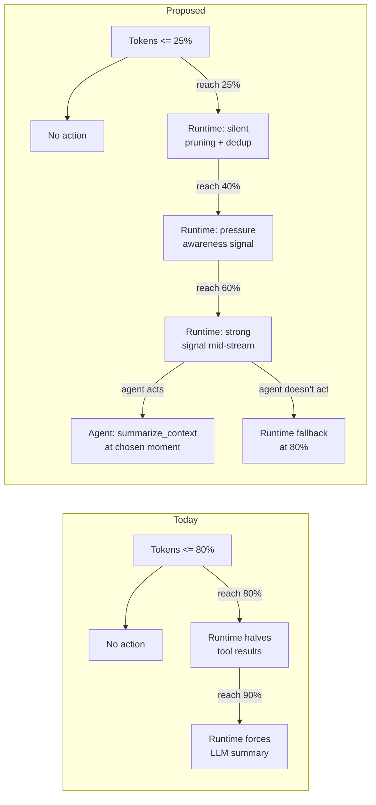

Why these specific numbers:

- **15–25% cheap pruning** is *free*: dedup of repeated tool reads, halving giant tool results, image trim. No agent involvement, no LLM call. Context-rot research (Chroma) shows quality starts degrading at surprisingly small fills; clearing the obvious garbage at 25% is almost certainly a quality win.
- **25–40% awareness** is purely informational. Agent sees pressure, doesn't have to act. Lets us measure whether *visibility alone* changes model behavior (Anthropic's models often pace themselves well when given metadata about their state).
- **40–60% soft suggestion** is where the cooperative protocol earns its keep. Agent is asked to compact at the next natural break. If it does, we get a high-quality timing signal; if it doesn't, runtime escalates.
- **60–80% strong signal** is mid-turn injection (see Channel 3 below). The agent should compact during the current turn, not "soon."
- **80–95% forced fallback** is the safety net. Runtime refuses everything except `summarize_context`. Logged because every fallback is a label for "the agent missed the cue" — useful training data for the trigger policy.

### Three pressure-signaling channels

The runtime communicates pressure to the agent through three increasingly-invasive channels. Each turns on at a specific band.

#### Channel 1: Per-observation token tag *(from 25%, always-on)*

Every tool result, every API observation, gets a token-usage suffix appended by the runtime before being returned to the model:

```
... (tool output) ...

[ctx: 32% (32,500 / 100,000) · no action needed]
```

At 40%:

```
[ctx: 42% (42,000 / 100,000) · consider summarize_context() at next break]
```

At 60%:

```
[ctx: 64% (64,000 / 100,000) · summarize_context() recommended before continuing]
```

This is Context-1's continuous-awareness pattern, extended to start earlier and escalate gradually. Implementation: post-process tool-result strings before sending to the API. ~30 LOC in the bridge's tool-result handler.

#### Channel 2: Pre-turn system note *(from 40%)*

The system message for each API call gets a pressure block appended:

```
[FREYJA CONTEXT PRESSURE]
Current usage:    47% of 100k token window.
Last compaction:  18 turns ago (turn 23).
Recommendation:   call summarize_context() at the next natural break in your
                  work (after current task completes, before starting a new
                  one). Use scope='since_last_compaction' for iterative
                  extension of the previous summary.
```

Why pre-turn rather than mid-turn for this channel: pre-turn system notes don't fragment in-flight reasoning. The agent reads it during the planning phase of its turn and incorporates the pressure context into the turn's plan.

#### Channel 3: Mid-stream injection *(from 60%, or on threshold crossing during a turn)*

The most novel channel — and the one that needs design care. **Three implementation approaches**, ordered easiest → most invasive:

**Approach A — Append to next tool result *(recommended)*.** The agent's natural cadence is `assistant_text → tool_use → tool_result → assistant_text → tool_use → ...`. When the agent issues a tool call and the runtime detects pressure crossed a threshold *during* the streaming of that tool call, the runtime prepends an advisory to the tool result:

```
[!CTX PRESSURE: window crossed 60% during this turn (was 58% at turn start).
Finish your current immediate goal, then call summarize_context() before
issuing more tool calls. Tool calls beyond ~5 more may be rejected.]

[actual tool output here]
```

Piggybacks on the natural tool-result cycle. Zero stream interruption. Maintains conversational structure. Implementation: ~40 LOC in `tool_result` emit path.

**Approach B — Inject a synthetic `ctx_advisory` tool result.** Mid-turn, when pressure spikes, the runtime invents a `tool_result` for a tool the agent never called:

```jsonc
{
  "type": "tool_result",
  "tool_use_id": "ctx_advisory_001",
  "content": "[CTX_ADVISORY] Pressure rising — at 67% as of this moment."
}
```

The agent sees a tool_result it didn't request. Modern Anthropic models handle this gracefully (treat it as a system intrusion). Slightly more invasive but works even during tool-less reasoning stretches.

**Approach C — Anthropic interleaved-thinking metadata.** When using extended thinking, the runtime can inject a metadata block into the next thinking segment. Most invasive (touches the model's reasoning surface) but lowest-latency.

**Recommendation: ship Approach A first.** It's the cleanest and composes well with the natural reactor pattern. Reserve B for tool-less reasoning stretches if measurement shows the agent doesn't get the signal often enough. C is research-grade.

### The new agent-facing tool surface

A single new tool, `summarize_context`, with arguments that let the agent express its intent:

```python
def summarize_context(
    *,
    scope: Literal[
        "all",                    # compact everything before last N turns
        "early",                  # compact only the oldest material
        "tool_results_only",      # leave assistant reasoning intact
        "exploration_only",       # compact reads/searches, keep edits
        "since_last_compaction",  # iterative — extend the prior summary
    ] = "since_last_compaction",
    level: Literal["episode", "chapter", "auto"] = "auto",
    preserve_facts: list[str] = [],   # verbatim strings the summary must keep
    reason: str = "",                 # free-form rationale (becomes training label)
) -> SummarizeContextResult:
    """Request compaction of conversation history.

    Returns:
      - tokens_freed: how much context was reclaimed
      - summary_excerpt: first ~200 chars of the produced summary
      - level_used: 'episode' / 'chapter' (the system picks if auto)
      - resumed_from_previous: True if this iteratively extended an
        earlier summary instead of starting fresh
    """
```

**Key design choices:**

- **`scope` is semantic, not numeric.** The agent expresses intent ("the exploratory work is over, compact that part") rather than picking turn ranges. The runtime maps semantic scope to actual ranges.
- **`level` defaults to auto.** Runtime picks episode for ~10–30 turns, chapter for ~30–80, session for 80+. The agent doesn't need to know the level taxonomy unless it wants to override.
- **`preserve_facts` is the agent's safety net.** Any short string in this list is required to appear verbatim in the produced summary. Catches the "summarizer paraphrased away my API key / file path / error message" failure mode.
- **`reason` is free-form text** — and it becomes training data. The agent explains *why* it's compacting now ("finished refactoring auth.py, about to start tests, want clean context"). Across thousands of sessions, these become natural-language labels for "when to compact."

**Resolution map** (what each `scope` value actually does):

| Scope                       | Resolves to                                                                                          |
| --------------------------- | ---------------------------------------------------------------------------------------------------- |
| `all`                       | Everything from turn 1 through `turn_now - keep_recent_count`. Full hierarchical summary.            |
| `early`                     | The oldest 50% of un-compacted turns. Preserves middle and recent context verbatim.                  |
| `tool_results_only`         | All tool results in compactable range → 1-liner summaries (Gap 6). Assistant text + user msgs intact.|
| `exploration_only`          | Tool calls of types `read_file`, `grep`, `glob`, `web_search` get pruned. `edit_file`, `bash` stay.  |
| `since_last_compaction`     | Iterative extension (Gap 2) of the prior compaction's summary with new turns since.                  |

### How this composes with iterative + hierarchical summaries

The cooperative protocol is the *trigger layer*. The summary mechanism underneath is the iterative/hierarchical infrastructure (Gap 2 + speculative section C1). They compose:

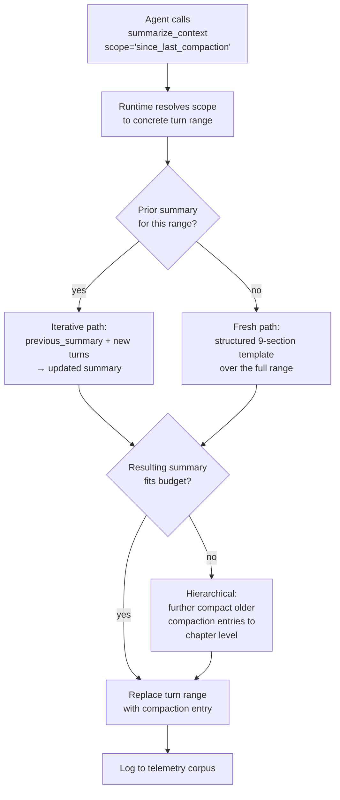

The first compaction in a session creates an episode-level summary (9-section template). The second uses the iterative path (extends the first). By the 5th-6th compaction, the system may notice that three episode summaries cover related work and trigger an automatic chapter-level rollup — collapsing three episode summaries into one chapter summary (denser, narrative-flavored, ~5 sections).

Concrete level templates:

| Level    | Token budget | Sections                                                                 | Best for           |
| -------- | ------------ | ------------------------------------------------------------------------ | ------------------ |
| Episode  | 800–2000     | Goal, Files, Actions, Decisions, State, Pending, Errors, Refs, Open Qs   | Single task / unit |
| Chapter  | 1500–3000    | Theme, Outcomes, Key Decisions, Persistent State, Loose Threads          | A phase of work    |
| Session  | 200–500      | One-liner per resolved task; flat key-value of persistent facts          | Whole session      |

The agent never has to specify which level; the runtime picks based on the compacted range size.

### The training-data architecture (the strategic prize)

This is the part that pays for everything else. Every interaction with the cooperative compaction surface produces labeled supervised data. Three datasets emerge naturally:

#### Dataset 1: "When to compact" — decision-policy corpus

Every time the runtime signals pressure at any band, we record:

```python
@dataclass
class CompactionDecisionPoint:
    session_id: str
    turn_id: int
    pressure_pct: float
    band: Literal["awareness", "soft", "strong", "fallback"]

    pressure_history: list[tuple[int, float]]
    # ↑ (turn_id, pct) — how long has the agent been in pressure?

    recent_tool_pattern: list[str]
    # ↑ last 10 tool names — was the agent in an exploratory burst,
    #   an edit cycle, a test run?
    recent_topic_embedding: list[float]
    # ↑ semantic state of the recent conversation

    agent_choice: Literal[
        "accept_now",       # called summarize_context immediately
        "accept_after_n",   # called it after N more turns
        "defer",            # acknowledged but didn't act
        "ignore",           # never acted; runtime hit fallback
    ]
    n_turns_until_act: Optional[int]
    scope_chosen: Optional[str]
    reason_text: Optional[str]

    # Retroactive labels (filled by replay analyzer N turns later):
    timing_quality: float    # was the chosen moment a natural break?
    quality_score: float     # did the agent's subsequent work succeed?
```

Each row pairs `(pressure context) → (agent's decision) → (outcome)`. Train a small classifier:

```
INPUT:  pressure_pct, pressure_history, recent_tool_pattern,
        recent_topic_embedding, time_since_last_compaction
OUTPUT: accept_now | wait_n_turns | defer
```

Once we have ~5K decision points labeled by outcome, this classifier is trainable. Likely 7B base + LoRA. Replaces "make the call via Opus" with a $0.001-per-decision specialist.

#### Dataset 2: "What to compact" — scope-policy corpus

Same decision-point structure, but the label is the chosen `scope`:

```
INPUT:  full state at the moment of the agent's compaction call
OUTPUT: scope = all | early | tool_results_only | exploration_only | since_last_compaction
```

Train a separate scope policy. Or — if scope correlates strongly with simple features (e.g. "after many file edits, exploration_only is usually right") — encode as rules and validate against the corpus.

#### Dataset 3: "How to compact" — summary-quality corpus

For every executed compaction we have `(full_prefix, summary, downstream_continuation)`. The summary's *quality* is judged retroactively by:

- Did the agent need to re-fetch evicted content (via `recall()` or direct re-tool-use) in the next 10 turns?
- Did the agent's task complete successfully?
- Did the user correct or clarify after the compaction?

This is the SFT corpus for **A1 (distilled compactor)** in the speculative section. The cooperative protocol *generates A1's training data as a side-effect of normal operation* — solving the chicken-and-egg problem of "we want to train a compactor but we have no data."

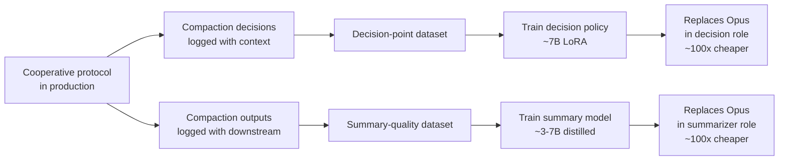

**Expected timeline:**
- Decision points: ~1000/week from current Freyja usage → ~50K decisions in a year. Plenty for both classifiers.
- Summary-quality rows: ~100/week (one per actual compaction) → ~5K rows in a year. Borderline for SFT; sufficient with LoRA + augmentation (e.g. each row spawns multiple synthetic variants by perturbing the prefix).

### Migration path (4 phases)

Don't flip the threshold from 80% to 25% on day one. Phased rollout, each phase gated by telemetry.

#### Phase 1: Plumbing + observation *(weeks 1–3, ~600 LOC)*

Ship:
- Telemetry instrumentation (`CompactionDecisionPoint` recorder); every signal logged whether the agent reacts or not.
- Cheap pruning at 25% (tool-result 1-liners, image trim, dedup) — silent to agent.
- Pressure signal channel 1 (per-observation tag) starting at 25%.
- Modestly lower existing thresholds (try 70%/82%) to start measuring at slightly more aggressive bands.

**Don't ship yet:** the `summarize_context` tool, channels 2–3, the agent-driven trigger logic.

**Goal:** establish baseline. Measure what % of sessions hit each band. Measure whether *visibility alone* changes model behavior (Anthropic models often pace themselves when given metadata).

#### Phase 2: Agent participation, runtime still in control *(weeks 4–8, ~800 LOC)*

Ship:
- `summarize_context` tool — but runtime still forces compaction at the existing thresholds as a fallback.
- Channels 2 and 3 (pre-turn note, mid-stream injection via Approach A).
- When the agent calls `summarize_context`, runtime executes it. AND runtime-triggered fallback still fires at 80%.
- Iterative + hierarchical summary paths fully wired (closes Gap 2).

**Goal:** observe how often the agent voluntarily compacts when given the option. Build the decision-point dataset.

**Critical telemetry:** "agent called summarize_context at pressure X with scope Y, reason Z." This is the corpus for Datasets 1–3.

#### Phase 3: Shift control, lower fallback *(weeks 9–14, ~400 LOC)*

Ship:
- Make agent-driven compaction the *primary* mechanism.
- Drop runtime fallback from 80% → 50% (well below the runaway-context-rot zone).
- If the agent doesn't act, runtime forces at 50%; logged as "fallback fired, agent missed cue."

**Goal:** validate that agent-driven compaction reaches its natural cadence. Should see runtime fallback firing on < 20% of sessions (agent is making the calls itself most of the time).

#### Phase 4: Train the specialists *(months 4–6)*

Once Datasets 1–3 each have ≥ 5K rows:
- Train decision policy (LoRA on 7B base, possibly Qwen3-Coder or similar).
- Train summary policy — either fine-tune from scratch on Dataset 3, or start from Context-1 weights and adapt.
- Roll out specialists behind a feature flag; A/B against the prompted-Opus baseline.

**Exit criterion:** specialists match or beat Opus on (task success rate / total spend), measured over ≥ 1000 sessions per arm.

### Risks and mitigations

| Risk                                                                            | Likelihood | Mitigation                                                                                              |
| ------------------------------------------------------------------------------- | ---------- | ------------------------------------------------------------------------------------------------------- |
| Agent ignores all signals, runs to 95% before fallback                          | Med        | Fallback at 50% from Phase 3 onward — agent can't run away even if it tries                              |
| Agent over-compacts to "look responsible," wastes tokens on tiny ranges         | Med        | Runtime rejects obviously-bad calls (e.g. compacting only last 3 turns); minimum-savings threshold       |
| Mid-stream injection fragments reasoning, hurts task quality                    | Low-Med    | Ship Approach A (tool-result piggyback) first; measure quality delta before adding B or C                 |
| Agent's `reason` field becomes garbage noise instead of useful labels           | Low        | Pre-fill structured prompt; reject obviously-fluffy reasons in the corpus                                 |
| Training corpus reflects Opus's biases; trained model inherits them             | Med        | Diversify: run cooperative protocol with Sonnet + Haiku in shadow; mix model decisions into training      |
| Lowering threshold cascades into compaction-too-often → user-visible cost spike | Med-High   | Phase 1 measurement-first; we set thresholds based on real telemetry, not theory                          |
| Iterative summary drifts semantically across N rounds                           | Med        | Periodic "fresh" rebuilds — every 5th compaction does a full re-summarization from raw transcript          |
| Compaction during a sub-agent's active turn corrupts working state              | Med        | `summarize_context` blocked while any sub-agent is running; queue and resolve after sub-agent completes    |
| Agent calls `summarize_context` repeatedly to game the reward signal during training | Low-Med  | Reward function in Phase 4 penalizes redundant compactions; require minimum time / turns between calls    |

### Why this is the right bet for Freyja specifically

Three reasons this architecture fits Freyja better than it would fit Claude Code or Hermes:

1. **Freyja already has the subagent + branching primitives.** The "sleep-time compaction subagent" path (speculative section E') is wired in days, not weeks. The agent-driven cooperative protocol is a slightly different shape but reuses the same machinery.

2. **Freyja is desktop-native and user-owned.** We can ship opt-in telemetry without the privacy review SaaS would face. The corpus we collect is *our* corpus; the models we train can ship locally.

3. **The user base is technical.** Power users will *use* `summarize_context()` consciously. They'll write good `reason` strings. They'll pin facts intentionally. The training data quality from Freyja's user base is higher than any cloud-only product could collect.

### What this section is asking us to commit to

The shorter version of all the above: **make compaction a cooperative protocol with the agent as primary decision-maker, runtime as pressure sensor + safety fallback, and treat every decision as training data for a future specialist.**

Three concrete commitments:

1. **Lower thresholds + add cooperative channels** in Phase 1–2 (next 8 weeks of work; ~1400 LOC).
2. **Capture decision-point telemetry from day one** so Datasets 1–3 accumulate from the moment the new system ships. The cooperative protocol *generates A1's training data as a side effect of normal operation*.
3. **Commit to training specialists at month 4** when corpus is sufficient — this is the bet that pays back the cooperative-protocol investment.

The Decision Matrix above ships incremental fixes; the speculative section below explores the research horizon. This section is the architectural commitment that connects them.

---

## Beyond the state of the art — speculative directions

The Gap section above is "catch up to peers." This section is "outrun them." Everything below is research-grade — speculative, often unproven, but plausibly buildable on Freyja's existing surfaces.

### Premise: compaction-as-summary is a local optimum

Every system we surveyed treats compaction as: *take a transcript prefix, ask an LLM to write a paragraph summary, replace the prefix with the paragraph*. The summary is generated *outside* the agent's loop, *opaque* to the agent, and *static* — nothing about the agent's downstream behavior feeds back into improving the next summary.

A different ontology is possible:

| Dimension       | State of the art              | Frontier opportunity                                    |
| --------------- | ----------------------------- | ------------------------------------------------------- |
| **Output**      | flat textual summary          | typed graph + vectors + plan + diff + bookmarks         |
| **Generator**   | general LLM with a prompt     | distilled small model trained on session rollouts       |
| **Trigger**     | token-count heuristic         | learned policy maximizing task success / cost           |
| **Locality**    | one-shot at the end           | continuous (bookmarks, self-summary every turn)         |
| **Loop**        | open                          | closed (downstream success feeds compactor training)    |
| **Recoverability** | summary is terminal         | compaction is reversible / re-expandable                |
| **Storage**     | inline in transcript          | tiered (hot transcript / warm vector / cold queryable)  |

The rest of this section explores nine themes against that backdrop. Each idea has a **build vs research** tag: *build* = engineering, weeks; *research* = needs experimentation, months.

---

### 2026 state of the field — primary-source reading list

Four threads of recent work directly relevant to what we're doing. Each has shipped artifacts (papers, weights, SDKs) we can build on rather than reinvent.

#### Context rot (Chroma research, July 2025 → ongoing) — the foundational constraint

**Finding:** every frontier LLM tested degrades as input length grows, *even when the window is nowhere near full*. Chroma tested 18 models (GPT-4.1, Claude 4 family, Gemini 2.5, Qwen3). At 32k input, retrieval accuracy drops 30%+ vs. 4k input. At 100k, the quadratic attention pattern means ~10B pairwise relationships compete for the model's attention budget; the result is *erratic, not just slow*.

**Three distinct failure modes:**

1. **Lost-in-the-middle.** Attention peaks at start + end of context. A fact placed in the middle of a 32k context recalls at ~50% of its 4k baseline accuracy.
2. **Distractor interference.** Semantically-similar-but-irrelevant content actively misleads the model. The agent that read 12 not-quite-right StackOverflow answers will produce worse code than the agent that read zero.
3. **Recency-bias collapse on coherent text.** Paradoxically, models score *higher* on shuffled context than on coherent context for retrieval tasks — coherent text creates a positional "rhythm" the model rides into recency bias, while shuffled text forces more uniform attention.

**Implication for compaction design:** compaction isn't only about fitting tokens in the window — it's about *avoiding the in-window degradation that happens long before overflow*. This flips a key assumption:

```
Old assumption (Freyja today):
  Compact when window full → preserve verbatim as long as possible.

New assumption (post-context-rot):
  Compact earlier and more aggressively → fewer distractors = better
  reasoning, even at the cost of less verbatim recall.
```

Hermes-Agent's 50% threshold (vs our 80/90) starts looking less like over-eagerness and more like *correctness optimization*. If we believe Chroma's findings, we may be running on degraded context for hours of every Opus session.

#### Chroma Context-1 (March 2026) — specialist retrieval subagent with RL-trained self-pruning

The single most relevant artifact to compaction-as-trainable in 2026.

- **20B dense model, derived from `gpt-oss-20b`, MXFP4-quantized at inference.** Apache 2.0 weights on Hugging Face. Trained on **~8,000 synthetically-generated multi-hop retrieval tasks** across Web / Finance (SEC filings) / Legal (USPTO) / Email (Enron+) domains.
- **No summarization.** Quote: "deliberately avoided lossy compression... to preserve evidence fidelity." Compaction is *selective document eviction* via a `prune_chunks(chunk_ids)` tool call.
- **Three-pressure-point harness:**
  - **Continuous awareness:** every turn appends `[Token usage: 14,203/32,768]` to the observation.
  - **Soft threshold:** at ~24k tokens, a synthetic system message suggests pruning.
  - **Hard cutoff:** at the configurable limit, *all tool calls except `prune_chunks` are rejected outright*. Forced compaction.
- **RL reward** = F1 on the final answer + trajectory recall (was the relevant document seen?) + final answer bonus. The model learns *behavioral* compaction — what to keep based on whether it pays off downstream.
- **0.941 prune accuracy** (vs 0.824 for the base `gpt-oss-20b`). Matches or beats Opus-4.6 on Web/Finance/Legal/Email benchmarks at **10× faster, 25× cheaper inference** (~400-500 tok/s on a B200).
- **Role:** designed as a *retrieval subagent* under a frontier answering model. Not a drop-in replacement; sits *before* the main model in an answer-generation pipeline.

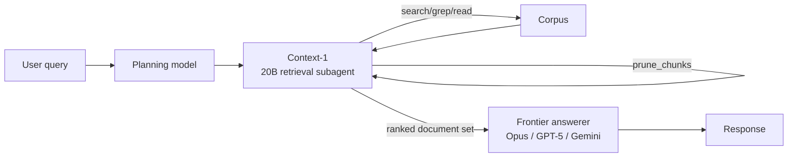

**What it validates:** in-loop, model-driven pruning via tool call beats out-of-loop LLM summarization, at least for retrieval-shaped work. Theme **H2** in our doc (`recall` tool + agent-driven pruning) is exactly this pattern.

**Caveat:** Context-1 is trained for *retrieval* (find documents in a corpus). Freyja's compaction needs to handle *agentic work* (tool calls, file edits, sub-agent results). The training objective and corpus differ. But: the recipe (RL with downstream-success reward, 20B dense, MXFP4) is directly portable.

#### Letta / MemGPT (Berkeley → company, sleep-time compute v0.7.0)

**Three-tier memory architecture** (validates our B1 hot/warm/cold proposal — they got there first):

| Tier            | Lives                      | Access pattern           | Analog            |
| --------------- | -------------------------- | ------------------------ | ----------------- |
| Core memory     | inside context window      | direct read/write        | RAM               |
| Recall memory   | external, searchable       | tool call (search)       | disk cache        |
| Archival memory | external, queryable        | tool call (query)        | cold storage      |

**Sleep-time compute** ([arxiv 2504.13171](https://arxiv.org/abs/2504.13171)):

- Letta creates **two agents per session**:
  - **Primary agent** — fast model (e.g. `gpt-4o-mini`), no memory-management tools, handles user-facing turns.
  - **Sleep-time agent** — larger model (`gpt-4.1`, Sonnet 3.7), owns memory-editing tools, runs during idle.
- Sleep-time agent has read+write access to *both* its own state and the primary's core memory.
- Memory operations: consolidation (raw context → "learned context"), promotion (core → recall → archival), compression, rewriting for clarity.
- Pareto improvement on AIME / GSM math benchmarks (specific numbers not in the public blog but referenced in the paper).
- Shipped feature in Letta 0.7.0 with API + Letta Code reference implementation.

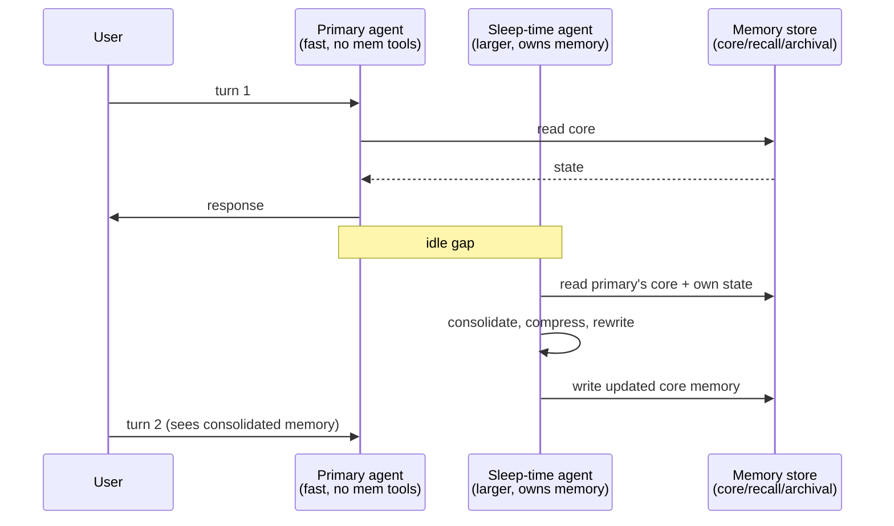

**What it validates:** asynchronous compaction is real and shipping. Our `force_compact` is synchronous and blocks the turn; sleep-time compute moves it to idle. Freyja already has the subagent machinery to do this — we'd just need a new "compactor subagent" role.

**Failure mode:** if sleep-time work is interrupted (user types a new message), partial writes corrupt memory. Letta's solution isn't fully documented; the obvious answer is transactional writes (stash changes; commit only on completion).

#### Mem0 + Mem0g (production memory layer, 2025-26)

**Mem0** is a Python SDK for agent memory ([github.com/mem0ai/mem0](https://github.com/mem0ai/mem0)). Two variants:

- **Base Mem0** — vector store + text memories. Trades 6 percentage points of accuracy against full-context for **91% p95 latency reduction (1.44s vs 17.12s)** and **90% fewer tokens**.
- **Mem0g** — adds a directed labeled knowledge graph alongside the vector store. Closes the accuracy gap to <5 points while staying at 2.59s p95.

**Mem0g extraction pipeline:**

1. *Entity extractor* — identifies nodes (people, devices, locations, preferences, schedules).
2. *Relations generator* — infers labeled edges connecting them.
3. *Conflict detector* — flags when new info contradicts existing graph; resolution deferred to retrieval time or async.

**Four principles** from their 2026 token-optimization playbook ([mem0.ai/blog/the-2026-token-optimization-playbook](https://mem0.ai/blog/the-2026-token-optimization-playbook-cut-ai-agent-memory-costs-3%E2%80%934x)):

1. **Single-pass ADD-only extraction** — one LLM call per memory write; defer conflict resolution. Cuts write-time LLM calls 60-70%.
2. **Entity linking + lightweight graph relationships** — small graph over the vector store enables relational queries.
3. **Agent-generated facts as first-class memories** — let the agent emit explicit memory entries (e.g. `user_preference: lower thermostat to 68°F at bedtime`) rather than relying on extraction over prose.
4. **Multi-signal retrieval** — vector + graph traversal + temporal recency + metadata, not just semantic.

**Reported aggregate:** 72% token savings (594 → 166 tokens on 24-entry stores), 91% recall on LoCoMo long-horizon benchmarks. They publish results but not full architectural prompts.

**What it validates:** Themes **B2** (knowledge graph) and **B4** (episodic/semantic split) — Mem0g is essentially what we sketched. The graph closes most of the accuracy gap that pure vector recall opens; that's important data.

---

### How this changes our priorities

The 2026 field work pushes three of our themes from "speculative" to "validated, just need to build":

1. **B1 (tiered memory) is Letta's three-tier architecture verbatim.** We should adopt the structure directly: core (in-context), recall (vector), archival (queryable). Letta has demonstrated the agent can navigate this via tool calls without confusion. We don't need to research — we need to implement.

2. **H2 (recall tool) is what Context-1 does and what Letta does.** Both validate that agents handle on-demand retrieval well when given the right tool. Ship it.

3. **B2 (knowledge graph) is Mem0g's exact contribution.** The 5-point-of-accuracy improvement over pure-vector retrieval is real money. Ship the extraction pipeline; defer the conflict-detector to v2.

And one theme flips from "research" to "stop, reconsider":

4. **C1 (hierarchical summarization).** Context-1's "deliberately avoided lossy compression" is a strong counter-signal — it suggests that for *evidence-heavy* tasks (which is most of agentic work), the right move is *eviction*, not *summarization*. Hierarchical summaries might be exactly the wrong direction. Worth re-thinking before building.

And one new direction emerges that we hadn't articulated:

5. **In-loop, model-driven pruning (à la Context-1).** Themed under H2 today but deserves its own first-class treatment. See enhanced section H below.

---

### A. Train dedicated models for compaction

The biggest single lever. Today we use Opus/Sonnet to summarize because we can't be bothered to train anything; but a 1-3B distilled model would be 10-100× cheaper per call and could be *better* at our specific task because it's trained on our specific tool set and session patterns.

#### A1. Salience-aware distilled compactor *(research, then build)*

Train a small model on session rollouts:

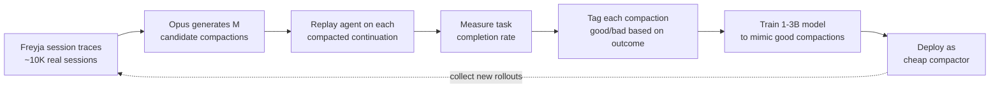

The loss function directly optimizes "preserves what the agent needed" rather than human notions of "good summary." Expected impact: 10-100× compaction cost reduction; possibly better downstream task success because the compactor learned what *matters* for Freyja-shaped work, not what reads well in English.

**Technical detail — Two-stage training (SFT then RL), per Context-1's recipe:**

```python
# Stage 1: Supervised fine-tuning on (transcript, expert_compaction) pairs
# Expert compaction = the one whose continuation had highest task success.
loss_sft = -log_prob(model(transcript), expert_compaction_tokens)

# Stage 2: RL with downstream-task reward
# Reward: r = α * F1(final_answer) + β * task_completion + γ * (-cost)
# Sample candidate compactions from the SFT model, score by reward,
# update with PPO or GRPO.
def reward(transcript, compaction, ground_truth):
    continuation = run_agent(transcript_with_compaction=compaction)
    r_correctness = task_success_score(continuation, ground_truth)
    r_recall = how_often_did_agent_need_evicted_content(continuation)
    r_cost = -(api_dollars(continuation) + api_dollars(compaction))
    return α * r_correctness - β * r_recall + γ * r_cost
```

**Model sizing math (working backwards from inference cost):**

| Model size | Cost / 1M tokens (cloud) | Cost / 1M tokens (local on M3 Max) | Latency / compaction (32k → 4k) |
| ---------- | ------------------------ | ----------------------------------- | -------------------------------- |
| Opus-4-7 (today) | ~$15 input + $75 output | n/a | ~30-60s |
| 20B (Context-1 size) | ~$0.50 input (MXFP4 vLLM) | ~$0 (~10-15 tok/s, ~3 min) | ~5s cloud / 3 min local |
| 7B (Llama / Qwen) | ~$0.20 input | ~$0 (~30 tok/s, ~60s) | ~2s cloud / 60s local |
| 3B | ~$0.10 input | ~$0 (~60 tok/s, ~30s) | ~1s cloud / 30s local |
| 1B | ~$0.05 input | ~$0 (~150 tok/s, ~12s) | <1s cloud / 12s local |

Per-compaction cost at Freyja's typical scale (~30k tokens summarized, ~4k summary out): Opus today **~$0.75**, a 3B distilled compactor **~$0.005** — 150× cheaper. If sessions hit 3-5 compactions, that's **$2-4 in saved spend per long session**.

**Compute requirement for training:**
- ~10K traced sessions at ~3 compactions/session × 5 candidate compactions = 150K training pairs.
- For SFT: 1-2 epochs on a 7B base ≈ 8-16 GPU-hours on 8×H100 (~$50-100 of cloud compute).
- For the RL stage: depends on rollout count; budget $500-2000 cloud + your own replay infrastructure.

**Total project cost estimate:** ~$3K-10K of compute + 2-4 weeks of one engineer's time, assuming the rollout collection (E1) is in place.

**Risks:**
- *Corpus bias.* Trained on Freyja's tool set; doesn't generalize if we add new tools. Mitigation: retrain quarterly, hold out 10% recent traces.
- *Reward hacking.* Model learns to compact in ways that minimize next-call cost but lose context needed at turn N+10. Mitigation: reward must look multiple turns ahead, not single-turn.
- *Off-distribution failure.* New session shapes (e.g. computer use heavy, multi-modal heavy) silently degrade. Mitigation: anomaly detection on input distribution; fallback to LLM summarizer.

#### A2. Per-turn salience scorer *(research)*

Instead of generating a summary, score each turn `0..1` on "this turn's content affects future correctness." Drop turns scored below threshold; keep high-salience verbatim; medium-salience get the LLM summarizer treatment. Trained with the same rollout-measure pipeline as A1, but smaller output space → faster training, smaller model.

#### A3. Compactability classifier *(build today, with rules; train later)*

A typed decision per turn — `KEEP_VERBATIM | COMPRESS | DROP`. Static heuristic version we can ship now:
- File edits, error messages, user preferences, model decisions → `KEEP_VERBATIM`.
- Exploratory reasoning, search results, tool reads of unchanged files → `COMPRESS`.
- Aborted attempts, duplicate observations, expired permissions → `DROP`.

Later: train it from the same rollout corpus as A1. The classifier becomes the routing layer above the summarizer.

#### A4. Compaction-aware base model *(research, longshot)*

Fine-tune the main agent model with mid-context compaction artifacts during training so it learns to:
- Emit explicit bookmark tokens (`<bookmark file=foo.py reason="user wants this refactored">`) during normal generation.
- Tolerate compaction summaries in its context without confusion.
- Self-issue recall tool calls when it senses missing state.

This is the deepest research direction; would require Anthropic-tier model access or open-model fine-tuning.

---

### B. Memory architectures beyond the linear transcript

The transcript is currently the only memory. It shouldn't be. A multi-tier architecture lets compaction be *eviction from a tier* rather than *destruction*:

```
┌─────────────────────────────────────────────────────────────┐
│ HOT — in the request body, model sees verbatim              │
│ - last N turns                                              │
│ - active plan tree (B4, C4)                                 │
│ - pinned facts (F1, H1)                                     │
│ - the running session-memory file (B5)                      │
├─────────────────────────────────────────────────────────────┤
│ WARM — vector-indexed, retrievable by tool call             │
│ - embeddings of compacted turn ranges                       │
│ - embeddings of tool result content (content-hashed)        │
│ - past sub-agent findings (cross-session)                   │
├─────────────────────────────────────────────────────────────┤
│ COLD — on disk, structured query only                       │
│ - full original transcript                                  │
│ - file system snapshot at each turn                         │
│ - tool execution log (queryable table)                      │
│ - knowledge graph extracted across sessions                 │
└─────────────────────────────────────────────────────────────┘
```

Compaction becomes "move from HOT → WARM." The model recalls via tool: `recall("when did I read foo.py?")`. Hot stays small and dense; warm/cold are unlimited.

#### B1. Tiered storage with explicit `recall` tool *(build — adopt Letta's architecture)*

Letta has already shipped this and validated it; we should adopt the structure rather than reinvent.

**Concrete spec:**

```python
# engine/memory_tiers.py (new module)

@dataclass
class CoreMemory:
    """Lives in the system prompt. Editable by the agent via tool calls.
    Persists across turns; gets bytes-for-bytes cached by Anthropic's
    prompt cache as long as it doesn't change."""
    persona: str            # "You are Freyja, a desktop agent..."
    user_profile: str       # known user facts; promoted from MEMORY.md
    session_state: str      # active goal, open files, current plan node
    pinned_facts: list[str] # user-pinned via F1; always preserved

    MAX_BYTES = 8_000  # ~2k tokens, fits comfortably in a prompt prefix

@dataclass
class RecallStore:
    """External, vector-indexed. Searchable by recall(query) tool.
    Holds compacted turn summaries + tool result hashes."""
    embeddings: faiss.IndexFlatL2  # ~per-session 10-100MB
    chunks: list[RecallChunk]      # text + metadata

@dataclass
class ArchivalStore:
    """SQLite. Queryable by archival_query(predicate) tool.
    Full structured tool log + raw transcript on disk."""
    db_path: Path  # ~/.freyja/sessions/{id}/archive.db
```

**Two new tools the agent gets:**

```python
def recall(query: str, top_k: int = 5) -> list[RecallChunk]:
    """Semantic search over compacted history.
    Returns most-relevant chunks with their source turn numbers.
    Cost: ~10ms locally with FAISS."""

def archival_query(sql_predicate: str) -> list[ToolCallRow]:
    """Structured query over the tool execution log.
    Examples:
      archival_query("tool_name='bash' AND result_text LIKE '%error%'")
      archival_query("turn_id BETWEEN 50 AND 100")
    Cost: ~1ms locally."""
```

**Memory write paths:**

```mermaid
flowchart TB
    NEW[New turn happens] --> EXTRACT[End-of-turn extraction<br/>(cheap LLM call)]
    EXTRACT --> CORE{Updates<br/>core memory?}
    EXTRACT --> ARCH[Always append to<br/>archival tool log]
    CORE -->|yes| WRITE_CORE[Agent calls<br/>edit_core_memory(...)]
    CORE -->|no| RECALL_Q{Significant<br/>enough for recall?}
    RECALL_Q -->|yes| EMBED[Embed + add to vector store]
    RECALL_Q -->|no| DROP[Discard turn body<br/>(archival keeps it)]
```

**Compaction = move from core → recall, never destroy:**

When core memory + recent turns exceed budget:
1. Walk back through old turns.
2. For each, emit a 1-2 sentence summary → recall.
3. Hash + store tool results in archival; transcript keeps the hash reference.
4. Remove turn body from the active context.
5. Agent can `recall("when did I read foo.py?")` to recover.

**Critical:** without this, more-aggressive compaction is reckless. With this, compaction at 50% becomes safe — exactly the threshold Hermes uses and Chroma's context-rot research suggests.

**Effort estimate:** ~800 LOC across 3 files; ~2 weeks for one engineer. Wire into existing `_BridgeSession` + the tracing tool registry.

#### B2. Knowledge graph extraction *(research → build, port Mem0g)*

Alongside the textual summary, extract a typed graph:

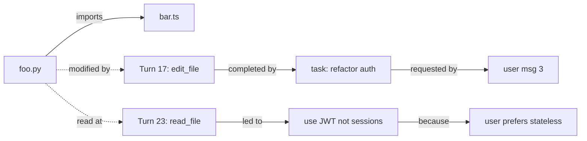

A 5KB graph carries comparable information density to a 50KB transcript prose section because it's structurally explicit. Serialize as JSON-LD, embed in system prompt or as a tool. Update incrementally on each turn (cheap LLM extract pass at end-of-turn).

Critically: model can *query* the graph (`graph_query("what files are involved in the auth refactor?")`) — symbolic retrieval is more reliable than vector retrieval for entity-level questions.

**Concrete schema (port Mem0g):**

```python
# engine/knowledge_graph.py

class NodeType(Enum):
    FILE        = "file"
    FUNCTION    = "function"
    TASK        = "task"
    DECISION    = "decision"
    ERROR       = "error"
    USER_PREF   = "user_pref"
    SUBAGENT    = "subagent"
    ARTIFACT    = "artifact"

class EdgeType(Enum):
    IMPORTS     = "imports"     # file → file
    MENTIONS    = "mentions"    # turn → file/function
    FIXES       = "fixes"       # commit/edit → error
    COMPLETES   = "completes"   # turn → task
    DEPENDS_ON  = "depends_on"  # task → task
    CONTRADICTS = "contradicts" # decision → decision (conflict)

@dataclass
class GraphNode:
    id: str                    # stable, e.g. "file:src/foo.py"
    type: NodeType
    label: str                 # human-readable
    metadata: dict             # arbitrary (last_modified, size, ...)
    first_seen_turn: int
    last_seen_turn: int

@dataclass
class GraphEdge:
    src: str
    tgt: str
    type: EdgeType
    confidence: float          # 0..1
    turn_id: int               # provenance
```

**Three-pass extraction pipeline (Mem0g recipe):**

```python
async def update_graph_for_turn(turn: Message, kg: KnowledgeGraph) -> None:
    """End-of-turn extraction. Runs in parallel with the next turn so
    doesn't block the agent. ~$0.001 per turn at Haiku rates."""

    # Pass 1: entity extraction. Cheap model, strict JSON output.
    new_nodes = await call_haiku(
        prompt=ENTITY_EXTRACTION_PROMPT,
        turn_content=turn.content,
        existing_node_ids=kg.node_ids(),  # avoid duplicates
        response_format={"type": "json_schema", "schema": NODE_SCHEMA},
    )

    # Pass 2: relation extraction. Same cheap model.
    new_edges = await call_haiku(
        prompt=RELATION_EXTRACTION_PROMPT,
        turn_content=turn.content,
        candidate_nodes=new_nodes + kg.recent_nodes(),
        response_format={"type": "json_schema", "schema": EDGE_SCHEMA},
    )

    # Pass 3: conflict detection. Mem0g calls this synchronously and
    # blocks the write; we can defer to retrieval time per Principle 1.
    conflicts = kg.find_contradictions(new_edges)
    if conflicts:
        # Tag both sides; let the agent resolve next time it queries.
        for old, new in conflicts:
            kg.add_edge(GraphEdge(old.id, new.id, EdgeType.CONTRADICTS,
                                  confidence=0.8, turn_id=turn.id))

    kg.merge(new_nodes, new_edges)
```

**Token economics:** a graph with 200 nodes + 400 edges serializes to ~5KB JSON-LD. Same information density as ~50KB of prose summary. **10× compression at zero LLM cost at retrieval time.** Per-turn extraction cost ~$0.001 (Haiku); breakeven after 5-10 turns of saved context.

**Where the graph lives:** in core memory (cheap), serialized as a compact JSON-LD section the model can read directly. Above ~10KB, becomes too noisy — move detail to recall, keep node/edge counts + top-10 entities in core.

**Query path:** `graph_query("files modified during the auth refactor")` walks the graph (`tasks where label LIKE '%auth%'` → `completes` edges → `mentions` edges → file nodes). Returns 3-5 results in ~10ms.

**Risks:**
- *Extraction noise.* Haiku will hallucinate nodes/edges occasionally. Mitigation: require evidence span (turn id + char range) for every edge; reject unsupported ones.
- *Schema drift.* New tool types need new node/edge types. Mitigation: schema versioning; migration path.
- *Conflict explosion.* Aggressive conflict detection produces too many CONTRADICTS edges. Mitigation: time-decay confidence; old edges decay below threshold and get pruned.

#### B3. Content-addressable tool-result store *(build)*

Every tool result hashed `sha256(name + args + output)`. Transcript stores hash references after compaction. Two wins:

1. **Dedup**: identical tool calls collapse to one stored result, many references. A session that re-reads `package.json` 12 times has 1 stored copy.
2. **On-demand recovery**: model can dereference any hash via a `tool_result_by_hash(h)` call.

Compaction can replace verbatim results with `@tool_result_abc123` references with confidence — the content is still addressable.

#### B4. Episodic vs semantic memory split *(build)*

Cognitive science distinguishes:
- *Episodic* — "user asked me to refactor auth at turn 23" (time-stamped, conversation-bound, decays).
- *Semantic* — "project uses TypeScript strict mode" (time-less, durable, never decays).

Today both live in the transcript and decay together. Split them:

```
episodic.jsonl     — append-only event log, aggressive eviction OK
semantic.md        — workspace-level facts, never evicted by compaction
```

On every turn, a cheap LLM pass extracts new semantic facts and appends to `semantic.md`. Compaction touches only episodic. Semantic memory pools across sessions in the same workspace.

#### B5. Per-session memory file (mid-session updated) *(build, easy)*

Like `CLAUDE.md` but updated mid-session by the agent itself. Path: `~/.freyja/sessions/{id}/MEMORY.md`. Two write modes:
- *Implicit*: end-of-turn LLM pass appends new facts.
- *Explicit*: the agent calls `remember(fact)` as a tool.

The file is always read into the system prompt. Compaction doesn't touch it. Cheap, safe, immediately useful — could ship this week.

#### B6. Cross-session collective workspace memory *(research)*

Freyja already does subagents + branching. Extend: every compacted summary feeds a workspace-level knowledge graph that the next session in the same workspace inherits. Long-running projects accumulate a real, queryable knowledge base. Bonus: graph-based de-duplication across sub-agents working on related sub-tasks.

---

### C. Structural compaction primitives

The summary is a flat string. We can do better with structured artifacts:

#### C1. Hierarchical summarization tree *(research → build)*

Memory at multiple resolutions:

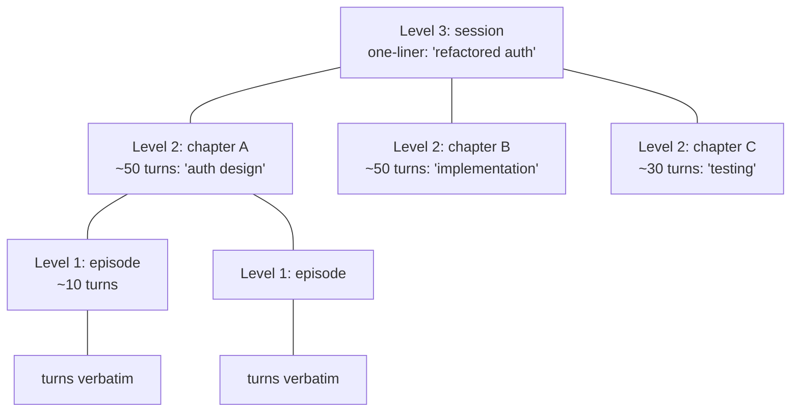

When level 0 fills, compact to level 1. When level 1 fills, compact deeper. Like a B-tree of memory. The model sees the highest level by default; can drill into any branch via a `expand_chapter(id)` tool. Mirrors how humans remember: the gist plus the option to dig.

#### C2. Macro folding *(build)*

Recognize patterns: a sequence of `[write_file → read_file → bash(tests)]` is a *code-edit cycle*. Replace with a named macro:

```
[MACRO: code_edit_cycle target=foo.py status=passing tests=3/3]
```

The macro carries the *outcome* without the *process*. Pattern library starts small (5-10 common patterns) and grows. Especially powerful in agentic sessions which have repetitive shapes.

#### C3. State-delta compaction *(research)*

Instead of summarizing *what happened*, summarize *what changed*. The compaction stores typed deltas:

```yaml
files_modified:
  foo.py: { +20, -3, summary: "JWT validation" }
  bar.ts: { +5, -12, summary: "removed session handler" }
variables_learned:
  project_root: "/Users/.../auth-service"
  test_cmd: "pytest tests/ -v"
errors_resolved: 3
tasks_completed: ["replace session auth with JWT"]
tasks_pending: ["update README"]
```

Smaller than prose for the same information; structurally queryable; composable across compactions (each new delta merges into the running state).

#### C4. Plan tree as the surviving artifact *(build)*

Most agentic sessions have an implicit plan. Surface it as the canonical artifact:

```
plan/
├── 1. refactor auth ✓
│   ├── 1.1 read current implementation ✓
│   ├── 1.2 design JWT approach ✓
│   └── 1.3 implement changes ✓ [refs: foo.py, bar.ts]
├── 2. add tests (in-progress)
│   ├── 2.1 unit tests ✓ [3 passing]
│   └── 2.2 integration tests (active)
└── 3. update docs (pending)
```

Compaction = keep the plan tree, evict the implementation work that satisfied each completed node (unless referenced). Plan tree is small (~1-2KB), semantically rich, and self-validating (the model can use it as ground truth for "where are we").

#### C5. Reversible compaction via deltas *(research)*

Each compaction stores `(forward_delta, reverse_delta)`. To recover, replay reverse deltas. Only practical for structured (graph + KV) compactions, not LLM-generated prose. Combined with B3 + C3, makes compaction non-destructive.

---

### D. Cache-aware compaction (the hidden cost dimension)

Anthropic's prompt cache (5min TTL default, 1hr extended) is keyed on the exact byte prefix. Every compaction mutates the prefix → evicts the cache → next call pays full input cost (~10× cache-read cost on Opus). Today's systems ignore this entirely.

**Anthropic cache mechanics (relevant facts):**
- Cache markers are placed via `cache_control: {type: "ephemeral"}` blocks. Up to 4 per request.
- Default TTL: 5 minutes from last hit. Extended TTL (1 hour) available on a "cache_control with ttl_1h" extension.
- Cache write costs ~1.25× input rate (one-time). Cache read costs ~0.1× input rate.
- On Opus 4-7: input $15/M, write $18.75/M (1.25×), read $1.50/M (0.1×).
- Cache key = SHA256 of the bytes up to the marker. *Any* byte change in the prefix evicts.
- Caches are per-org, per-region; concurrent requests with the same prefix can share.

The economics:

```
Cost without cache eviction:   prefix * cache_read_rate     ($0.30/MTok on Opus)
Cost with cache eviction:      prefix * input_rate          ($3.00/MTok on Opus)
Compaction savings:            (evicted_tokens * input_rate)
```

For a session that issues 10 more calls after a compaction, eviction costs 10× the compaction's nominal savings if you measured only the immediate call.

#### D1. Cache-aligned compaction decision *(build)*

Before compacting, compute:
- *Eviction cost* = (estimated remaining calls in session) × (prefix tokens at cache_read rate − input rate).
- *Compaction savings* = evicted tokens × input rate, summed across remaining calls.

Only compact if savings > eviction cost. For short-lived sub-agents this often means *don't compact at all* — just let them hit the window. For long parent sessions, the math favors compaction late but rarely.

#### D2. Strategic `cache_control` block placement *(build)*

Anthropic API supports up to 4 `cache_control` markers per request. Place them at:
1. End-of-system-prompt (always cacheable).
2. End-of-compaction-summary (cacheable until next compaction).
3. End-of-pinned-context (cacheable for the duration the user keeps the pin).
4. End-of-tool-definitions (cacheable until tool set changes).

Most of the request body stays cached across turns; only the moving tail recomputes.

#### D3. Predictive prefix prewarm *(research)*

While the user is typing, send a minimum-cost ping with the *same prefix the next call will use*. Cache warmed when the real call arrives. Cost: one extra request per typing pause. Saves: cache misses on the actual call.

#### D4. Branching cache trees *(research)*

When the agent reasons about multiple paths, each gets its own cacheable prefix. Maintain a cache-line per active branch rather than mutating a single prefix. Pairs with our existing branch-session feature — branching becomes cache-natural rather than cache-disruptive.

---

### E. Closed-loop measurement and feedback

Today, compaction is *open-loop*: we summarize, we hope. There's no signal that connects compaction quality to agent outcomes. This is the single biggest gap.

#### E1. Compaction quality dataset *(build, ongoing)*

For every compaction in production (opt-in), record:
- The full pre-compaction transcript.
- The compaction summary.
- The next N turns of agent activity.
- Whether the task ultimately completed successfully (user explicit `/done` or `/cancel`).

Becomes the training corpus for A1.

#### E2. Active recall probing *(research)*

Periodically, in shadow, ask the agent "was X mentioned earlier?" where X is sampled from the *original* transcript. Recall failure = compaction lost something important. Trigger un-compaction (re-load from disk) for that span. The agent never sees the shadow probes; this is observer mode.

#### E3. Salience from re-reads *(build)*

Instrument the agent to log which past turns it references in its reasoning. Frequently-referenced turns get high salience. Becomes ground-truth signal for training A2.

#### E4. Production A/B *(build)*

For sessions long enough to compact twice, randomly route to compaction mechanism A or B. Compare downstream outcomes (task success, total cost, user retries). Continuous improvement instead of static tuning.

#### E5. Cost-per-correctness as the north star metric *(framing)*

Replace "tokens compacted" with "dollars saved per task completed at the same quality." A compactor that saves 80% of tokens but causes 30% more task failures is worse than today's status quo. This metric must drive all training (A1) and tuning decisions.

**Concrete instrumentation schema for E1:**

```python
# Per-turn telemetry the bridge already partly emits; extend to:

@dataclass
class TurnTelemetry:
    session_id: str
    turn_id: int
    model: str
    input_tokens: int           # billed
    cache_read_tokens: int      # cheaper
    cache_write_tokens: int     # one-time write
    output_tokens: int
    tool_calls_made: list[str]  # tool names
    referenced_turn_ids: list[int]  # which past turns the model cited
    user_acknowledged: bool     # did the user follow up or correct?

@dataclass
class CompactionTelemetry:
    session_id: str
    triggered_at_turn: int
    trigger_reason: str         # "pre_request" | "post_response" | "overflow" | "manual"
    tokens_before: int
    tokens_after: int
    mechanism: str              # "halve" | "summary" | "iterative" | "context1_prune"
    duration_ms: int
    cost_usd: float             # cost of the compaction itself

@dataclass
class CompactionOutcome:
    """Filled in N turns later by replay analysis."""
    compaction_id: str
    next_5_turns_success_rate: float    # how often did the agent succeed
    re_fetches_within_10_turns: int     # did it re-query content we pruned?
    cumulative_cost_after_compact: float
    user_satisfaction_signal: int       # +1 if user said thanks, -1 if corrected
```

Pipeline: emit `TurnTelemetry` + `CompactionTelemetry` to a local JSONL → nightly replay job correlates them into `CompactionOutcome` → corpus accumulates for training A1.

---

### E'. Sleep-time compaction *(borrowed from Letta, big leverage on Freyja)*

Letta's primary/sleep-time split is a perfect fit for Freyja because we already have subagent infrastructure. The pattern:

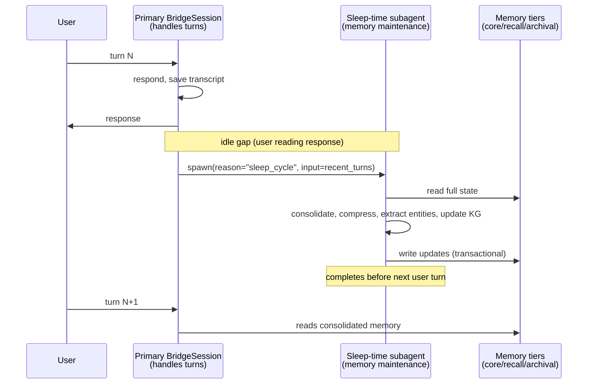

**Why it works for us:**
- We already have `_BridgeSession`, `SubAgentSpec`, and the subagent runner. The sleep-time compactor is just another subagent role with restricted tools (`edit_core_memory`, `consolidate_recall`, `update_kg`).
- The primary stays fast — no `prune_chunks` reasoning during user-facing turns. Compaction reasoning happens between turns.
- Failure mode (interrupted sleep) is solved by transactional writes: stash changes; commit only on completion. Freyja's session-archive infrastructure already has the right shape.

**Trigger policy:**
- Fire after every turn that exceeds a "complexity" threshold (e.g. >5 tool calls, or any file edit).
- Cancel if user starts typing (asyncio task with cancellation).
- Cap at 30s wall-clock; if it doesn't finish, defer to next idle window.

**Model choice:**
- Primary uses whatever the user picked (Opus, Sonnet, etc.).
- Sleep-time uses the same model OR a cheaper-but-thoughtful tier (e.g. Sonnet for an Opus primary). Letta uses smaller-for-fast / larger-for-thoughtful; we'd flip it.

**Effort estimate:** ~500 LOC; mostly wiring the existing subagent machinery. ~1.5 weeks. The hard part is the trigger policy + cancellation semantics, not the compaction itself.

---

### F. Human-in-the-loop primitives

#### F1. Pin-to-never-compact *(build, easy)*

Right-click any message → "pin." Pinned messages skip compaction. Surface visually (a small bookmark icon). Maps cleanly to Anthropic's `cache_control` user marker. UX win: user has explicit control over what survives.

#### F2. Compaction preview *(build)*

Before applying a compaction, show: "12 turns will be replaced by this summary. [edit] [reject] [apply]". User can refuse a bad compaction or hand-edit the summary. Especially valuable for `/compact` manual invocations.

#### F3. Browsable compaction history *(build)*

UI shows compaction events as collapsible inline cards in the conversation. Click "[+] 12 turns compacted" to expand and see the original. Compactions are reversible from the UI: "Restore these turns" button.

#### F4. Multi-faceted manual compaction *(build, easy)*

Extend `/compact`:
- `/compact --focus "auth refactor"` — Hermes-style focus topic.
- `/compact --keep "anything mentioning foo.py"` — regex / semantic preserve.
- `/compact --aggressive` — more aggressive ratio.
- `/compact --preserve-tool-calls` — keep all tool calls verbatim, summarize prose only.

---

### G. Domain-specific information stores

#### G1. File-system snapshot as compaction oracle *(build)*

For any "I read foo.py at turn 17" content, the compaction can drop the body if foo.py at compaction-time has the same content (verify by hash). Recover by re-reading from disk on demand. Saves massive tokens in code-edit sessions where the same files are read repeatedly.

#### G2. Tool execution log as queryable DB *(build)*

Every tool call becomes a row in a queryable SQLite table:

```sql
SELECT * FROM tool_calls
WHERE session_id = ?
  AND tool_name = 'bash'
  AND result_text LIKE '%error%'
ORDER BY turn_id DESC LIMIT 5;
```

Compaction drops prose freely; the model can `query_tool_log(...)` to recover any past tool call by predicate. Especially useful for "did I already try this?" questions.

#### G3. Code-diff stream *(build)*

For code-editing sessions, persist the cumulative diff from session start. Replaces all "I changed line X" prose. One canonical artifact, semantically complete, never gets stale.

#### G4. Test memo *(build, trivial)*

For each unique test command, store only the latest result + timestamp: `pytest tests/ → 3 fail at 14:32 (test_a, test_b, test_c)`. One line, evergreen. Replaces hundreds of lines of pytest output across multiple runs.

---

### H. Agent-cooperative compaction

The agent has more information than any external summarizer about what's important. We should let it tell us.

#### H1. Inline bookmarks *(build)*

Train (or prompt) the agent to emit `<bookmark>fact</bookmark>` tokens during normal generation when it encounters important state. Bookmarks are extracted into the structured store (B2/B4/B5) and survive all compaction. Cheap (no extra LLM call), explicit (agent decides what matters), composable (works with any compactor).

```
The user wants me to refactor the auth module.
<bookmark>user goal: replace session-based auth with JWT</bookmark>
Let me read the current implementation.
```

#### H2. On-demand self-recall as a first-class tool *(build)*

The agent has a `recall(query)` tool. Compaction can be aggressive because recall is reliable. The tool searches the warm tier (vector-indexed compacted history) and cold tier (full transcript on disk).

**Plus a Context-1-style `prune_chunks` mechanism** — this is the deep idea:

```python
# Context-1's three-pressure-point harness, ported to Freyja:

class CompactionHarness:
    SOFT_THRESHOLD = 0.60   # at 60% of effective window, suggest pruning
    HARD_THRESHOLD = 0.85   # at 85%, reject all tools except prune_chunks

    def on_observation(self, observation: ToolResult) -> ToolResult:
        """Append token-usage telemetry to every observation so the
        model has continuous awareness of pressure. Mirrors Context-1's
        `[Token usage: 14,203/32,768]` injection."""
        usage = self.session.usage.effective_context_tokens()
        budget = self.provider.context_window - self.config.max_tokens_per_turn
        observation.text += f"\n\n[ctx: {usage:,}/{budget:,} ({usage/budget:.0%})]"
        return observation

    def filter_tool_call(self, call: ToolCall) -> ToolCall | RejectedCall:
        """Soft-suggest at SOFT, hard-cut at HARD."""
        ratio = self.session.usage.effective_context_tokens() / self.budget
        if ratio < self.SOFT_THRESHOLD:
            return call
        if ratio < self.HARD_THRESHOLD:
            # Soft: still allow, but inject a system message after this turn
            self.pending_suggestions.append(SUGGEST_PRUNE_MSG)
            return call
        # Hard: only prune_chunks survives.
        if call.name != "prune_chunks":
            return RejectedCall(
                reason=f"Context at {ratio:.0%}, only prune_chunks allowed. "
                       f"Drop irrelevant chunks then retry your call."
            )
        return call

def prune_chunks(chunk_ids: list[str]) -> ToolResult:
    """The agent calls this with the IDs of chunks it wants gone.
    Chunks are evicted from the active context but archived to recall
    tier so prune_chunks is always recoverable via `recall()`."""
    for cid in chunk_ids:
        chunk = self.session.chunk(cid)
        self.recall_store.add(chunk)  # archive before eviction
        self.session.evict(cid)
    return ToolResult(text=f"Pruned {len(chunk_ids)} chunks. "
                           f"Freed ~{freed_tokens} tokens. "
                           f"Recoverable via recall().")
```

**Why this beats summarization (Context-1's bet, validated by their numbers):**

- *No summary noise.* Summarization paraphrases — meaning shifts, details rounded, false confidence introduced. Eviction is lossless on the kept chunks.
- *Model knows what it needs.* The agent has just *used* the context for reasoning; it knows which chunks were load-bearing vs. distractors. No external summarizer has that signal.
- *Reversible.* Pruned chunks live in recall; `recall()` brings any one back exactly. Summarization is one-way.
- *Cache-friendly.* The pruned prefix is *byte-identical* to the same prefix at the previous turn (with those chunks removed) — the cache hits the surviving prefix until the next mutation.

**Drawback:** the agent has to spend tokens reasoning about *what* to prune. Context-1's RL training amortizes this; without training, your generalist model may make poor prune decisions. The pragmatic recipe:

1. **Now:** ship the harness + tool, let Opus/Sonnet decide via prompting. Measure prune-decision quality.
2. **Next:** if quality is poor (re-fetches via `recall()` happen >X% of the time), train a small specialist via the A1 pipeline.
3. **Eventually:** the trained model can be a dedicated *prune-decider subagent* that the main model delegates to (effectively running the Context-1 recipe inside Freyja).

**Effort estimate:** ~400 LOC for the harness + tools; ~1 week for one engineer. The training step is a separate quarter-long project (A1).

#### H3. End-of-turn self-summary *(build)*

After every turn, cheap call: "in 50 tokens, what should I remember from this turn?" Stored as the turn's canonical summary. Compaction = "drop the original turn body, keep the bookmark + self-summary." Costs ~$0.001/turn but compaction becomes nearly free and arbitrarily fine-grained.

#### H4. Adversarial compaction probe *(research)*

After compacting, run the resulting transcript through a *critic* model: "what important detail is missing from this summary?" Use the critic's findings as a quality gate. Retry with adjusted prompt if criticism is severe. Generative adversarial compaction.

---

### I. Frontier / longshot

#### I1. Local-first compactor *(build, with model from A1)*

Run the trained small model on-device (MLX, llama.cpp). $0/call, no network latency, full privacy. Strong brand fit for Freyja (desktop-native, user-owned).

#### I2. Generative replay from agent's perspective *(research)*

Instead of third-person summary, ask the model to write a first-person internal monologue of what happened. Different prompt, different output structure. May preserve different facts (model writes about what *it* found important; third-person summary writes about what *a reader* finds important). A/B both.

#### I3. Curriculum compaction across model upgrades *(research)*

When migrating from Opus 4-6 to 4-7, re-compact old transcripts using the new model's preferences. Memory is *ported* to each model rather than degrading at upgrade boundaries.

#### I4. Compaction as RL meta-policy *(research, longshot)*

Train a small policy network that decides *when* to compact (not *how*). Reward = `task_success - α * total_API_cost`. The policy learns session-specific timing: "compact early in tool-heavy sessions, late in conversational ones."

#### I5. Federated workspace memory *(research, careful)*

Opt-in: multiple Freyja users share an anonymized workspace-level memory. Common knowledge graph for shared projects pools. The system gets smarter at common tasks across users. Privacy: requires strong differential-privacy guarantees on the extracted graph.

#### I6. Symbolic + neural hybrid (SOAR-style) *(research, longshot)*

Cognitive architectures (SOAR, ACT-R) have spent decades on memory consolidation. Graph DB (symbolic) plus LLM (neural). Compaction extracts to symbolic; recall is symbolic-first, neural-fallback. The agent has a *typed* working memory and *typed* long-term memory, not just rolling tokens.

---

### Reference implementations to draw from

We don't need to build all of this from scratch. Direct, well-licensed prior art:

| Component                               | Source                                                      | License        | Maturity       |
| --------------------------------------- | ----------------------------------------------------------- | -------------- | -------------- |
| **20B retrieval/pruning model**         | [`chromadb/context-1`](https://huggingface.co/chromadb/context-1) on HF | Apache 2.0     | Released 03/26 |
| **Three-tier memory architecture**      | [Letta v1 agent loop](https://www.letta.com/blog/letta-v1-agent) | Apache 2.0     | Production    |
| **Sleep-time compute reference**        | [Letta 0.7.0](https://github.com/letta-ai/letta), [arxiv 2504.13171](https://arxiv.org/abs/2504.13171) | Apache 2.0     | Production    |
| **Graph + vector memory pipeline**      | [`mem0ai/mem0`](https://github.com/mem0ai/mem0) (Mem0 + Mem0g) | Apache 2.0     | Production    |
| **Context rot benchmark**               | [Chroma context-rot](https://www.trychroma.com/research/context-rot) | Reproducible   | Released 7/25 |
| **Synthetic data generation pipeline**  | [`chroma-core/context-1-data-gen`](https://github.com/chroma-core/context-1-data-gen) | Apache 2.0     | Released 03/26 |
| **Cognitive-arch memory frameworks**    | Cognee, Zep, Memary                                         | varies         | Early prod    |

**Practical implication:** the engineering plan is *integration*, not *invention*. Adopt Letta's tier model, use Mem0g's extraction pipeline (or run their SDK directly), download Context-1 weights and serve via vLLM as a pruning subagent. Most of the speculative section is plumbing on top of existing weights and patterns.

---

### Speculative-section decision matrix

| Direction                                | Tag             | Verdict                                    |
| ---------------------------------------- | --------------- | ------------------------------------------ |
| B5 — Per-session memory file             | build (easy)    | **Ship soon**, immediately useful          |
| F1 — Pin-to-never-compact                | build (easy)    | **Ship soon**, low cost / high UX value    |
| G4 — Test memo                           | build (trivial) | **Ship soon**, niche but free              |
| H3 — End-of-turn self-summary            | build           | **Ship after measurement** (cost ~$0.001/turn vs savings) |
| H1 — Inline bookmarks                    | build           | **Prototype**, test on real sessions       |
| C4 — Plan tree as artifact               | build           | **Prototype**, especially with goal mode   |
| G2 — Tool execution log as DB            | build           | **Prototype**, replaces several gaps       |
| B3 — Content-addressable tool results    | build           | **Prototype**, dedup wins immediately      |
| B1 — Tiered hot/warm/cold + recall tool  | build           | **Prototype**, foundational for aggressive compaction |
| D1 — Cache-aligned compaction decision   | build           | **Prototype after telemetry from Gap 3**   |
| D2 — Strategic `cache_control` markers   | build           | **Prototype**, no model changes needed     |
| F2/F3 — Compaction preview / history UI  | build           | **Consider**, depends on user feedback     |
| F4 — Manual `/compact` extensions        | build           | **Consider after H1/B1 land**              |
| B2 — Knowledge graph extraction          | research → build | **Research project**, big payoff long-term |
| E1-E5 — Closed-loop measurement          | build, ongoing  | **Start collecting now**, foundation for everything else |
| A1-A3 — Distilled compactor + classifier | research        | **Research project**, requires corpus from E1 |
| C1 — Hierarchical summarization tree     | research → build | **Research**, structurally elegant         |
| C2 — Macro folding                       | research → build | **Research**, depends on pattern frequency |
| C3 — State-delta compaction              | research        | **Research**, formal model first            |
| H4 — Adversarial compaction probe        | research        | **Research**, evaluate cost/benefit         |
| A4 — Compaction-aware base model         | research (deep) | **Longshot**, requires model-team partnership |
| I-series — Longshots                     | research        | **Park**, revisit annually                  |

### What I'd actually pursue, in priority order (updated post-field-survey)

**Month 1 — instrumentation + cheap wins:**

1. **E1 instrumentation** — emit `TurnTelemetry` + `CompactionTelemetry`. Every other research direction depends on this corpus. Opt-in for opted-in users.
2. **B5 (per-session memory file)** — ~200 LOC. Survives compaction by construction. Immediate value.
3. **D2 (strategic `cache_control` markers)** — ~50 LOC change in `anthropic_provider.py`. Measure cache hit ratio with the new telemetry.
4. **F1 (pin-to-never-compact)** — right-click in our existing message context menu. ~150 LOC.
5. **Lower compaction threshold to 70/80** — based on context-rot research, our 80/90 may be costing quality. A/B against current default using E1 telemetry.

**Month 2-3 — adopt the Letta architecture:**

6. **B1 (three-tier memory) — direct port from Letta's spec.** Core/recall/archival, two new tools (`recall`, `archival_query`). ~800 LOC. Foundation for everything below.
7. **B3 (content-addressable tool store)** — pairs naturally with B1. ~200 LOC.
8. **E' (sleep-time compaction subagent)** — wire a new subagent role into existing machinery. ~500 LOC.

**Quarter 2 — adopt Mem0g + start the training corpus:**

9. **B2 (knowledge graph via Mem0g pipeline)** — either run Mem0 SDK directly (Apache 2.0, lowest friction) or port the entity/relation extraction prompts. ~600 LOC if porting; ~50 LOC if integrating their SDK.
10. **H1 + H3 (inline bookmarks + end-of-turn self-summary)** — depends on B1 being in place.

**Quarter 3 — train a specialist:**

11. **A1 / Context-1-style RL-trained pruning subagent.** Two options:
    - (a) Use Context-1 weights directly as the compaction subagent for retrieval-heavy work — Apache 2.0, vLLM-serveable, $0 training cost.
    - (b) Fine-tune our own 3-7B model on Freyja's traces using the E1 corpus. ~$5K compute.
    - Start with (a) for measurement; move to (b) if results justify.
12. **H2 (Context-1-style `prune_chunks` harness)** — the soft/hard threshold pattern. Ship this generically (works with any prompted model), then route prune decisions to the trained model from #11.

**Quarter 4+ — the bigger bets:**

13. **C4 (plan tree)** — natural extension if goal-mode lands.
14. **C2 (macro folding)** — pattern detection over the now-rich telemetry from E1.
15. **I3 (curriculum compaction across model upgrades)** — when migrating from Opus 4-7 to 4-8, re-compact with the new model's preferences.

### Three contrarian bets worth defending

1. **Compaction is a model-training problem, not a heuristic problem.** Context-1 proves it. Every line of code we write today fighting the current paradigm is debt; every session trace we collect is the asset that frees us. **Start E1 immediately.**

2. **Compact earlier, not later.** Context-rot research says model quality degrades on long context *before* the window fills. Lowering threshold from 80% to 50-60% may improve answer quality even though it costs more compactor calls. We've been optimizing for the wrong metric — *correctness*, not *capacity*.

3. **Don't summarize; evict + retrieve.** Context-1 deliberately avoids summarization. Mem0g uses graph + vector retrieval. Letta uses three tiers. The pattern is: keep data verbatim somewhere addressable; route only the relevant slice into the active window. Lossy summary is yesterday's design.

---

## Open questions for us

1. **Is the cache-eviction story real?** We can't decide on #3 without measuring. What's the current cache-hit ratio on long Opus sessions? — Phase 1 telemetry should answer this.
2. **Do we want a `focus_topic` API at all?** UX-wise it's a power-user feature. If we ship #7, what surfaces it (slash command? right-click on a message → "compact around this topic"?).
3. **Does `iterative re-compaction` change persistence semantics?** Currently `append_compaction` replaces all earlier entries with one summary entry. With iterative updates, do we *replace* the previous summary entry, or *append* a new one and keep both? Replacing is cheaper; appending preserves history for debugging.
4. **Should `MIN_MESSAGES_TO_COMPACT = 20` change?** Hermes uses `protect_first_n + 3 + 1 = 7`. Our 20 may be too high for sub-agent sessions that don't generate that many turns before hitting the window.
5. **Thrash recovery UX.** When the thrash detector trips, what do we surface? Hermes recommends `/new`. We could offer one-click branching (which we already have) at the message before the compaction loop started.

---

## Implementation log

What landed in this pass (Phase 1 of the cooperative early-trigger
architecture, plus three of the gap-analysis fixes):

### Thresholds — significantly more aggressive

- `engine/constants.py` — `CONTEXT_PRESSURE_THRESHOLD` lowered from
  **0.80 → 0.25** (cheap pruning fires earlier).
- `engine/constants.py` — `CONTEXT_COMPACTION_THRESHOLD` lowered from
  **0.90 → 0.40** (LLM-based summarization fires much earlier).
- New constants in the same file for the cooperative bands:
  `CONTEXT_AWARENESS_THRESHOLD = 0.25`,
  `CONTEXT_SOFT_SUGGEST_THRESHOLD = 0.40`,
  `CONTEXT_STRONG_SUGGEST_THRESHOLD = 0.60`,
  `CONTEXT_FALLBACK_THRESHOLD = 0.80`.
- `engine/types.py` — `AgentConfig.compaction_threshold` default dropped
  to 0.25 so the runner's pre-request safety check matches.

### Effective-window math (Gap 8)

- `engine/runner.py:_ensure_context_room` and
  `_handle_context_pressure_async` now compute `effective_window =
  context_window - max_tokens_per_turn` and use that as the denominator
  for the threshold ratio. Prevents the "model rejects request even
  though pressure says 89%" failure mode near the ceiling.

### Latest-user-message anchor (Gap 4)

- `engine/compaction.py:_ensure_latest_user_message_kept` ports the
  Hermes fix (`context_compressor.py:1148-1193`). The most recent user
  message is now guaranteed to survive compaction; if `_find_safe_split`
  pulled the boundary past it, we pull it back.
- Called inside `SummaryCompaction.compact` immediately after the safe
  split walk.

### Thrash detector (Gap 1)

- `engine/runner.py:RunnerContext` gained
  `last_compaction_savings_pct: float` and
  `ineffective_compaction_count: int`.
- `AsyncAgentRunner._attempt_compaction` now skips compaction when the
  last 2 attempts each saved < 10%, returning a clear
  `CompactionResult(success=False, error="Compaction thrash detected …")`
  so the runner can fall back to alternate paths rather than burning
  more API calls.

### Secret redaction (Gap 5)

- New `engine/redact.py` with regexes for Anthropic / OpenAI keys, AWS
  access keys, GitHub tokens, Slack tokens, bearer-shaped strings,
  and private-key blocks.
- `engine/compaction.py:_generate_summary` applies redaction twice —
  once on the conversation we feed the summarizer, once on the summary
  it returns (LLMs sometimes echo credentials back even when prompted
  not to).

### Cooperative protocol channel 1 — token-usage tag

- `bridge/freyja_bridge.py:_build_pressure_tag` builds the per-observation
  tag `[ctx: 32% (32,500 / 100,000) · advisory]`. Escalates wording at
  25 → 40 → 60 → 80%.
- `_new_tracing_registry.traced_execute` appends the tag to every tool
  result's `content` field before returning. The model sees it as part
  of the natural reactor cycle — zero stream interruption, zero new tool
  surface. Below 25% the tag is the empty string.

### Telemetry instrumentation (the strategic prize)

- New `bridge/compaction_telemetry.py` writes a JSONL log to
  `~/.freyja/telemetry/compaction.jsonl`. One row per pressure-band
  crossing, one per compaction event, one per LLM call. Rotates at 256
  MB. Best-effort: never blocks an agent turn.
- `_BridgeSession` gained `last_pressure_band: str` so band crossings
  emit exactly one event per change (not per LLM call).
- `_BridgeSession._emit_pressure_telemetry_if_changed` computes the
  band (clean / pruning / awareness / soft / strong / fallback) and
  fires both the JSONL append and a live renderer event.
- `_on_llm_call` writes `llm_call_metric` rows to telemetry on every
  call.
- `_on_system_event` mirrors `compaction_start`, `compaction_complete`,
  `compaction_skipped`, `context_pruning`, and `media_pruning` events
  into the telemetry log as `compaction_event` rows.

### IPC route + main-process file reader

- `src/shared/events.ts` — new `IPC.compactionMetrics` channel + typed
  `CompactionTelemetryRow` union.
- `src/main/main.ts` — handler reads `~/.freyja/telemetry/compaction.jsonl`,
  tail-trims to the last 10K rows, returns parsed JSON.
- `src/preload/preload.ts` — exposes `harness.compactionMetrics()` to
  the renderer.

### Renderer — Metrics Dashboard

- New `src/renderer/components/MetricsDashboard.tsx`. Full-screen modal
  (88vh × min(1280px, 96vw)) opens via the header **metrics** button.
  Closes on Esc or backdrop click.
- Visual structure:
  - **Four stat tiles** at the top: total spend, compactions, tokens
    saved, cache hit rate.
  - **Pressure-band distribution** — single horizontal stacked bar with
    color-coded segments per band (clean → fallback) + legend grid.
  - **Mechanism mix** — horizontal bars for each compaction mechanism
    (summary / tool_halve / image_prune / etc).
  - **Spend over time** — hand-rolled SVG line chart with gradient fill,
    downsampled to 200 points, x-axis dates.
  - **Model mix** — per-model spend + call count, ranked.
  - **Per-session table** — top 50 by spend with calls / tokens / cache
    hit % / compactions / peak band badge (colored by band).
- Aggregation pipeline (`aggregateRows`) walks the JSONL once and
  computes everything in a single pass.
- All charts hand-rolled SVG; no chart library. Matches the rest of
  Freyja's monochrome aesthetic with cyan accents.

### Renderer state + header button

- `HarnessState` — new `metricsDashboardOpen: boolean`.
- `HarnessActions` — new `toggleMetricsDashboard(open?: boolean)`.
- `src/renderer/components/TitleBar.tsx` — new `metrics` TitleControl
  button next to `dashboard`, opens the modal.
- `src/renderer/App.tsx` — `<MetricsDashboard />` mounted alongside the
  existing Mission Dashboard.

### Verification

- All Python tests pass (73 passing).
- TypeScript type-check clean on the files I touched.
- `npm run build:renderer` + `npm run build:main` both succeed.
- Telemetry file path: `~/.freyja/telemetry/compaction.jsonl` (created
  on first append).

### Decision-matrix delta

| Gap | Before | After |
| --- | ------ | ----- |
| 1. Thrash detector | Ship | **Shipped** |
| 4. Latest-user-message anchor | Ship | **Shipped** |
| 5. Secret redaction | Ship | **Shipped** |
| 8. Effective-window math | Ship | **Shipped** |
| 10. Threshold tuning | Wait | **Shipped (subsumed by cooperative arch)** |
| Cooperative Phase 1 (telemetry + Channel 1 + cheap pruning at 25%) | Plan | **Shipped** |
| Metrics dashboard v2 (sparklines + squeeze drawer + new metrics) | Plan | **Shipped** |
| OpenAI cache normalization + per-call cache % column | Plan | **Shipped** |
| Profiles view (sub-agent telemetry + drawer) | Plan | **Shipped** |
| Cooperative Phase 2 (summarize_context + Channels 2 & 3 + iterative path) | Plan | **Shipped** |
| Gap 2 — iterative summary path | Ship | **Shipped** |
| B5 — per-session memory file | Plan | **Shipped** |
| F1 — pin-to-never-compact | Plan | **Shipped** |
| D2 — cache_control review + 3rd breakpoint for compaction summaries | Plan | **Shipped** |
| Phase 2 gap-fix sweep + agent-decisions dashboard panel | Ship | **Shipped** |
| Subagent tool isolation + system-event/pin emit + raw-transcript + 3-view export bundle + cooperation tile | Ship | **Shipped** |
| Channel 2 framing → `<system-reminder>` tail-append (cache-friendly) | Ship | **Shipped** |
| Clickable compaction inspection — ActivityView + dashboard | Ship | **Shipped** |
| Compaction flow audit — 7 gaps closed + flow doc | Ship | **Shipped (see docs/COMPACTION-FLOW.md)** |

### Metrics dashboard v2 (2026-05-07)

Refactored `src/renderer/components/MetricsDashboard.tsx` from a centered
single-column modal to a **flex-row** modal: the main panel is `flex-1`
and the new `SessionDetailDrawer` is a 500px sibling that *squeezes* the
main content left when a row is clicked — drawer never overlays the
aggregate view. Esc closes the drawer first, then the modal.

Backend prereqs landed in the same pass:

- `bridge/freyja_bridge.py:_on_llm_call` now writes `turn_id` into
  every `llm_call_metric` JSONL row so the per-session drawer can group
  calls by turn.
- `engine/runner.py:_attempt_compaction` (both sync and async paths)
  emits a `compaction_event` with `subtype: "thrash_skip"` whenever the
  ineffective-run thrash detector trips. The dashboard now counts thrash
  trips per session and surfaces them as a badge on the row.
- `src/shared/events.ts` widened the `llm_call_metric` variant of
  `CompactionTelemetryRow` to include the optional `turn_id` field.

New surface area:

- **Stat tiles (6):** total spend, cache reuse %, compactions
  (with thrash sub-count), tokens saved, p95/p50/p99 latency, subagent
  share (% of cost from `sub_*` session IDs).
- **Charts:** existing band distribution, model mix, and spend over
  time, plus three new ones:
  - `RankedBars` for trigger-source mix (`pressure_runner`,
    `precommit_check`, `thrash_detector`, etc.).
  - `SavingsTrend` plotting compaction savings % over time with a
    10%-thrash threshold line — dots turn red below the line.
  - `HistogramChart` of cost-per-turn across fixed bins
    ($0–0.01 / 0.01–0.05 / 0.05–0.20 / 0.20–0.50 / 0.50–1 / 1–3 / 3+).
- **Per-session table:** inline `Sparkline` column (120×24 SVG with
  cumulative spend line + pressure-band shading), peak-band pill, "sub"
  tag for subagent sessions, "thrash" badge when `thrashTrips > 0`.
  Rows are clickable.
- **Detail drawer** (`SessionDetailDrawer`): session identity header,
  **mini Gantt** of LLM calls (bar height = output tokens, color hashed
  from model name, pressure band shaded in the background, compaction
  events as vertical markers — cyan for summary, orange for prune, red
  for thrash_skip), per-call table (time / model / in / out / cache /
  cost / duration), compaction log entries with mechanism + trigger +
  savings %.
- **Header filter bar:** time-range (24h / 7d / 30d / all), group-by
  (none / model / day / peak-band), filter (all / has compaction / has
  thrash / has subagents). All client-side over the raw JSONL pull.

Deferred — needs new telemetry:

- **Tool-cost ranking**: requires per-tool-call cost attribution; we
  only persist totals per LLM turn.
- **Re-fetch rate**: needs deduplication tracking across `Read`/`Grep`
  calls in the bridge tool registry.

Both are noted here so the next pass can pick them up.

### Compaction flow audit — 7 gaps closed (2026-05-14)

Second end-to-end stocktaking of LLM-summary compaction surfaced
seven gaps. All seven closed in this pass. The full lifecycle is now
documented in `docs/COMPACTION-FLOW.md` — the doc to consult when
debugging, adding a trigger, building a dashboard surface, or
onboarding to the subsystem.

**Gap 1 — Overflow cascade was silent.** `_handle_overflow_cascade`
ran `_attempt_compaction` without emitting any SystemEvent. The
dashboard's compaction count, savings trend, and trigger-source
breakdown all under-counted any session that hit
``ContextOverflowError``. Made the cascade async, added
``compaction_start`` / ``compaction_complete`` / ``compaction_skipped``
emits with trigger=``overflow_cascade``, threaded through the same
``_compaction_event_details`` builder the other paths use. The
chain ``_handle_provider_error`` is now async too — propagated the
``await`` to its one call site at line ~1238.

**Gap 2 — Manual ``force_compact`` bypassed the JSONL mirror.**
``force_compact`` emits its own ``system_event`` via the global
``emit(...)`` and never goes through the runner's
``on_system_event`` callback, so its compactions never landed in
``compaction.jsonl`` or per-session ``compactions.jsonl``. Extracted
``_BridgeSession._mirror_compaction_event(subtype, details)`` and
called it directly from ``force_compact`` after each of its three
emits. Same helper is now also called from the
``_on_system_event`` mirror path so all four triggers route through
the same code (and the JSONL row shape is identical regardless of
path).

**Gap 3 — Snapshot pairs only existed for the manual path.**
``_write_compaction_snapshot`` writes a ``.md`` (human-readable
transcript dump) + ``.json`` (machine-readable) pair under
``~/.freyja/sessions/compactions/`` — the most useful "what did
the model see before vs after" artifact. Was wired only into
``force_compact``. Moved the call into the bridge's
``_on_system_event`` mirror so it fires on every
``compaction_start`` (before snapshot) and ``compaction_complete``
(after snapshot) regardless of trigger. The manual path keeps its
own explicit calls so they execute even though it bypasses the
runner emit.

**Gap 4 — Summarizer LLM call was invisible.**
``SummaryCompaction._generate_summary`` calls ``provider.complete``
directly — never goes through the runner, so the runner's
``on_llm_call`` hook never fires for summarizer calls. The
summarizer's input/output tokens, duration, and cost were
completely absent from the dashboard's spend metrics.

Fix: extended ``CompactionResult`` with ``summarizer_input_tokens``,
``summarizer_output_tokens``, ``summarizer_duration_ms``,
``summarizer_model``, ``summarizer_cost_usd``. Added an
``on_summarizer_call`` callback parameter to
``SummaryCompaction.compact()`` that ``_generate_summary`` fires
after the LLM call returns. The runner threads its own
``on_llm_call`` through this callback wrapped to emit
``call_kind="summarizer"``. The bridge's ``_on_llm_call``
recognizes the tag and writes the JSONL row with
``call_kind: "summarizer"`` + ``iterative_summarizer`` so the
dashboard can break out compaction overhead distinct from
main-loop spend. All four trigger paths now thread the callback —
runtime (via ``_attempt_compaction``), agent (via
``SummarizeContextTool._on_summarizer_llm_call``), manual (via
``force_compact``'s own forwarder).

**Gap 5 — Token coordinates were inconsistent.** The four paths
reported ``tokens_before`` / ``tokens_after`` in three different
units (engine transcript total, request total, effective-window-
relative). The dashboard's savings% was subtly comparing different
things across triggers. ``_compaction_event_details`` now always
emits ``transcript_tokens_before`` / ``transcript_tokens_after`` as
the canonical engine measure, plus ``effective_window`` and
``pressure_pct_before`` / ``pressure_pct_after`` for percent math.
``tokens_before`` / ``tokens_after`` remain as the caller-
perspective measure for back-compat with the renderer.

**Gap 6 — Persistence ordering window.**
``compaction_event`` JSONL was written the moment a compaction
landed, but ``transcript.json`` wasn't saved until turn end. A
crash between compaction and turn end would leave the disk
transcript in the pre-compaction state, disagreeing with the
already-logged JSONL row. The ``_on_system_event`` mirror now
calls ``self._save_transcript()`` immediately on
``compaction_complete``.

**Gap 7 — ``summary_tokens`` not computed.**
``CompactionResult`` now exposes ``summary_tokens``
(``len(summary) // 4`` estimate) so callers can forecast prompt-
prefix size after compaction and sanity-check that the summarizer
didn't go overboard. Included in the canonical details dict + the
JSONL row.

**Tests added:**
- ``test_compaction_result_carries_summary_tokens_and_summarizer_stats``
  — verifies the new CompactionResult fields populate.
- ``test_compaction_event_details_emit_canonical_pressure_fields``
  — verifies effective_window + pressure_pct math.
- ``test_bridge_mirror_helper_writes_compaction_event_telemetry``
  — verifies ``_mirror_compaction_event`` writes both JSONL stores
  (the helper that closes Gap 2's bypass).

**Doc added:** ``docs/COMPACTION-FLOW.md`` documents every trigger
path, every emit, every persistence surface, every metric field,
and the universal canonical fields. The reference to consult when
adding a new trigger or building a new dashboard surface.

### Clickable compaction inspection (2026-05-12)

The activity timeline + metrics dashboard previously surfaced
compaction events as one-liners ("Manual compaction complete: 79,319
-> 32,355 context tokens; 542 entries summarized") with a comma-
separated key-value dump on expand. The actual produced summary text
— what the agent will see in place of the truncated transcript — was
never visible to the user. This pass adds clickable detail panels in
both surfaces.

**Backend.** Three places now carry the FULL summary_text through:

  - ``SummarizeContextTool`` system_event details: added
    ``summary_text`` (full) alongside ``summary_excerpt`` (240 char).
  - ``_BridgeSession._on_system_event`` JSONL mirror: cross-session
    ``compaction.jsonl`` rows now have ``summary_text`` (full),
    ``scope``, ``reason``, ``resumed_from_previous``. The 240-char
    excerpt is kept for at-a-glance lists.
  - ``_BridgeSession._emit_summarize_event`` JSONL mirror: same fields
    for the agent-driven path.

Shared type ``CompactionTelemetryRow`` widened with ``scope``,
``reason``, ``resumed_from_previous``, ``summary_excerpt``,
``summary_text``.

**ActivityView (in-session timeline).** Replaced the single-line
``summarizeDetails`` body for summary-category events with a new
``CompactionDetailPanel``: scope/mechanism/trigger/iterative chips,
tokens before→after with delta + percent saved, the agent's free-text
reason in its own labeled box, and the full produced summary in a
scrollable ``<pre>`` with a copy button. Other system events
(media_pruning, context_pruning, etc.) keep the existing key-value
fallback.

**Metrics dashboard — session detail drawer.** Compaction-log rows
are now clickable when they have details to show. The expanded panel
mirrors ``CompactionDetailPanel`` (scope/mechanism/trigger chips,
tokens delta, reason box, scrollable full-summary with copy). Rows
without details (e.g. legacy events from before the new fields landed)
render as plain rows with no expand affordance. ``CompactionEventRow``
on the dashboard side widened to carry the new fields through the
aggregator.

Test added: ``test_summarize_context_system_event_carries_full_summary_text``
asserts a long summary (~1.5k chars with a tail marker) lands intact
in the system_event details' ``summary_text`` field while the
``summary_excerpt`` stays capped at 240.

### Subagent isolation + raw transcript + 3-view export + cooperation tile (2026-05-12)

Second walkthrough surfaced more gaps; this pass closes them and ships
the durable export infrastructure.

**Gap J — subagent tool isolation (real bug).** SubAgents inherited
``summarize_context`` and ``session_memory`` from the parent registry
as the SAME tool *instance*. Their closures pointed at the parent's
session / provider / runner / pressure-pct getter, and the
``SessionMemoryTool`` constructor captured the parent's session_id.
Result: a subagent that called ``summarize_context`` would have
compacted the PARENT's transcript; a subagent that wrote to
``session_memory`` would have clobbered the parent's memory file.
Fix: in ``sub_agent_tool._run_child``, after the runner is built,
overwrite ``child_registry._tools["summarize_context"]`` and
``["session_memory"]`` with fresh instances scoped to the child
session via a tiny ``sub_runner_holder`` dict (the runner doesn't exist
when the registry is first populated; the holder gets filled in right
before ``runner.run`` is called).

**Gap N — agent compactions emit system_events.** The runtime path
already calls ``_emit_system_event(SystemEvent(type='compaction_start'
/ 'compaction_complete' / ...))`` which the renderer shows inline in
the conversation timeline. Agent-driven ``summarize_context`` was
silent — the transcript would just shrink with no marker. Fix:
``SummarizeContextTool`` constructor gained an ``on_system_event``
callback wired through the registry to the bridge's emit. Tool fires
``compaction_start`` before dispatch, ``compaction_complete`` (or
``context_pruning`` for the in-place ``tool_results_only`` /
``exploration_only`` scopes, or ``compaction_skipped`` on error) after.
Bridge's ``_emit_summarize_event`` forwards to the renderer AND
mirrors to ``compaction.jsonl`` so the agent-driven event lands in the
existing dashboard's trigger-source bar / savings trend with
``trigger: "agent_summarize_context"``.

**Gap M — agent pins notify the renderer.** Same shape: tool gained an
``on_pin_changed`` callback. ``_apply_pins_by_ordinal`` fires it for
each successfully pinned ordinal so the renderer's pin badge appears
immediately. Bridge handler funnels the event through the same emit
channel; the renderer's existing ``entry_pin_changed`` reconciler picks
it up.

**Raw transcript log (durable history).** New
``Session.on_message_appended`` callback (already existed as
``TranscriptManager.on_append`` — wired to bubble up). Bridge writes
every appended message to
``~/.freyja/projects/<safe_sid>/raw_messages.jsonl`` with ts,
session_id, turn_id, and the full Message dict. Append-only, never
truncated, never rewritten by compaction. This becomes the source of
truth for the "raw_transcript" view of a session.

**Compaction history with full summary text.** Both runtime-driven
(via ``_on_system_event`` mirror) and agent-driven (via
``_emit_summarize_event``) compactions now append a row to
``~/.freyja/projects/<safe_sid>/compactions.jsonl`` with the FULL
summary text plus scope / reason / mechanism / trigger / tokens
before-after / resumed_from_previous. The cross-session telemetry
file keeps an excerpt only (240 chars) so its JSONL lines stay short
enough for the dashboard's fetch. ``_compaction_event_details`` in
the runner now includes ``summary_text`` (full) and
``resumed_from_previous`` in the SystemEvent details.

**Session export — 3-view bundle.** ``exportSessionToFile`` now
writes THREE files alongside the destination path:
``<dest>.json`` (existing — back-compat), ``<dest>.bundle.json``
(new), and ``<dest>.trace.txt`` (existing). The bundle has:

  - ``raw_transcript[]`` — every message ever exchanged, read from
    ``raw_messages.jsonl``.
  - ``live_transcript[]`` — the renderer's current message slice (what
    the agent sees right now post-compactions).
  - ``compactions[]`` — every compaction with FULL summary text,
    sourced from per-session ``compactions.jsonl``.

  Plus metadata. Preload type updated; main-process IPC handler
  returns ``bundlePath`` alongside ``jsonPath`` and ``tracePath``.

**Cooperation effectiveness tile.** Dashboard aggregator now tallies
``cooperative_complete`` compactions by trigger lineage: agent-driven
(``trigger: agent_summarize_context``) vs runtime fallback (``pre_request``,
``overflow_cascade``, etc.). Records mean pressure_pct at decision for
each, sourced from the most recent ``pressure_signal`` row in the
session. New 6th stat tile shows ``N% agent`` with sub-text ``agent @
X% · runtime @ Y%``. Tile is color-coded: green ≥ 70% agent share,
neutral 40-70%, warn < 40%. This is the metric we'll use to decide
whether Phase 3 (drop fallback to 50%) is justified.

Tests added (4): on_message_appended fires for messages but not
compaction entries; agent compaction emits start + complete system
events with the right trigger; agent pin_entries fires
entry_pin_changed for each ordinal; preserve_facts auto-repair lands
in the persisted summary (existing).

### Phase 2 gap-fix sweep + agent-decisions panel (2026-05-12)

Walking the compaction flow end-to-end after the Phase 2 ship surfaced
9 gaps; this pass closes the cache + correctness ones. Highlights:

- **Gap A (architectural).** `CONTEXT_COMPACTION_THRESHOLD` raised
  from 0.40 back to 0.80. Lowering it to 0.40 in Phase 1 made the
  runtime preempt the cooperative protocol — it forcibly compacted at
  the same band where Channel 2 first nudged the agent, so Channels 2
  and 3 had no effect. Restored to 0.80 to give the agent a real
  40–80% cooperation window. (`engine/constants.py`)
- **Gap B (cache).** Channel 2's pressure note now quantizes pct to
  10-point bands (`40–49%`, `50–59%`, ...) instead of embedding the
  exact integer. System-block cache stays warm within a band; only
  band crossings cause cache writes. Same fix applied to Channel 3's
  advisory string. (`engine/runner.py:_build_pressure_system_note`)
- **Gap C (correctness).** `summarize_context` provider getter now
  follows `runner.fallback_chain.current` so post-fallback summaries
  use the live provider, not the dead original. (`bridge/freyja_bridge.py`)
- **Gap D (real bug).** `_honor_pins` was walking `transcript.entries`
  while incrementing `message_idx` only on message-bearing entries —
  but `get_messages()` injects a sys_summary pseudo-message right
  after every compaction entry, so post-compaction the indices were
  off by one. The bug-trigger case was a pin immediately after a
  compaction → `earliest_pin_message_idx` reported 0 → compaction
  bailed permanently. Fixed by tracking an `inject_pending` flag and
  advancing `message_idx` for the sys_summary inject. New test
  pins-the-message-after-compaction. (`engine/compaction.py:_honor_pins`)
- **Gap E (preserve_facts).** When the summarizer paraphrases a
  preserve_facts entry, the tool now auto-appends a "Preserved Facts
  (auto-repaired)" section to the just-written compaction summary so
  the verbatim string is literally present in the transcript. The
  tool result surfaces the auto-repaired set so the agent can choose
  to pin the source message instead next time.
  (`bridge/tools/summarize_context_tool.py:_repair_preserve_facts`)
- **Gap F (waste + correctness).** The iterative summary path now
  strips the `[Previous conversation summary]` sys_summary inject
  from the `to_summarize` slice before formatting it. Previously the
  prior summary was fed to the summarizer twice (once via the
  `PREVIOUS SUMMARY:` section of the update prompt, once embedded in
  the conversation transcript). (`engine/compaction.py:_is_summary_inject`)
- **Gap G (fragile).** `_turn_start_pressure_band` is now `Optional[int]`
  with `None` as the "uninitialized" sentinel — disambiguates from
  band 0 (clean). (`engine/runner.py`)
- **Gap H (agent surface).** `summarize_context` gained a
  `pin_entries: list[int]` parameter — message ordinals (same indexing
  used by edit/rerun/delete IPC) that get pinned BEFORE the compactor
  runs. Lets the agent declare load-bearing messages without UI
  involvement; the tool result echoes which ordinals were successfully
  pinned. (`bridge/tools/summarize_context_tool.py:_apply_pins_by_ordinal`)

Visibility on agent-driven compactions:

- **Dual telemetry.** `SummarizeContextTool` now writes BOTH a
  `summarize_context_call` row (the trigger-decision corpus, Dataset 1)
  AND a `compaction_event` row (which the existing dashboard surfaces
  — trigger-source breakdown, savings trend, per-session compaction
  count). Mechanism is `summary` or `summary_iterative` for LLM scopes,
  `tool_results_only` / `exploration_only` for the in-place rewrites.
  Trigger is `agent_summarize_context`. Without this dual-write,
  agent-driven compactions would have been invisible in the aggregate
  dashboard panels.
- **New panel: agent compaction decisions.** Appears in the metrics
  dashboard above the per-session table when ≥ 1 agent decision exists
  in the time window. Scope-mix RankedBars on the left; recent-decisions
  list on the right with scope chip, iter flag, tokens-freed, pressure
  pct at call, error chip, "N repaired" chip when preserve_facts auto-
  repair fired. Two-line reason snippet under each row.
  (`MetricsDashboard.tsx:AgentDecisionsPanel`)

Tests added:

- `test_honor_pins_after_prior_compaction_no_off_by_one` — pin-at-
  position-1-after-compaction → `_honor_pins` returns 1 (with fix), 0
  (without fix). Regression guard for Gap D.
- `test_iterative_path_strips_sys_summary_inject_from_to_summarize` —
  unique marker in the prior summary appears exactly once in the
  iterative prompt. Guard for Gap F.
- `test_preserve_facts_auto_repair_appends_missing` — full tool
  execute() flow with a summarizer that drops a fact; assert the fact
  ends up in the persisted summary. Guard for Gap E.

### Cooperative Phase 2 + B5/F1/D2 (2026-05-12)

Phase 2 of the cooperative early-trigger architecture landed in one
push, plus three Month-1 cheap-wins (per-session memory file, pin-to-
never-compact, third cache breakpoint). Phase 2 closes the loop that
Phase 1 opened: Phase 1 made the runtime *observable*, Phase 2 makes
the agent the *decision-maker* — and every decision is captured as a
``summarize_context_call`` JSONL row, which is the training corpus for
Datasets 1–3.

**Iterative summary path (Gap 2)** — `engine/compaction.py`. Adds a new
``SUMMARY_UPDATE_PROMPT`` that takes ``previous_summary + new turns``
and emits an updated 9-section structured summary. ``compact()`` now
walks the transcript newest-first to find the most recent
``is_compaction=True`` entry; if present, the iterative prompt is used
and ``CompactionResult.resumed_from_previous`` is set to True.
Hermes-style port (`context_compressor.py:833-847`) — long-lived
sessions hitting 3-4 compactions stop paying the full summarizer cost
on every cycle, and early-turn facts stop being re-derived (and
sometimes silently dropped) each time.

**``summarize_context`` tool** — `bridge/tools/summarize_context_tool.py`.
The agent-facing surface from the doc (`:621-666`). Parameters:
``scope`` (one of `since_last_compaction / all / early /
tool_results_only / exploration_only`), ``level`` (`episode / chapter /
auto`), ``preserve_facts`` (verbatim strings the summary must keep —
verified post-summary, missing facts surface as a warning), ``reason``
(free-form rationale that becomes a training label). The fine-grained
scopes (``tool_results_only``, ``exploration_only``) are LLM-free —
they rewrite tool_result bodies in place with 1-liner placeholders,
which is the cheap-win path the doc's Gap 6 anticipated.

**Channel 2 — pre-turn pressure note** — `engine/runner.py`.
Tail-appended to the last user-role message in the request when ratio
≥ 40% (NOT injected into the system prompt — that would invalidate
the cache_control breakpoint on the static system block every band
crossing, paying ~30k tokens at the cache_write rate to deliver
~200 bytes of dynamic guidance). The note is wrapped in
``<system-reminder>...</system-reminder>`` — the framing Anthropic-
family models are specifically trained to attend to as runtime
tooling (not user intent, not the model's own thought, just a side-
channel notification). For OpenAI/Fireworks models, the wrapper still
reads as cleanly demarcated automated guidance. This avoids both the
awkwardness of impersonating the user AND the complexity of
Anthropic prefill (which would charge at output rate and contaminate
the response).

Wire site: ``_augment_messages_with_pressure_note(messages)`` returns
a new list with a *cloned* tail message (transcript never mutated).
For tool_result messages with list content, the note is added as a
new TextBlock after the existing tool_result blocks; for string
content it concatenates. The system prompt stays bit-identical across
the entire pressure range — system + tools + compaction-summary cache
markers all remain valid as pressure rises and falls.

Recommendation escalates by band (40 → "at the next natural break",
60 → "before issuing more tool calls", 80 → "NOW — fallback
imminent"); pct quantized to 10-point bands ("40-49%", ...) so the
note text is stable within a band.

Companion: ``_snapshot_turn_start_band`` records the band at the
start of each iteration for Channel 3's mid-turn crossing detection.

**Channel 3 — mid-stream advisory (Approach A)** — `engine/runner.py`
+ `bridge/freyja_bridge.py`. The runner records the pressure band at
the start of each iteration (``_turn_start_pressure_band``); after the
provider call returns, ``mark_channel3_crossing()`` notices any band
escalation into ≥ strong (band 3) and stashes an advisory. The
bridge's existing tool-result wrapper pops that pending advisory via
``runner.consume_channel3_advisory()`` and prepends it to the next
tool result. One-shot so we don't spam multi-tool turns. Cleanest of
the three approaches in the doc: piggybacks on the natural reactor
cycle, no stream interruption.

**``summarize_context_call`` telemetry** — new row in the
``CompactionTelemetryRow`` union; `_BridgeSession._on_summarize_context_call`
persists every agent invocation with ``scope, level_requested,
level_used, preserve_facts_count, preserve_facts_missing, reason,
pressure_pct_at_call, tokens_before, tokens_after, resumed_from_previous,
entries_removed, success, error, elapsed_ms``. This is the *trigger-
decision* corpus (Dataset 1) the doc identifies as the strategic prize
for a future trained policy.

**B5 — per-session memory file** — `bridge/tools/session_memory_tool.py`.
New ``session_memory`` tool with ``read / write / append / clear``
actions backed by ``~/.freyja/projects/<safe_sid>/memory.md``.
Survives every future compaction by construction (file is outside the
transcript). Distinct from the existing workspace-scoped ``memory``
tool, which is for cross-session user/project preferences. 64KB
defensive cap with truncate-from-head behavior.

**F1 — pin-to-never-compact** — `engine/session.py` +
`engine/compaction.py` + renderer. New ``compaction_excluded: bool``
field on ``TranscriptEntry`` (persisted via to_dict/from_dict).
``SummaryCompaction._honor_pins`` pulls ``split_point`` back so the
earliest pinned entry stays in the kept tail. New IPC command
``toggle_entry_pin`` + bridge handler. Renderer: MessageContextMenu
gains pin/unpin items + state-aware label; the store has
``toggleEntryPin`` with optimistic update; bridge-driven
``entry_pin_changed`` events reconcile in case future tool surfaces
toggle pins without a renderer round-trip.

**D2 — cache_control review + third breakpoint** —
`engine/anthropic_provider.py`. Audit: confirmed two existing
breakpoints (end of system prompt at line 669, last tool at line 676)
are correctly placed; Freyja only uses ``{"type": "ephemeral"}``
(5-min) caches so our ``1.25x input`` multiplier in
``compute_cost`` is the right rate. Added a third breakpoint on the
most recent compaction-summary message (still under Anthropic's 4-
breakpoint limit). Most stable item in the message list after a
compaction; long-lived sessions get cache reuse on the entire prefix
through system + tools + summary.

### Cache normalization + per-call cache % column (2026-05-12)

OpenAI's Responses API returns ``input_tokens`` as the *total* prompt
token count with ``input_tokens_details.cached_tokens`` as a SUBSET of
that count. Anthropic returns the three buckets as disjoint. The rest of
the codebase (`engine.usage.UsageAccumulator`, `engine.providers.
compute_cost`) assumes the disjoint convention — so passing OpenAI's
totals through unchanged caused ``compute_cost`` to bill the cached
slice twice (once at full input rate via ``input_tokens``, once at the
cache rate). On a typical gpt-5.5 cache hit the dashboard cost was
~10× too high.

The fix is a single helper, `_api_usage_from_response_usage`, applied at
every site that builds an ``APIUsage`` inside `engine/openai_provider.py`
(both the streamed and non-streamed paths). It subtracts cached_tokens
from input_tokens so the rest of the codebase sees disjoint values for
every provider. Verified against
[platform.claude.com prompt-caching docs](https://platform.claude.com/docs/en/docs/build-with-claude/prompt-caching)
(disjoint quote: "input_tokens = tokens after your last breakpoint")
and the openai-python ResponseUsage type
(``cached_tokens`` "tokens that were retrieved from the cache" — a
subset of the prompt total).

Dashboard surfacing:

- Per-call drawer table renamed "in" → **fresh** with tooltip
  ("Fresh input tokens — new prompt content this turn. Cache reads/
  writes are billed separately.").
- New **cache %** column = ``(cache_read + cache_write) / (fresh + cache_read + cache_write)``,
  color-graded (≥70% green, ≥30% blue, otherwise grey).
- "cache" cell shows the merged ``read + write`` total with a tooltip
  break-down so Anthropic cache_write surfaces too.
- Per-session table top-tile + column updated to the same denominator.

Regression coverage added in `tests/test_image_attachments.py`:
``test_openai_provider_normalizes_cached_tokens_out_of_input`` pins the
shape, and
``test_openai_normalization_yields_correct_cost_against_anthropic_semantics``
asserts a cache-heavy gpt-5.5 turn now costs ~$0.10 instead of ~$1.07.

### Profiles view (2026-05-12)

The metrics dashboard now has a top-level **sessions ↔ profiles** view
toggle in the filter bar. Switching to *profiles* swaps the content
area to a per-profile aggregation, keyed by sub-agent `agent_type`
(``general / explore / explore-fast / code / verify / plan / review /
test / browser-qa / performance / docs``). Root chat sessions roll up
under a synthetic ``root`` profile.

New JSONL row types written to `~/.freyja/telemetry/compaction.jsonl`:

- ``tool_call_metric`` — one row per tool invocation. Fields:
  ``session_id, turn_id, agent_type, parent_session_id, tool_call_id,
  tool_name, duration_ms, ok, result_bytes``. Fired from a new
  ``on_tool_metric`` callback wired into `engine.runner.AsyncAgentRunner`
  and consumed by both the bridge session (`_BridgeSession._on_tool_metric`)
  and the subagent runner (closure in `bridge/tools/sub_agent_tool.py`).
- ``profile_invocation`` — written by `sub_agent_tool.execute` when a
  subagent is spawned. Carries ``parent_session_id, agent_type, model,
  max_iterations, task_preview`` (first ~240 chars of the spawn prompt).
- ``profile_completion`` — written by `_emit_terminal_events` on any
  terminal path. Carries ``iterations_used, final_outcome
  (success/error/cancelled), duration_ms``. Pairs with
  ``profile_invocation`` by session_id.
- Existing ``llm_call_metric`` and ``pressure_signal`` rows now carry
  optional ``agent_type`` + ``parent_session_id`` tags so the dashboard
  can attribute calls without a per-row session lookup.

UI:

- **Stat tiles:** total invocations · busiest profile · success rate ·
  budget utilization (iterations_used / max_iterations).
- **Per-profile table:** profile chip · spawns · calls · spend ·
  spawn-trajectory sparkline (per-day bars in the profile's color) ·
  top models · p95 latency · ok rate · budget %.
- **ProfileDetailDrawer** — right-squeeze, matching the SessionDetailDrawer
  pattern: identity header, outcomes donut, p50/95/99 latency, iterations-
  vs-budget bar, top models, top-tools `RankedBars` histogram, recent
  task previews (clickable → opens the session drawer in the sessions
  view), and a sub-table of sessions tagged with this profile.

Synthetic ``root`` profile aggregates any session_id that has telemetry
rows but no ``profile_invocation`` — the primary user-driven chats.
Tagged with a `synth` chip in the table.

### Done so far (current state, 2026-05-12)

The cooperative early-trigger architecture is **Phase 2 complete**. The
agent has a real surface (`summarize_context` tool with 5 scopes + pin
+ preserve_facts + reason), three pressure channels (per-tool-result
tag, pre-turn system note, mid-stream advisory), the iterative-summary
path that extends prior summaries instead of redoing them, and the
runtime sits patiently at 80% as a safety net. Every decision the
agent makes is captured in `summarize_context_call` JSONL rows — the
trigger-decision corpus for Dataset 1.

Visibility is in place too: the metrics dashboard's existing surfaces
(trigger-source breakdown, savings trend, per-session compactions)
include agent-driven compactions alongside runtime ones, and the new
"agent compaction decisions" panel surfaces scope mix + recent reasons
+ auto-repair status.

Gap-analysis status:
- Gap 1 thrash detector ✓
- Gap 2 iterative summary ✓
- Gap 3 image-prune cache eviction — partially: 3rd cache breakpoint
  on compaction summary ✓; image-prune as separate from transcript
  mutation (Phase 2 of the gap) still pending
- Gap 4 latest-user-message anchor ✓
- Gap 5 secret redaction ✓
- Gap 6 per-tool 1-liner summaries — partially: agent-triggered via
  `tool_results_only` scope ✓; runtime-driven silent 1-liner pass at
  25% pressure still pending
- Gap 7 focus-topic compaction — pending
- Gap 8 effective-window math ✓
- Gap 9 PreCompact/PostCompact hooks — pending
- Gap 10 threshold tuning ✓ (subsumed by cooperative arch)

Phase-2 gap sweep landed: A (raise runtime threshold back to 80%), B
(cache-friendly quantized pressure note), C (provider getter follows
fallback), D (`_honor_pins` off-by-one fix), E (preserve_facts
auto-repair), F (iterative path no double summary), G (Optional
sentinel), H (`pin_entries` agent surface).

### Not yet shipped (next pass)

Ordered by leverage. The first three are the measurement / specialist
prep that everything downstream depends on:

1. **Measure Phase 2 cooperation effectiveness** *(small, blocking
   for Phase 3 decision)*. Add a "cooperative effectiveness" tile to
   the metrics dashboard: % of compactions agent-driven vs runtime-
   fallback, mean pressure_pct at agent-driven decisions, mean
   pressure_pct at runtime fallback, time-from-Channel-2-onset to
   agent action distribution. Need 1-2 weeks of real usage data
   before deciding Phase 3.
2. **B1 — Letta-style three-tier memory** *(medium-big, foundational)*.
   Core (always in context) + recall (queryable archived) + archival
   (vector store, on-demand). Pairs with B5 (already shipped). Two
   new tools (`recall`, `archival_query`). ~800 LOC. Unlocks H1/H3
   (inline bookmarks + end-of-turn self-summary) and B2 (knowledge
   graph on top of archival).
3. **Per-tool cost attribution** *(small, unblocks future analysis)*.
   `tool_call_metric` rows today have duration + ok/bytes but no cost
   attribution. Each tool call should record what fraction of the
   wrapping LLM turn's input/output is attributable to it. Lets the
   dashboard show tool-cost ranking and re-fetch waste.

Independent tracks that don't block each other:

4. **Cooperative Phase 3** *(blocked on #1 above)*. Once we have
   data showing the agent reliably drives compaction in the 40-80%
   band, drop the runtime fallback from 80% → 50%. The doc's Phase 3
   spec is unchanged.
5. **B2 — Knowledge graph via Mem0g** *(medium, depends on B1)*.
   Either run the Mem0 SDK directly (Apache 2.0) or port the
   entity/relation extraction prompts. ~600 LOC if porting.
6. **C4 — Plan tree** *(big, needs goal-mode)*. Natural extension
   once we have richer task structure.
7. **A1 specialist training** *(Q3 once corpus has accumulated
   ~5K decision points)*. Start with Context-1 weights as a
   measurement baseline; move to fine-tune-our-own if A/B justifies.

Tactical/process improvements:

8. **End-to-end integration test through the real bridge**. Today
   we have focused unit tests for every mechanism but no test drives
   a 30-turn session end-to-end through `_BridgeSession.run`. ~200
   LOC, needs a fake provider that respects token budgets and emits
   stub permission events.
9. **Per-session cache-hit-ratio sparkline** in the session table.
   Existing "cache %" is a single number; a sparkline of cache hit
   ratio over the session lets the user spot cold-cache moments
   without opening the drawer.
10. **Runtime-driven silent tool-result 1-liner pass at 25%**
    *(closes Gap 6 fully)*. Today the `tool_results_only` scope is
    agent-triggered. The doc's "cheap pruning at 25%" should also
    include a runtime-driven version that fires alongside the
    existing image-prune. ~50 LOC.

---

## Sources

### Codebases surveyed (primary)

- **Freyja:** `engine/runner.py`, `engine/compaction.py`, `engine/session.py`, `engine/constants.py`, `bridge/freyja_bridge.py`.
- **Hermes-Agent:** `agent/context_compressor.py` (1479 LOC, primary), `run_agent.py` (preflight/post-response wiring), `trajectory_compressor.py`, `agent/model_metadata.py`.
- **Claude Code:** `CHANGELOG.md` (primary; runtime bundled separately via npm `@anthropic-ai/claude-code`), `plugins/plugin-dev/skills/hook-development/SKILL.md`. The repo at `~/work/services/claude-code` is documentation + plugin SDK, not the runtime — implementation details inferred from changelog entries with version refs.

### 2026 field work (cited inline in "Beyond the state of the art")

- **Chroma Context-1** — [research page](https://www.trychroma.com/research/context-1), [MarkTechPost summary](https://www.marktechpost.com/2026/03/29/chroma-releases-context-1-a-20b-agentic-search-model-for-multi-hop-retrieval-context-management-and-scalable-synthetic-task-generation/), [HF weights](https://huggingface.co/chromadb/context-1), [data-gen pipeline](https://github.com/chroma-core/context-1-data-gen).
- **Chroma context rot** — [research page](https://www.trychroma.com/research/context-rot), [understanding AI explainer](https://www.understandingai.org/p/context-rot-the-emerging-challenge), [Redis breakdown](https://redis.io/blog/context-rot/).
- **Letta / MemGPT** — [agent memory blog](https://www.letta.com/blog/agent-memory), [v1 agent loop](https://www.letta.com/blog/letta-v1-agent), [sleep-time compute](https://www.letta.com/blog/sleep-time-compute), [Letta Code](https://www.letta.com/blog/letta-code), [Letta repo](https://github.com/letta-ai/letta), [sleep-time paper arxiv:2504.13171](https://arxiv.org/abs/2504.13171).
- **Mem0 / Mem0g** — [Mem0 paper arxiv:2504.19413](https://arxiv.org/html/2504.19413v1), [2026 token-optimization playbook](https://mem0.ai/blog/the-2026-token-optimization-playbook-cut-ai-agent-memory-costs-3%E2%80%934x), [state of AI agent memory 2026](https://mem0.ai/blog/state-of-ai-agent-memory-2026), [Mem0 repo](https://github.com/mem0ai/mem0).
- **Other memory frameworks compared:** [Vectorize: Mem0 vs Letta](https://vectorize.io/articles/mem0-vs-letta), [n1n.ai: Mem0 vs Zep vs Letta vs Cognee](https://explore.n1n.ai/blog/ai-agent-memory-comparison-2026-mem0-zep-letta-cognee-2026-04-23), [Atlan: best memory frameworks 2026](https://atlan.com/know/best-ai-agent-memory-frameworks-2026/).
