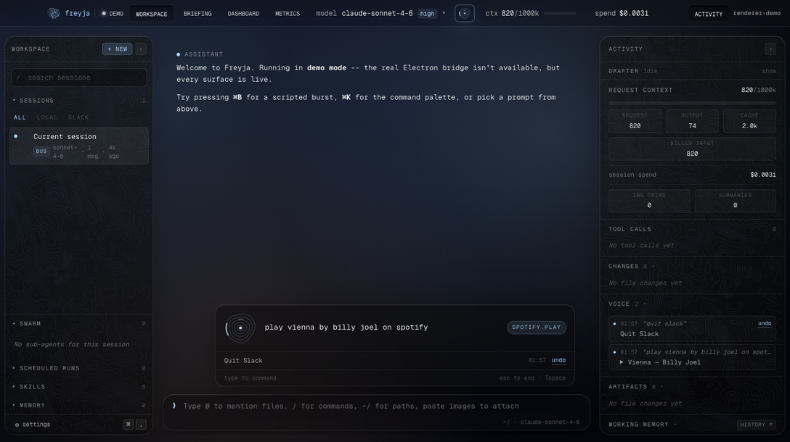
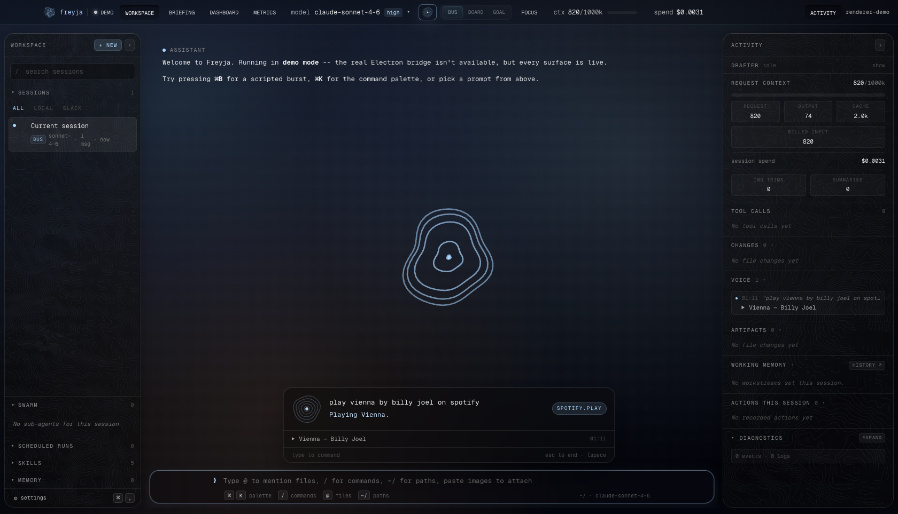
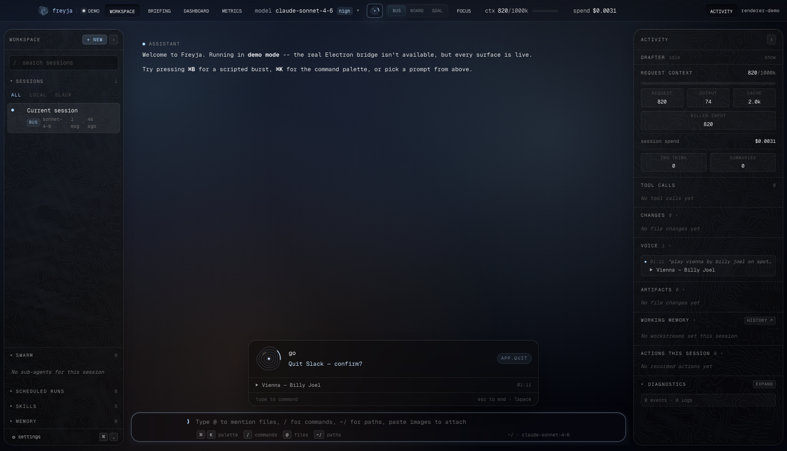
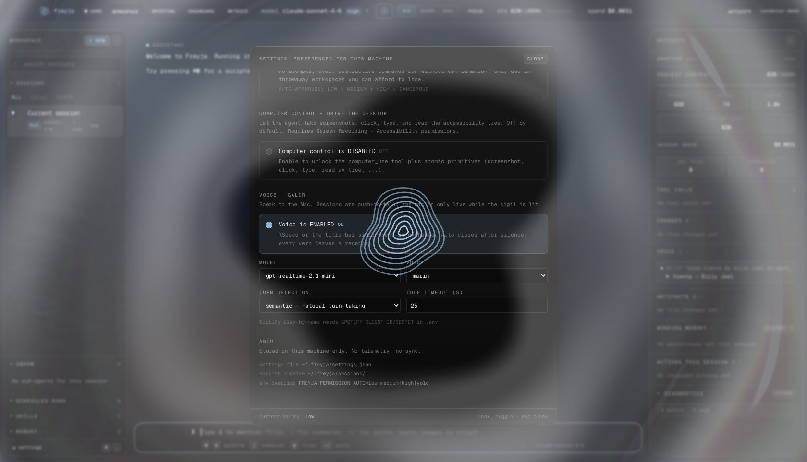

# Galdr — voice agent for Freyja (slices 1–2)

Speak to your Mac. Freyja opens a realtime voice exchange, the model calls
verbs that run natively on the machine, and every action lands as an
undoable receipt. Push-to-talk (⌥Space); the mic is live only while the
sigil is lit.




This implements phases V-1/V-2 of the concept dossier (`docs/freyja-voice-galdr.html`)
plus slices of V-3/V-4. Full interface contract: `docs/GALDR-BUILD.md`
(protocol facts §0 were live-probed against the real Realtime API before
any code was written).

## What it does

- **⌥Space** (or the title-bar sigil) opens a voice exchange. Say *"play
  Vienna by Billy Joel on Spotify"*, *"quieter"*, *"quit Slack"*, *"set a
  timer for ten minutes"*, *"what's playing"*. The mic closes on silence
  (idle timeout) or Esc — it is never hot in the background.
- The **actuator** is a single `act` meta-tool. The model picks a verb
  from a catalog baked into its instructions; the bridge dispatches it
  through a `VerbRegistry` to native adapters (AppleScript / `open` /
  Core Audio via osascript / async timers / slack_sdk / screencapture).
  Slice-1 verbs: `spotify.*` (transport + optional search),
  `system.volume` (undoable), `app.open/focus/quit/frontmost`,
  `timer.set/list/cancel`, `mission.spawn`. Slice-2 reach: `slack.read`,
  `slack.send`, `screen.look`, `mission.status`, `computer.do`, and the
  live computer verbs `computer.see/click/type/press/scroll/menu/open_url`.
  Slice-3 native apps + Shortcuts: `reminders.create/list`, `notes.append/create`,
  `messages.send` (confirm), `contacts.find`, `calendar.today/next`,
  `mail.unread`, and `shortcuts.list/run` — every apple.* verb degrades
  cleanly when the Automation TCC grant is missing (`data.setup="automation"`),
  and `shortcuts.run` inherits the operator's whole Shortcuts library
  (App Intents) as voice verbs.
- **Two-tier safety.** `auto` verbs run immediately; `confirm` verbs
  (quit an app) require a single-use, 90-second, args-scoped token — the
  model must relay the ask and re-call after you say yes, out loud.
- **Every action leaves a receipt** — `~/.freyja/voice/receipts.jsonl`,
  surfaced live in the HUD and the Activity panel's VOICE section, with
  one-click **undo** (volume restores, quit reopens, timer cancels).
- **The floor.** Panic words (*"stop"*, *"never mind"*) and deterministic
  transport commands are parsed locally and never touch the model — the
  panic scan runs over partial transcripts so *"stop"* cancels mid-sentence.
- **mission.spawn** hands multi-step work to a real Freyja agent session —
  and (slice 2) **reports back**: when the mission finishes, its final
  answer lands as a receipt, a macOS notification, and — if a voice
  exchange is live — Freyja says it out loud. **mission.status** answers
  *"how are my missions doing?"* ("2 running, 1 done").
- **Slack, first-class** (slice 2). *"Read me #general"* → `slack.read`
  pulls the last messages (names resolved, cached) for a spoken digest;
  *"tell Ada I'm running late"* → `slack.send` posts to a channel or DMs
  a person by name — confirm-tier, since a sent message is sent.
- **screen.look** (slice 2) gives the voice its eyes: *"check this out"*
  captures the screen (`screencapture`, packaged-app TCC), downscales it,
  and asks a one-shot vision model (`FREYJA_VOICE_LOOK_MODEL`, default
  gpt-5-mini) for a two-sentence read.
- **computer.do** (slice 2, confirm-tier) hands the model the mouse and
  keyboard: spawns a computer-use mission ("computer: …") with the same
  report-back — refused with a setup hint while computer control is
  disabled in settings.
- **Live computer control** (slice 2b). *"Click the compose button"*
  happens in the exchange, not in a background mission: `computer.see`
  condenses the front window's AX tree into numbered refs (coordinates
  never reach the model — they're cached bridge-side), `computer.click /
  type / press / scroll` act by ref through the same atomic tools agent
  sessions use (identical highlight, coordinate translation, permission
  preflights), `computer.menu` clicks menu-bar paths by name, and
  `computer.open_url` opens http(s) links. Every `see` drops a screenshot
  receipt under `~/.freyja/voice/frames/` (last 10 kept); refs go stale
  the moment the screen changes and the verbs refuse them. All gated on
  the same computer-control setting, with spoken setup hints.

## Architecture

Audio stays in the renderer; the bridge never sees a byte of it.

```
renderer  VoiceEngine ⇄ OpenAI Realtime (WebRTC, mic + remote audio)
          │ tool calls + transcripts only, over JSONL IPC
bridge    VoiceService — mints ephemeral secrets (owns OPENAI_API_KEY),
          VerbRegistry → native adapters, tiers + tokens + receipts + undo
```

The ephemeral client secret bakes the entire session config server-side
(model, instructions, verb schema, voice, VAD, transcription), so the
renderer receives only a ~10-minute token — **the API key never leaves the
bridge**.

## Surfaces

| | |
|---|---|
| `VoiceSigil` | Canvas contour-ring mark; its motion maps 1:1 to engine state (listening ripples off real mic RMS, acting sweeps an arc, speaking pulses outward). Reduced-motion → one static frame per state. |
| `VoiceHUD` | Bottom-center glass capsule: streaming transcripts, lane-colored verb chip, confirm row (go/cancel, also voice-answerable), receipt + undo, inline floor-command input. |
| `VoiceReceiptsSection` | Activity-panel history with undo affordances. |
| Settings → *voice · galdr* | Enable, model, voice, turn-detection, idle timeout, capability hints. |





## Verification

- **155 voice unit tests** green (floor grammar table, receipts/undo,
  adapters via mocked osascript, service dispatch + confirm cycle + panic).
- Full suite: **12 pre-existing failures, zero new** (kanban/image baseline).
- `tsc --noEmit` and `npm run build` green.
- **Live, end-to-end, against the real API on this machine:** ephemeral
  mint → `gpt-realtime-2.1-mini` → `act` function call → real bridge
  dispatch → native verb → receipt → spoken confirmation, including a
  set-timer / cancel-timer round trip and an undo.

## Config

- `OPENAI_API_KEY` (required) — the voice brain (and screen.look's eyes).
- `SPOTIFY_CLIENT_ID` / `SPOTIFY_CLIENT_SECRET` (optional) — play-by-name
  search; without them, transport verbs and URI play still work.
- `SLACK_BOT_TOKEN` (optional) — slack.read / slack.send; comma-separated
  multi-workspace tokens supported, voice uses the first. Without it the
  verbs refuse with a spoken setup hint.
- `FREYJA_VOICE_LOOK_MODEL` (optional, default `gpt-5-mini`) — the
  one-shot vision model behind screen.look.
- `~/.freyja/voice/config.json` — model/voice/VAD/idle-timeout, bridge-owned.

## Deliberately out of slice 1

Wake word, voice-print, always-on mic (V-4); MCP-client verb mounts and
the automation-skill flywheel (dossier §05 / V-5); non-OpenAI voice seats
(the `model` field is a free string, so a Grok/Gemini seat is a config
change once an adapter exists).
