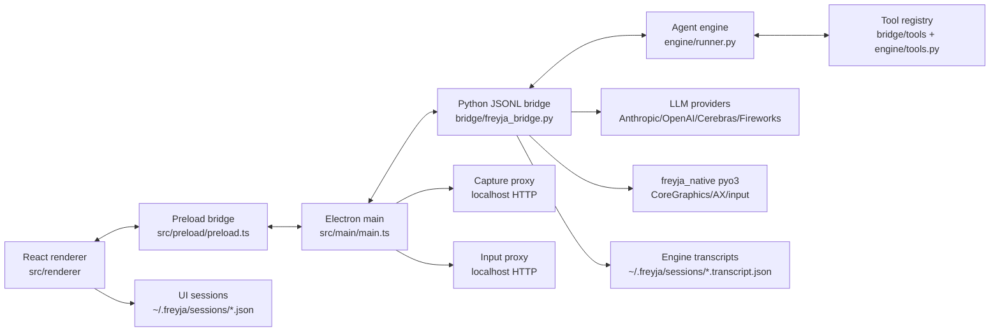

# Freyja Project Deep Dive

Generated from a source-level review on 2026-04-30.

This document is a practical stocktake of what is in the repository today. It focuses on implemented code and calls out where existing docs describe planned architecture that is not fully present in the current source.

## Executive Summary

Freyja is a macOS-first agentic desktop app. The product is an Electron shell with a React renderer, a Python JSONL bridge, a Python agent engine, and a Rust `pyo3` native extension for screen capture, input injection, window enumeration, and Accessibility tree access.

The main runtime path is:

1. Electron main starts a transparent/vibrant macOS window.
2. Electron main starts localhost capture and input proxies.
3. Electron main spawns `bridge/freyja_bridge.py` over stdin/stdout JSONL.
4. The bridge owns sessions, model/provider selection, tool registry assembly, permission mediation, transcript persistence, sub-agent orchestration, and computer-use gating.
5. The engine runs the model/tool loop, streams deltas, executes tools, tracks usage, truncates large tool outputs, and tries context pruning/compaction under pressure.
6. The renderer folds bridge events into a Zustand store and persists UI session slices under `~/.freyja/sessions/`.

There are four major authored surfaces:

| Layer | Primary paths | Main responsibility |
|---|---|---|
| Electron shell | `src/main/`, `src/preload/`, `src/shared/events.ts` | Window lifecycle, IPC, bridge process, settings, session artifact IO, TCC proxies |
| React UI | `src/renderer/` | Chat UI, sessions, model picker, activity panel, swarm/sub-agent views, artifact preview, permission prompts |
| Python bridge + engine | `bridge/`, `engine/` | JSONL command handling, LLM providers, agent loop, tools, sub-agents, persistence |
| Native macOS extension | `native/freyja_native/` | CoreGraphics capture, Accessibility, input injection, windows, TCC permission checks |

Large generated or vendored payloads are present in the workspace: `node_modules/`, `.venv/`, `python-bundle/`, `dist-*`, `out/`, and `native/freyja_native/target/`. They are important for local operation and packaging, but they should not be treated as authored source.

## Repository State

This directory is not currently a git repository: `git status` returns `fatal: not a git repository`. That means change attribution, diffs, and branch state cannot be inspected locally from this path.

Top-level authored or important files:

| Path | Purpose |
|---|---|
| `README.md` | Strong operational overview, build/run instructions, packaging notes, and common workflows |
| `package.json` | Electron/Vite scripts and electron-builder package config |
| `pyproject.toml` | Python package metadata and dependencies for `engine` + `bridge` |
| `uv.lock` | Locked Python dependency graph |
| `vite.config.ts` | Renderer build/dev config, Vite port `5179` |
| `tsconfig.json` | Renderer/shared TS config, strict mode, path aliases |
| `launch.sh` | Local dev bootstrap around `.env`, `npm install`, `uv sync`, and `npm run dev` |
| `scripts/` | Dev orchestration, main/preload build, Python bundling, signing, DMG generation, trajectory conversion |
| `docs/ARCHITECTURE.md` | Research-heavy living architecture document; broader than current implementation |
| `docs/TRAJECTORY-TRAINING.md` | Export/training data design notes |
| `vision-board*.html` | Large standalone design/prototype artifacts |

There are no test files found under the authored source tree at the time of review, even though `pyproject.toml` configures `pytest` with `testpaths = ["tests"]`.

## Runtime Architecture

### Electron Main Process

`src/main/main.ts` is the desktop host. It:

- Creates a macOS transparent/vibrant `BrowserWindow` with dark theme, hidden inset titlebar, and dev/prod renderer loading.
- Starts the capture proxy before the bridge so `FREYJA_CAPTURE_URL` can be passed into Python.
- Starts the input proxy before the bridge so `FREYJA_INPUT_URL` can be passed into Python.
- Spawns the bridge through `HarnessBridge`.
- Buffers early bridge events until the renderer calls `getMode`, preventing the renderer from missing the initial `ready` event and model catalog.
- Provides IPC handlers for bridge commands, settings, session list/load/save/delete/export, artifact read/write, external URLs, and bridge restart.
- Registers global computer-use emergency stop hotkeys.

Important implementation detail: artifact read/write is only allowed under the user's home directory and read has a 5 MB cap. That is permissive enough for agent outputs and workspace files but avoids arbitrary system reads through the renderer.

### Bridge Process Management

`src/main/bridge.ts` wraps the Python child process.

Startup candidate order:

1. `FREYJA_PYTHON`
2. Packaged `python-bundle/bin/python3`
3. Source-root `python-bundle/bin/python3`
4. Project `.venv/bin/python`
5. `uv`
6. `python3`
7. `python`

It loads `.env` from source root and harness root, sets `PYTHONPATH`, forwards `FREYJA_WORKSPACE`, and injects capture/input proxy URLs. It waits up to 5 seconds for a JSON `ready` event. If no Python bridge comes up, it falls back to `DemoBridge`.

The wrapper is deliberately defensive around broken pipes. `stdin` write errors are logged instead of crashing the Electron main process, and restart suppresses the normal "bridge exited, switch to demo" path.

### Preload and Shared Types

`src/preload/preload.ts` exposes a single `window.harness` API via Electron `contextBridge`. It forwards event subscription and IPC methods for commands, session operations, settings, and artifact IO.

`src/shared/events.ts` is the contract between all layers. It defines:

- Bridge commands: send message, cancel, model changes, permission responses, session lifecycle, file search, computer toggles, shutdown.
- Bridge events: streaming deltas, tool calls/results, usage, system events, sessions, sub-agents, skills, artifacts, permissions, and computer-use events.
- Shared settings shape and default computer blocklist.

This file is dependency-free and is the right place to start when changing the app/bridge protocol.

## Python Bridge

`bridge/freyja_bridge.py` is the operational center of the backend. It is about 2,000 lines and owns process-level state, per-session state, command routing, and event emission.

### Startup and Readiness

The bridge:

- Ensures the project root is importable.
- Imports `engine.runner.AsyncAgentRunner` and `engine.session.Session`.
- Emits `ready` with workspace, default model, model catalog, and capability flags.
- Creates an initial boot session.
- Starts an async stdin command loop with a 32 MB line limit so image attachments do not break `readline()`.

### Model Catalog and Providers

The bridge declares the UI-facing model catalog in `AVAILABLE_MODELS`.

Current families:

| Family | Models in bridge catalog | Env var |
|---|---|---|
| Anthropic | `claude-opus-4-6`, `claude-sonnet-4-6`, `claude-haiku-4-5`, `claude-opus-4-5`, `claude-sonnet-4-5` | `ANTHROPIC_API_KEY` |
| OpenAI | `gpt-5.4`, `gpt-5.4-mini`, `gpt-5.4-nano` | `OPENAI_API_KEY` |
| Cerebras | `zai-glm-4.7` | `CEREBRAS_API_KEY` |
| Fireworks | `kimi-k2.5`, `glm5`, `minimax-m2.5` | `FIREWORKS_API_KEY` |

`build_provider()` maps model IDs to provider implementations and raises a recoverable bridge error if the required API key is missing.

### Session Ownership

`_BridgeSession` owns one engine session and runner per UI session ID:

- `Session` transcript
- provider instance
- `AsyncAgentRunner`
- tool registry
- sub-agent registry
- permission handler
- message bus
- queued user messages
- computer cancel event

Sessions are lazily initialized. On restore, the bridge loads `~/.freyja/sessions/{session_id}.transcript.json`, rebuilds the runner/tools, restores transcript entries, strips provider-specific thinking blocks if switching provider families, and attempts compaction if the restored transcript is above the model's compaction threshold.

### Commands

Main command handlers include:

| Command | Behavior |
|---|---|
| `send_message` | Ensures session, queues if a turn is already running, otherwise starts an async turn task |
| `cancel` / `force_cancel` | Signals sub-agent records, computer cancel event, pending turn task, and named child tasks |
| `diagnose` | Dumps bridge session/task state to `~/.freyja/bridge-diagnose.txt` and emits a system event |
| `set_model` | Updates a session model and resets/restores runner state |
| `new_session` / `switch_session` | Creates or activates bridge sessions |
| `restore_context` | Legacy fallback that injects a UI-derived summary when transcript persistence is missing |
| `list_tools` | Emits current registry catalog entries |
| `list_skills` | Reads `knowledge/index.jsonl` if present |
| `set_permission_policy` | Updates global or session-scoped auto-approval tier |
| `set_computer_enabled` | Rebuilds session registries to add/drop computer tools |
| `computer.emergency_stop` | Applies force-cancel across all sessions |

The turn runner path saves transcripts after successful, cancelled, and failed turns. It also backfills synthetic tool results for orphaned tool-use IDs after cancellation or errors to avoid provider request failures on the next turn.

## Engine

The engine is provider-agnostic Python code in `engine/`.

### Agent Loop

`engine/runner.py` implements sync and async runners. The desktop bridge uses `AsyncAgentRunner`.

Key behavior:

- Adds the user message to the session transcript.
- Performs a pre-request context-room check.
- Calls provider in streaming or non-streaming mode.
- Streams text, thinking, tool start, and partial input events.
- Adds assistant messages and tool results into the transcript.
- Executes multiple tool calls in parallel when `AgentConfig.parallel_tool_execution` is enabled.
- Tracks repeated tool calls and injects steering messages for identical-call loops.
- Runs end-turn verification after long repeated tool sequences.
- Handles provider errors with retry/backoff, failover, and context overflow recovery.
- Emits system events for context pruning, compaction, output truncation, and tool truncation.

### Context Management

Context management exists in three places:

- `engine/usage.py` tracks both cumulative billing-ish values and "last-call" context values so cache-read totals do not inflate the UI context meter.
- `engine/session.py` can prune old tool results while preserving recent ones.
- `engine/compaction.py` can summarize old transcript entries using the current provider, keeping recent messages verbatim.

Important thresholds in `engine/constants.py`:

| Constant | Value | Meaning |
|---|---:|---|
| `DEFAULT_CONTEXT_WINDOW` | 200,000 | fallback model window |
| `MAX_TOOL_RESULT_TOKENS` | 60,000 | hard cap before tool result truncation |
| `DEFAULT_MAX_TOKENS` | 64,000 | default model output cap |
| `CONTEXT_PRESSURE_THRESHOLD` | 0.80 | prune old tool results |
| `CONTEXT_COMPACTION_THRESHOLD` | 0.90 | attempt summary compaction |
| `KEEP_RECENT_TOOL_RESULTS` | 3 | recent tool outputs kept intact |
| `KEEP_RECENT_MESSAGES` | 10 | recent messages kept through compaction |
| `MAX_COMPACTION_ATTEMPTS` | 3 | per-turn compaction retry cap |

The compaction prompt explicitly preserves artifact paths like `~/.freyja/sessions/*/artifacts/*.md`, which matters because sub-agent summaries are stored externally.

### Providers

Provider implementations live in:

- `engine/anthropic_provider.py`
- `engine/openai_provider.py`
- `engine/cerebras_provider.py`
- `engine/fireworks_provider.py`

All expose a common shape: sync completion, async completion, structured completion, streaming, and stream-to-response assembly. Anthropic supports extended thinking and provider-specific thinking blocks/signatures. OpenAI uses the Responses API. Cerebras and Fireworks use OpenAI-compatible chat completions.

## Tool System

The engine-level abstraction is `engine/tools.py`: `ToolDefinition`, `ToolRegistry`, `ToolResultTruncator`, and the `Tool` protocol.

The desktop bridge tools live in `bridge/tools/` and import shared engine tool types through `bridge/tools/base.py`.

### Registry Assembly

`bridge/tools/registry.py` constructs the desktop registry. It always includes read/search tools, optional write tools, memory, bash, browser tools, optional web tools, `tool_search`, sub-agent tools, and optional computer-use tools.

Core tools:

| Area | Tools |
|---|---|
| Files | `read_file`, `write_file`, `edit_file`, `edit_json`, `list_directory` |
| Search | `glob`, `grep` |
| Shell | `bash` |
| Browser CDP | `browser_execute_js`, `browser_screenshot` |
| Web | `web_search`, `web_fetch` when `PARALLEL_API_KEY` is set |
| Memory | `record_user_preference` |
| Meta | `tool_search` |
| Sub-agents | `sub_agent`, `subagents` |
| Computer | `screenshot`, `list_displays`, `list_windows`, `focus_window`, `click`, `move_mouse`, `type_text`, `press_key`, `key_down`, `key_up`, `scroll`, `wait`, `inspect_region`, `read_ax_tree`, `find_element`, `cursor_position`, `computer_use` |

### Permissions

`BashTool` declares `requires_permission` and builds a `PermissionRequest` based on risk classification:

- Low: read-only commands and simple inspection
- Medium: unknown commands
- High: state-changing commands, installs, network calls, git push/merge/rebase
- Dangerous: destructive commands, sudo, force pushes, database destructive statements

The bridge's `DesktopPermissionHandler` either auto-approves based on the configured tier or emits a renderer `permission_request` and awaits a `permission_response`.

Tiers are `none`, `low`, `medium`, `high`, and `yolo`. `yolo` auto-approves dangerous commands.

### Tool Result Truncation

Long tool outputs are truncated by token budget. Full content is written to `~/.freyja/truncated/` when possible, and the model receives a suffix with size and saved path. JSON-shaped outputs get a structural summary.

## Sub-Agents and Swarm Mechanics

`bridge/tools/sub_agent_tool.py` implements the main delegation mechanism. It spawns a child `AsyncAgentRunner` and registers a real child UI session via events.

Agent types are declared in `bridge/tools/agent_types.py`:

| Type | Model | Tools | Use |
|---|---|---|---|
| `general` | parent model | inherited tools minus recursion/memory bus exclusions | default bounded delegation |
| `explore` | `claude-sonnet-4-6` | web/file/bash subset | deep research |
| `explore-fast` | random `kimi-k2.5`, `glm5`, or `zai-glm-4.7` | quick web/file subset | fast breadth lookups |
| `code` | parent model | file/bash/search subset | isolated code edits |
| `verify` | `gpt-5.4` | read/search/bash subset | QA/verification |

Child agents cannot recursively spawn further sub-agents. They get a filtered tool registry, their own provider/model/thinking config, a child system prompt, and a first-class session ID. Their streaming events route to their own archived renderer slice.

Completed sub-agents write full output to:

`~/.freyja/sessions/{parent_session_id}/artifacts/{subagent_id}.md`

This artifact path is returned through UI events and surfaced in the renderer's artifact list.

### Message Bus

`bridge/tools/message_bus.py` implements a session-scoped append-only bus. `publish_finding` and `read_findings` are injected into child registries only. The parent does not receive these tools directly. Bus events are emitted to the renderer so the swarm monitor can display inter-agent activity.

## Computer Use

Computer use spans Electron main, Python bridge tools, and the Rust native extension.

### Native Extension

`native/freyja_native/` builds a `pyo3` module named `freyja_native._native`.

Native capabilities:

- Screen/window capture
- Display enumeration
- Mouse/keyboard input
- Cursor position
- Window listing/focus/app activation
- Accessibility tree reading
- AX element search
- Accessibility and Screen Recording permission checks/prompts

Rust modules:

| File | Responsibility |
|---|---|
| `capture.rs` | CoreGraphics capture, display metadata, image encoding, Screen Recording checks |
| `input.rs` | Enigo-driven input injection and key/modifier parsing |
| `windows.rs` | CGWindowList + NSRunningApplication window enumeration/focus |
| `ax.rs` | Accessibility permissions, tree walk, element matching |
| `lib.rs` | Python-visible function exports |

### TCC Proxy Pattern

Two Electron main-process localhost proxies exist for macOS TCC inheritance:

- `src/main/captureProxy.ts`: `GET /capture?...` captures through Electron's `desktopCapturer`.
- `src/main/inputProxy.ts`: `POST /input` shells into Python and calls `freyja_native` input functions.

The bridge receives `FREYJA_CAPTURE_URL` and `FREYJA_INPUT_URL` so Python-side computer tools can route privileged operations through the parent process when direct native calls are blocked by TCC.

### Safety

Computer control is disabled by default in settings. Default blocked bundle IDs include password managers and Keychain Access. Emergency stop can be triggered from the renderer, global `Cmd/Ctrl+Shift+Esc`, or triple-Esc when a computer session is running.

## Renderer

The renderer is a React + Zustand app in `src/renderer/`.

### Store

`src/renderer/state/store.ts` is the central UI state machine. It folds every bridge event into either the active session slice or an archived slice for a background/child session.

It tracks:

- Messages and message parts
- Tool calls and parallel groups
- Sub-agent records
- Usage and context window
- System events
- Bus messages
- Artifacts
- Sessions and archived per-session slices
- Available models
- Permission queue
- Pending image attachments
- Settings
- Computer-use live state

It also persists sessions through main-process IPC and exports training-oriented session JSON from the renderer.

### App Shell and Components

`src/renderer/App.tsx` wires global keyboard shortcuts, bridge event subscription, session persistence after turn/session completion, settings hydration, and legacy context restore.

Notable components:

| Component | Role |
|---|---|
| `Conversation.tsx` | Central transcript rendering |
| `InputDock.tsx` | Composer, attachments, slash commands |
| `Sidebar.tsx` | Session list, lineage, navigation |
| `ActivityPanel.tsx` | Logs, usage, tools, live activity |
| `ModelPicker.tsx` | Model selection |
| `PermissionPrompt.tsx` | Human approval UI |
| `SettingsModal.tsx` | Permission/computer settings |
| `SubagentSwarmGrid.tsx`, `SwarmMonitor.tsx`, `SubagentDetail.tsx` | Multi-agent UI |
| `ArtifactWorkspace.tsx`, `ArtifactPreview.tsx`, `ArtifactsSection.tsx` | Artifact browsing/editing |
| `ComputerLiveView.tsx`, `ComputerPermissionWizard.tsx`, `EmergencyPanic.tsx` | Computer-use UI |
| `DebugDrawer.tsx`, `LogStreamModal.tsx`, `ToolTimeline.tsx` | Diagnostics |

### Styling

The renderer uses Tailwind plus custom CSS in `src/renderer/styles/globals.css`. The design is a transparent macOS glass UI with custom Departure Mono and Geist Mono fonts, dark theme, frosted panels, compact activity surfaces, and Markdown styling.

## Persistence and Export

There are two persistence layers:

| Layer | Owner | Path | Purpose |
|---|---|---|---|
| UI session slice | Electron main via renderer IPC | `~/.freyja/sessions/{id}.json` | Restores visible chat/session UI |
| Engine transcript | Python bridge | `~/.freyja/sessions/{id}.transcript.json` | Restores model context for future turns |

Sub-agent artifacts live under:

`~/.freyja/sessions/{parent_id}/artifacts/{sub_id}.md`

Settings live at:

`~/.freyja/settings.json`

The renderer's "download session" export emits a richer v3 training JSON with system prompt, task description, message parts, tool calls, tool stats, thinking traces, sub-agents, usage, and system events. The main-process `/export` path writes the persisted UI JSON plus a compact `.trace.txt` sibling for diagnostics.

Conversion scripts:

- `scripts/convert-to-atif.py`
- `scripts/convert-to-sharegpt.py`

## Build, Packaging, and Distribution

### Development

`npm run dev` runs `scripts/dev.mjs`, which:

1. Starts `scripts/build-main.mjs --watch` for main/preload.
2. Starts Vite on `http://localhost:5179`.
3. Waits for Vite.
4. Starts Electron pointed at the dev URL.

`launch.sh` checks `.env`, installs missing JS/Python deps, and runs `npm run dev`.

### Build

`npm run build` runs:

- `npm run build:renderer`: Vite build to `dist-renderer/`
- `npm run build:main`: esbuild main/preload to `dist-main/main.cjs` and `dist-preload/preload.cjs`

### Python Bundle

`scripts/bundle-python.sh` creates `python-bundle/` from the project `.venv`, copies stdlib and site-packages, builds `freyja_native`, strips bulk, writes `pyvenv.cfg`, signs Python and native libraries, and verifies imports.

### Packaging

`npm run package` builds and runs `electron-builder --mac --dir`. `package.json` copies `bridge/`, `engine/`, `python-bundle/`, assets, and `.env` as extra resources.

`scripts/sign-resources.js` ad-hoc signs bundled Python/native libraries, Electron frameworks/helpers, and the outer `.app` in inside-out order.

`npm run dist` additionally runs `scripts/create-dmg.mjs`, which uses `hdiutil create -srcfolder` directly to avoid electron-builder DMG issues on arm64 macOS Tahoe.

## Documentation vs Implementation

`README.md` largely reflects the current implementation and is the best operational entry point.

`docs/ARCHITECTURE.md` is a broad research/living design document. It describes a much larger memory/skills/evolution architecture than this repo currently implements. Examples that appear aspirational or partial in current source:

- Rich multi-layer skill lifecycle and discovery. Current bridge `list_skills` only reads `knowledge/index.jsonl` if it exists; no full skill loader was found in the source tree.
- Persistent cross-session episodic memory with Q-values. Current implementation writes sub-agent artifacts and has a session message bus, but not the full MemRL-like retrieval/update system described.
- MCP progressive schema loading at ecosystem scale. Current `ToolRegistry` has hot/warm/cold concepts and `tool_search`, but the registered desktop tools are mostly hot and no MCP connector layer is present.
- Custom agent definitions from `.freyja/agents/` or `~/.freyja/agents/`. Current agent types are hardcoded in `bridge/tools/agent_types.py`.

The doc is still useful as product direction, but it should not be read as an exact implementation map.

## Risks, Gaps, and Cleanup Candidates

### No Test Suite in Tree

No test files were found, despite `pytest` config. For a project with bridge subprocesses, provider adapters, persistence, and native input, this is the biggest maintainability gap.

High-value first tests:

- `engine/session.py` transcript serialization/restore and orphan tool result handling.
- `engine/tools.py` tool truncation budgets and file fallback.
- `bridge/transcript_persistence.py` save/load/delete behavior.
- `bridge/tools/file_tools.py` edit modes, especially line and JSON edits.
- `bridge/freyja_bridge.py` command handlers around queued messages, cancellation, and transcript restore using mocked runners/providers.

### Workspace Is Not a Git Repo

Without git metadata, it is hard to safely distinguish user edits from generated changes or audit drift. This matters because the repo contains generated outputs beside source.

### Generated Outputs Are Checked Into the Working Tree

`dist-*`, `out/`, `python-bundle/`, `node_modules/`, `.venv/`, and Rust `target/` are all present. That is workable for a local app workspace but makes code review and inventory noisy. If this becomes a shared repo, generated outputs should be ignored or moved to release artifacts.

### Provider Metadata Drift

Model/context metadata exists in multiple places:

- `bridge/freyja_bridge.py` `AVAILABLE_MODELS`
- `engine/constants.py` `MODEL_CONTEXT_WINDOWS`
- renderer `store.ts` `MODEL_CONTEXT_WINDOWS`
- provider-specific metadata

There are already mismatches: `gpt-5.4` is 1,050,000 in the bridge catalog but 1,000,000 in the renderer store, and newer bridge models are missing from `engine/constants.py`. This should be centralized or generated.

### Persistence Comment Drift

`src/main/persistence.ts` still has a note saying full transcript restoration is a follow-up, but bridge-side transcript persistence now exists in `bridge/transcript_persistence.py` and restore paths in `bridge/freyja_bridge.py`. The comment should be updated to avoid misleading future work.

### File Tools Are Not Workspace-Sandboxed

Bridge file tools resolve relative paths from process cwd and allow absolute paths. The renderer artifact IO has a home-directory guard, but agent file tools themselves do not enforce a workspace root. That may be intentional for a local agent, but it is a trust boundary to document explicitly.

### Bash Risk Classification Is String-Based

`BashTool` uses substring matching for risk categories. It is pragmatic but bypassable and can misclassify shell constructs. It should be treated as UI friction, not a security sandbox.

### Computer Blocklist Is UI Settings, Not Full Enforcement

Default blocklist values exist in shared settings and renderer/main settings, but I did not find those allowlist/blocklist arrays passed into `bridge/tools/computer_tools.py` or enforced by the Python computer tools. Today the hard gate appears to be the global enabled flag plus prompt-level safety instructions, not per-bundle enforcement.

### Skill System Is Mostly Placeholder

Shared event types and architecture docs mention skills, and the bridge can list from `knowledge/index.jsonl`, but there is no complete skill discovery/load/evolution system in current code.

### Cost Estimation Is Hardcoded

Bridge usage events compute rough cost as `(input * 3 + output * 15) / 1_000_000`, independent of provider/model. This is useful for UI but should not be considered billing-accurate.

## Good Places To Start For Changes

| Goal | Start here |
|---|---|
| Add or modify a renderer event | `src/shared/events.ts`, then `src/renderer/state/store.ts` |
| Add a UI command | `src/renderer/state/store.ts` `runSlashCommand()` |
| Add a model | `bridge/freyja_bridge.py` `AVAILABLE_MODELS`, then centralize/update context maps |
| Add a provider | `engine/providers.py`, a new `engine/*_provider.py`, and `bridge/freyja_bridge.py` `build_provider()` |
| Add a tool | Implement in `bridge/tools/`, register in `bridge/tools/registry.py`, optionally add to agent type allowlists |
| Add a sub-agent type | `bridge/tools/agent_types.py` |
| Debug stuck turns | `/diagnose`, `~/.freyja/bridge-diagnose.txt`, bridge logs in UI |
| Debug computer use | `~/.freyja/bridge-events.jsonl`, `src/main/captureProxy.ts`, `src/main/inputProxy.ts`, `bridge/tools/computer_tools.py` |
| Debug resume/persistence | `src/main/persistence.ts`, `bridge/transcript_persistence.py`, `store.ts` `hydrateFromDisk` / `switchSession` |
| Debug packaging | `scripts/bundle-python.sh`, `scripts/sign-resources.js`, `package.json` build config |

## Suggested Next Engineering Moves

1. Add a small test suite around engine/session/tool behavior before large refactors.
2. Centralize model metadata so bridge, engine, and renderer cannot drift.
3. Update stale comments in persistence and docs to reflect implemented transcript restore.
4. Decide whether absolute-path file tools are intended. If not, add workspace-root checks at the tool layer.
5. Split generated artifacts from authored source or add a clear `SOURCE_INVENTORY.md`.
6. Implement the missing skill loader or trim skill claims in UI/docs until it exists.
7. Add smoke tests for bridge startup with a fake provider and fake tool registry.
8. Add a packaging verification script that checks `.app` resources, Python imports, native extension import, and required env/resource files.
